[TOC]


## 一 论文阅读

### 1 2021《Understanding Drivers’ Stress and Interactions with Vehicle Systems Through Naturalistic Data Analysis》

**主要研究**：驾驶员的生理状态和驾驶员的interactions之间的关系。

**作者**：MIT

- 危险驾驶状态是因为驾驶员的生理或者精神条件诱导而成；而这种来自生理、精神的状况又是由驾驶员内在或者外在的原因引起的。比如内在的精神压力，或者外在的天气、抑或是交通状况。

- 最危险的驾驶状态可能要说secondarytask引起的分心行为；

- physiological measurements from **biometric wearable sensors**, vehicle **telemetry data** from in-vehicle sensors, and **audio/video data** [8] that can capture various aspects of driving.

- 使用自然驾驶数据进行分析不算是新鲜事儿，但是在自然驾驶条件下对驾驶员驾驶行为及其心理状态的关系研究却很匮乏。

- 现在有paper在研究车辆的动态时序信息；不过却少有人将驾驶行为与**驾驶环境和驾驶员状态（精神、生理或者车内互动行为）**联系起来。

- 本文研究内容：

  - 不同的驾驶环境下的驾驶员精神状态及其变化；
  - 车内的驾驶员与车辆的交互行为；

  ---

  - 正常驾驶condition下，驾驶员activity及其生理反应；

    数据来源：**车辆运行数据（GPS、车速、加速度等）**、**驾驶员生理数据**EDA皮肤电活动和3D相机拍摄到的 **驾驶员activity监控视频** 。

  - 分析监控驾驶员activity（interactions with car components）的video data 和biometric data。

  ```mermaid
  graph LR;
  	1_monitor --外在交通\天气环境--> RealDrivingConditions;
  	1_monitor --车内交互--> 驾驶员activity\interactions;
  	1_monitor --生理状态\精神状态--> 驾驶员生理反应;
  	%% 这里的EDA生物数据即是指代生理和精神的两种状态，而并没有进一步区分。 
  	
  	RealDrivingConditions --意味着不同天气\不同路况等-->车辆运行数据;
  	
  	驾驶员生理反应--主要指EDA皮肤电活动图-->BiometricData-->2_分析精神Stress变化;
  	车辆运行数据-->4_StressEstimation_InRealDrivingConditions
  	车辆运行数据-->3_Correlations_StressAndInteractions;
  	BiometricData-->3_Correlations_StressAndInteractions;
  	
  	驾驶员activity\interactions--即监控视频-->VideoData-->2_分析精神Stress变化;
  ```

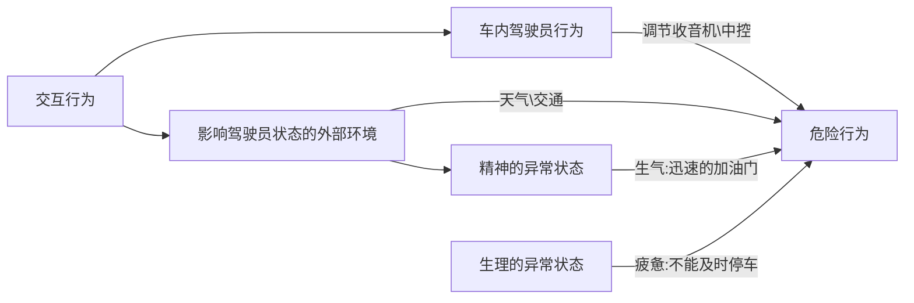
```mermaid
graph LR;
	交互行为-->车内驾驶员行为;
	交互行为-->影响驾驶员状态的外部环境;
	
	车内驾驶员行为--调节收音机\中控-->危险行为;
	影响驾驶员状态的外部环境--天气\交通-->危险行为;
	影响驾驶员状态的外部环境-->精神的异常状态;

	精神的异常状态--生气:迅速的加油门-->危险行为;
	生理的异常状态--疲惫:不能及时停车-->危险行为;
```

- 数据分析

  - video DataSets和biometric DataSets 视频数据和生物数据。
  - telemetry bus data 和biometric data 不同的环境和交通条件下的驾驶员压力的分析；
  - 基于三种数据分析驾驶员和车辆之间的关系。

  ---

  -  A. Drivers’ interaction with car interior from video data

    使用深度图像，避免光照的影响；相机角度固定；通过计算深度图像的平均像素值以探测是否出现人手。

    同时通过序列数据的峰值检测算法以检测峰值的出现。一旦出现，再通过openpose对相应的2维图像进行二次确认。

    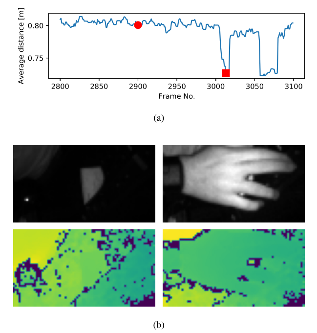

    > 这一点可以用到区分图像是否需要进行数据增强。

    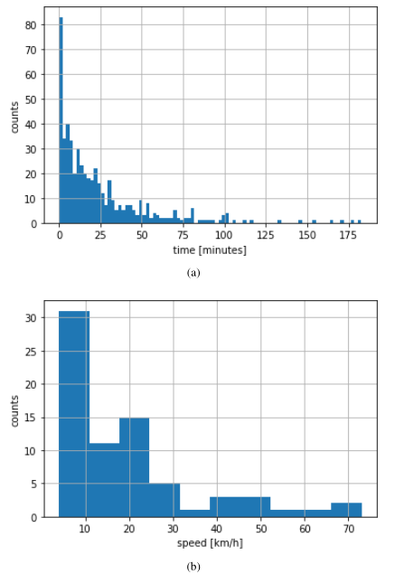

    发现：大多数的与车辆的交互行为都发生在低俗行驶的状态下。
    
    发现：手是否落在方向盘上是基于固定的相机视角下手部的节点坐标和方向盘的位置区域的比较而得来。
    
    发现：双手驾驶时的平均速度要低于单手驾驶平均速度15%。可能原因是在快道上倾向于比较惬意的驾车方式。
    
  -  B. Understanding the relations between driver and vehicle
  
     - 先前研究表明：心率变异性和皮肤电活动的变化与压力有密切联系。
  
     - 1） Correlation between CAN bus and **Hearth Rate**
  
       瞬时速度和纵向加速度之间的关系，**表示高速状态下瞬时的纵向加速度较小，加速度的值也有较小的变化。**
  
       心率（压力）和纵向加速度成负相关关系。**猜测司机可能在压力之下，在驾驶车辆时可能会格外小心**。
  
     - 2) Correlation between CAN bus and Biometric signals
  
       发现，心率标准差和车辆速度呈负相关关系。表示高驾驶速度通常和更加轻松的驾驶风格相关。
  
     - 3) Effect of driving conditions on driving stress
  
       正压力的特征是：低水平的EDA和低层次的心率；负压力恰恰相反。
  
       正压力还和周末、较高气温相关。


### 2 2019《STM: SpatioTemporal and Motion Encoding for Action Recognition》

-- Without any 3D convolution and pre-calculation optical flow

作者：浙江大学和商汤科技


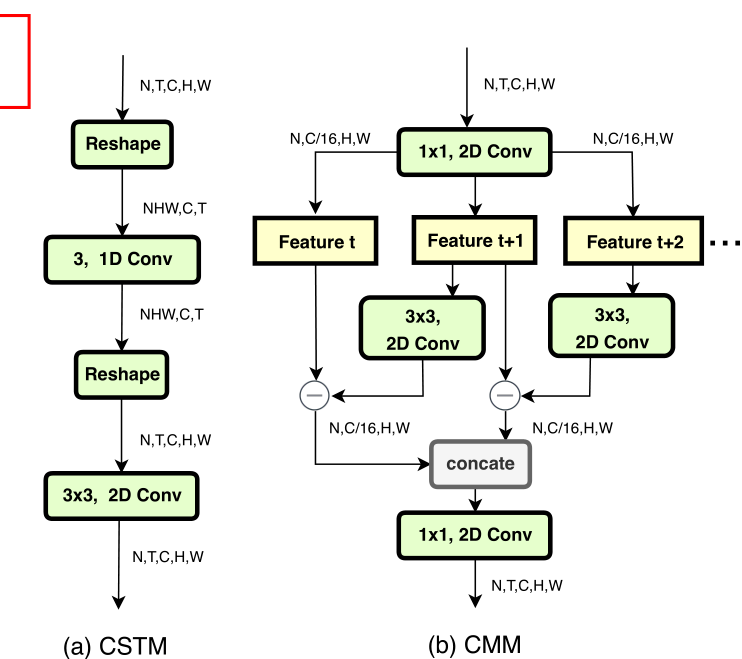


#### 1 摘要和介绍的重点

- **Spatiotemporal and motion features** are two complementary and crucial information for video action recognition。


#### 2 Idea的诞生

- [【16】](https://www.cv-foundation.org/openaccess/content_cvpr_2014/papers/Karpathy_Large-scale_Video_Classification_2014_CVPR_paper.pdf)采用二维卷积网络作为主干backbone，通过简单地聚合**逐帧**预测frame-wise prediction完成对视频的分类；

  但是基于二维卷积的网络的缺点是，只单独地关注每一帧的appearance feature外观特征，而忽视了帧之间的动态信息。也就是说，不适合处理时序相关的视频数据。

  > 既然如此，如果研究的行为不涉及时序信息，就不需要时序性质的算法。

- 同时考虑appearance和dynamic的特征的方法之一：引入了双流模型（spatial and temporal model）；

  两个stream信息的fuse是在网络模型的最后或中间部分进行加权操作。

  - [22]双流卷积模型；
  - 【33】TSN，Temporal Segment Networks，为 **双流模型** 提出了一个稀疏时序采样策略，同时将两个stream的信息在模型最后加权平均进行融合。
  - 【8，9】提出在模型中间进行fuse的学习策略，以便获得**空间时序特征 spatiotemporal features**。

  但是以上模型的局限性是：

  - 需要预先计算好的光流数据optical flow，而这部分数据需要时间和内容；
  - 学到的特征通过简单的加权平均进行fuse和prediction，使得这些模型比temporal-relationship的模型的性能差。

- 同时考虑appearance和dynamic的特征的方法之二：通过3DCNN模型处理RGB图片学习得到；

  - 【27】C3D，首个实现该想法的模型，however，tremendous parameters和缺乏large scale和high quality的数据集。
  - 【2】I3D，将基于Imagenet预训练好的二维核inflat至三维，以实现在一个stream捕捉到spatiotemporal features同时在另一个stream对motion features建模。（I3D是双流配置，而C3D是单个stream）

  三维卷积网络都是学习输入通道之间的局部相关关系

  - 【4】STCNet在三维残差网络中插入了STCblock，以期捕捉到spatial-channels 和 temporal-channels的相关性信息。
  - 【7】SlowFast，一方面通过slowPath捕捉spatial semantics语义信息，另一方面通过FastPath捕捉fine temporal resolution精细时序分辨率的motion特征。

  但是三维卷积网络的不足是：

  - heavy computation，难以deploy部署在现实世界的应用。

- 实现lightweight and learn spatiotemporal features。

  precision和speed之间的trade-off。

  > 这里的trade-off，是指精确率和达到收敛的速度之间的权衡。而我们的实验是不考虑收敛速度的。如果模型面向嵌入式，那么需要考虑两方面：计算量以及效率（达到收敛所用的时间）。

  - 【28，37】探讨了spatiotemporal卷积网络的几种form，比如网络模型的前几层是三维卷积而后几层是二维卷积；
  - 【20，28】P3D和P(2+1)D实现lightweight的方式是将三维卷积分解为二维空间卷积和一维时序卷积。
  - 【19】TSM介绍了一种新的时序卷积，沿着时间维度对part of channels 进行shift。

- **作者的CSTM模型**。
  
  - 具有相同的对spatiotemporal features的理解；但是CSTM使用channel-wise 1D 卷积以捕捉不同的channels中蕴含的不同temporal relationship 。
  - 对heavy computation进行权衡，但是无法避免地借助双流模型以**捕捉motion特征**，以获得它们最好的性能。而 Motion information is the key difference between video-based recognition and image-based recognition task. 关键区别。
    - 但是基于TVL1方法计算得到的光流数据非常耗费时间和空间。
- 计算motionFeature的数据optical flow的方法。
  - 【33】TSN框架涉及两帧的RGB数据的difference以表示motion；
  - 【39】使用Cost volume处理方法对表面的motion进行建模；
  - 【26】Optical Flow guided Feature OFF的产生**涉及一系列的操作**：sobel和element-wise subtraction。
  - 【18】MFNet采取五个固定的motion过滤器作为一个motion block，以找到两个相邻时间step之间的时序特征（这是人话？）。
- **作者的CMM模型**。
  - CMM分支同样是为了找打更好的且轻量级的motion特征的替代表示。
  - 不同于上述方法的是：CMM学习**每两个相邻的时间步中，**不同channels中的不同motion特征。


#### 2 补充的知识点

- BackBone：

- spatiotemporal features 和 spatial features以及temporal features的区别和联系。

- Channel-Wise和普通卷积的差别

  不同的channel之间进行交流；


#### 3 方法

##### 3.1 CSTM：channel-wise spatiotemporal fusion。

- CSTM 能够获取到丰富的spatiotemporal特征，这个特征能够大幅提升**时序相关temporal-related的行为识别任务的性能**。

- 采用channel-wise的好处：

  - 不同通道的时序信息的融合也是不同的；因此channel-wise卷积可以用于独立地学习每个通道的卷积核。
  - **the computation cost** can be reduced by a factor of G where G is the number of groups

- CSTM的输出特征图像，表明 we can find that the **CSTM has learned the spatiotemporal features** which pay more attention in the main part of the actions such as the hands in the first column **while the background features are weak.**

  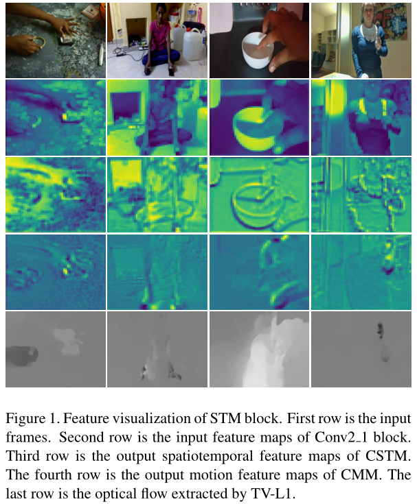

##### 3.2 CMM：extract feature-level motion information。

- 数据来源是：不是通过optical-flow motion stream 光流运动流，而是 **feature-level motion patterns between adjacent frames**

  换句话说，motion特征是通过RGB帧得到，而非pre-computed optical flow。

  **Note that our aim is to find the motion representation that can help to recognize actions in an efficient way rather than accurate motion information (optical flow) between two frames.**

- 具体的过程：

  1X1卷积降低spatial channel的大小以降低计算成本（HW维度）-->相邻两个特征图之间复杂相减得到T-1个motion 表示（T维度）-->通过1X1卷积恢复channel的维度到C值。（C维度）

  > 每一帧经过的2D卷积的目的是？可能只是为了得到motion特征计算之前的次级特征（高于原始特征，低于高维特征）。

##### 3.3 STM：assemble CSTM and CMM as a building block 嵌入模块 into RestNet。

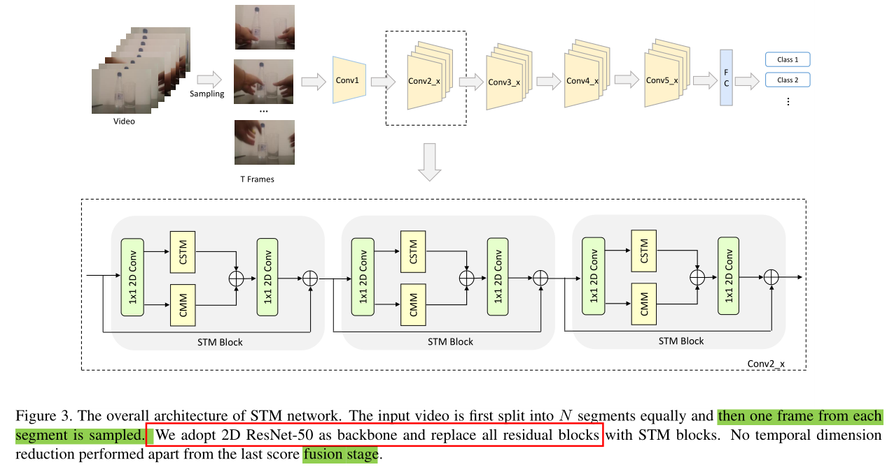

- the compressed feature ：tensor经过1X1卷积进行某个维度的降维得到的feature；
- CSTM和CMM两个模块的fuse方式是：summation 和 concatenation，但是前者效果更好experimentally。

#### 4. Experiments

- 数据集分类：

   temporal-related datasets (i.e., Something-Something v1 & v2 and Jester) and scene-related datasets (i.e., Kinetics-400, UCF-101, and HMDB-51)

- baseline method：TSN Temporal Segment Networks ，with backbone of ResNet-50；

##### 4.1. Datasets

- 虽然第二类数据集并不是与所提出的模型匹配，但是仍然可以做实验以观察结果

  Since our method is designed for effective spatiotemporal fusion and motion information extraction, we mainly focus on those temporal-related datasets. Nevertheless, for those scene-related datasets, our method also achieves competitive results.

  > 这里提到：一些数据集 where the background information contributes a lot for determining the action label in most of the videos

##### 4.2. Implementation Details

- Training
  -  **the same strategy as mentioned in TSN**
  - **we randomly sample one frame from each segment to obtain the input sequence with T frames**。
  - . The size of the short side of these frames is fixed to 256
  -  corner cropping and scale-jittering are applied for data argumentation.
  -  resize the cropped regions to 224×224 for network training
  - In our experiments, T is set to 8 or 16.
  -  For Kinetics, Something-Something v1 & v2 and Jester
    - we start with a learning rate of 0.01 and reduce it by a factor of 10 at 30,40,45 epochs and stop at 50 epochs.
    -  use the ImageNet pre-trained model as initialization
  - For UCF-101 and HMDB-51
    -  we use Kinetics pre-trained model as initialization and start training with a learning rate of 0.001 for 25 epochs.The learning rate is decayed by a factor 10 every 15 epochs.
    -  We use mini-batch SGD as optimizer with a momentum of 0.9 and **a weight decay of 5e-4.**

##### 4.3. Results on Temporal-Related Datasets

-  ourSTMnetwork gains 29.5% and 30.8% top-1 accuracy improvement with 8 and 16 frames inputs respectively on Something-Something v1. 

  > **这里表明，数据集用于训练的连续片段的数目如果不同，结果也不同，因此这个值应该作为超参数**

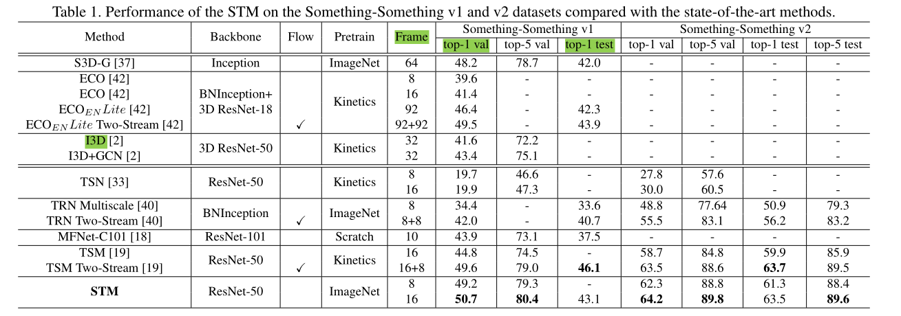

##### 4.4. Results on Scene-Related Datasets

- 在场景数据集中的实验结果表明：
  - 场景数据集中的行为可以被场景或者物体即使是一帧的情况下被识别出；
  - 面向时序相关数据集的STM在非时序相关的数据集中的测试效果不错。

##### 4.5. Ablation Studies

- **Impact of two modules**：To validate the contributions of each component in the STM block(i.e., CSTMandCMM),we compare the **results of the individual module and the combination of both modules** in Table 5

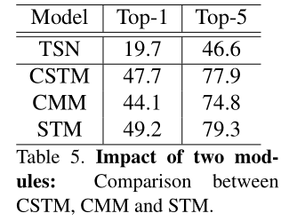

- **Fusion of two modules**：

  - The element-wise summation is parameter-free and easy to implement.

  -  concatenation fusion：1 the dimension of **concatenate features** is 2C-->  2 **1x1 convolution** is applied to reduce the channels
    to C.

    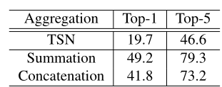

    

- **Location and number of STM block.**

  - ResNet-50 architecture can be divided into 6 stages. We refer the conv2 x to conv5 x as stage 2 to stage 5.

    > 这一点表明，残差网络可以被划分为6个层次，这个就意味着backbone不是迁移学习，不是用于初始化模型参数。

  - 同时，处于deeper层的TSMblock会取得处于shallower层的TSM block 更好的性能，这是因为One possible reason is that temporal modeling is beneficial more with larger receptive fields which can capture holistic features. **感受野越大，时序建模的性能越好，越能获取到整体的特征。**

    > 这一点非常适合我们的实验探索。

  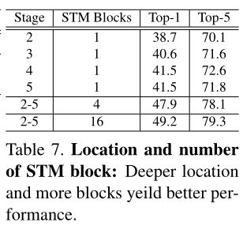

  

- **Type of temporal convolution in CSTM**

  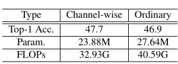

##### 4.6. Runtime Analysis

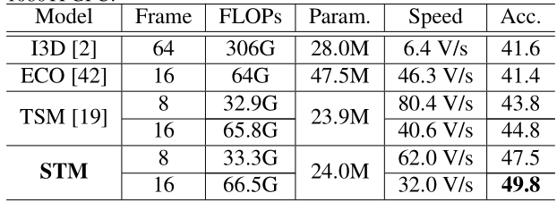

- 具体细节：
  -  For a fair comparison, we evaluate our method by **evenly sampling 8 or 16 frames** from a video and then **apply the center crop**. To evaluate speed, we use a **batch size of 16** and **ignore the time of data loading**.


### 3 2018《ChannelNets: Compact and Efficient Convolutional Neural Networks via Channel-Wise Convolutions》

得克萨斯农工大学  Hongyang Gao;  IEEE TPAMI  机器学习领域的顶刊


#### 2 背景与动机

常规卷积网络的问题

- 输入特征图和输出特征图之间的连接时全连接模式的。意味着巨大的参数量和计算量；

  $d_k*d_k*m*n$ 

为了减少卷积计算量和参数量，尽量规避$d_k*d_k$ 和$m*n$之间的multiplication相乘。

- 【12】MobileNets的核心是深度分离卷积，由depth-wise conv后接1X1Conv得到。

  The depth-wise separable convolution actually decomposes the regular convolution into a depth-wise convolution step and a channel-wise fuse step。从而实现了$d_k*d_k$ 和$m*n$的decoupling解耦。

  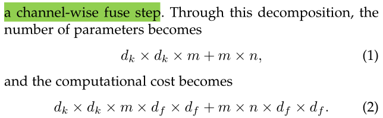

$m*n$项仍然主导着大部分的参数量，因而需要改变输入和输出中存在的dense connection的现象，以circumvent 1X1卷积。

- 常规的卷积模块，1X1卷积也不例外，输入和输出的通道之间的连接关系Connections，呈“全连接模式fully-connected pattern”。
- 【1】AlexNet中使用过的Group Conv；每一组使用一次1X1卷积；

组卷积因为组间无交流，因此通常性能受到限制compromise。

- 【30】shuffleNet，在1X1组卷积之后紧跟一个shuffling Layer，Through random permutation, the shuffling layer partly
  **achieves interactions among groups**；

shuffleNet，因为任何一个输出的组只能接受到$m/g$个输入特征图，得到局部的信息。

- 因此对于shuffleNet必须使用一个比mobileNet更加deeper的架构以 achieve competitive results.具有竞争力的结果。


#### 3 Channel-Wise Convolution And ChanNelNets

以下小标题将介绍完整的内容：计算量和参数量；具体的定义和区别、价值。

##### 3.0 Depth-wise Separable Conv

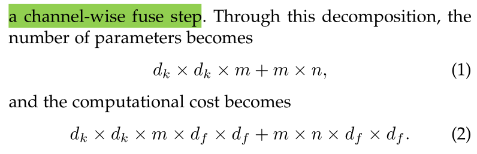

参数量：$d_k * d_k * m + m * n$

FLOPs:$d_k * d_k * m * d_f * d_f + m * n * d_f * d_f$


##### 3.1 Channel-Wise Convolutions

- **产生原因：克服1x1卷积全连接模式带来的大规模参数量的缺点。**

- 即使用面向通道的一维卷积；

- 好处： **the connection pattern between input and output channels** becomes sparse, where each output feature map is connected to a part of input feature maps.

- 运用一维卷积，实现从M个特征图中随机选择几个非每次数目固定的特征图用于生成一张输出特征图，如果真是如此，那么一维卷积如何实现该效果？

  ```
  def rev_conv2d(outs, scope, rev_kernel_size, keep_r=1.0, train=True, data_format='NHWC'):
      if data_format == 'NHWC':
          outs = tf.transpose(outs, perm=[0, 3, 1, 2], name=scope+'/trans1')
      # 截至到上一步得到的数据格式：N,C,H,W;
      pre_shape = [-1] + outs.shape.as_list()[1:] #pre_shape: -1,C,H,W
      hw_dim = np.prod(outs.shape.as_list()[2:]) #hw_dim: H*W
      new_shape = [-1, outs.shape.as_list()[1]] + [hw_dim] #new_shape:  -1,C,H*W
      outs = tf.reshape(outs, new_shape, name=scope+'/reshape1')
      num_outs = outs.shape.as_list()[-1] # num_outs:H*W
      kernel = rev_kernel_size # 一般都是3；
      outs = conv1d(
          outs, num_outs, kernel, scope+'/conv1d', 1, keep_r, train) # outs:-1,C,H*W
      # TF官网给出介绍，无论数据是几维，卷积作用的都是倒数第二个维度。
      outs = tf.reshape(outs, pre_shape, name=scope+'/reshape2')
      if data_format == 'NHWC':
          outs = tf.transpose(outs, perm=[0, 2, 3, 1], name=scope+'/trans2')
      return outs
  
  # 在这里-1,C,H*W，HW才是通道数，而C作为倒数第二个维度是被卷积的维度，卷积核的大小是[kernalsize，H*W],最终得到的是[C-kernalsize+1，H*W]
  def conv1d(outs, num_outs, kernel, scope, stride=1, keep_r=1.0, train=True,
             data_format='NHWC', padding='same'):
      df = 'channels_last' if data_format == 'NHWC' else 'channels_first'
      outs = tf.layers.conv1d(
          outs, num_outs, kernel, stride, padding=padding, use_bias=False,
          kernel_initializer=tf.truncated_normal_initializer(stddev=0.09),
          data_format=df, name=scope+'/conv1d')
      if keep_r < 1.0:
          outs = dropout(outs, keep_r, scope=scope)
      return outs
  ```

  > 代码参考:https://github.com/HongyangGao/ChannelNets/blob/20bd062225f7bb464546a553db5d3a59ae2d7107/utils/ops.py#L108
  >
  > 其中的一维卷积参考文章：https://blog.csdn.net/qq_42004289/article/details/105367854

- 参数量：$d_k * d_k * m + m * n$

  FLOPs:$d_k * d_k * m * d_f * d_f + d_c * m * n * d_f * d_f$

  

##### 3.2 Group Channel-Wise Convolutions

- **产生原因：是基于shuffleNet，不能够得到全面的局部信息的问题而提出的一个fusion Layer方法。**

- Group Channel-Wise Convolution **只是代表一层计算结构而不是全部的网络结构**，其他的卷积也是如此的道理；

  因此GCWC并不包含depth-wise Conv；

  以图c为例，其网络结构解释为：depth-wise convolution --> 1 x 1 group convolution --> group channel-wise convolution；

  以此真正地实现组间交流与组内交流。

- 代码：

  ```python
  def simple_group_block(outs, block_num, keep_r, is_train, scope, data_format,
                         group, *args):
      results = []
      split_outs = tf.split(outs, group, data_format.index('C'), name=scope+'/split')
      for g in range(group):
          cur_outs = single_block(
              split_outs[g], block_num, keep_r, is_train, scope+'/group_%s' % g,
              data_format)
          results.append(cur_outs)
      results = tf.concat(results, data_format.index('C'), name=scope+'/concat')
      return results
  
  def single_block(outs, block_num, keep_r, is_train, scope, data_format, *args):
      num_outs = outs.shape[data_format.index('C')].value
      for i in range(block_num):
          outs = dw_block(
              outs, num_outs, 1, scope+'/conv_%s' % i, keep_r, is_train,
              data_format=data_format)
          #outs = tf.add(outs, cur_outs, name=scope+'/add_%s' % i)
      return outs
  ```

  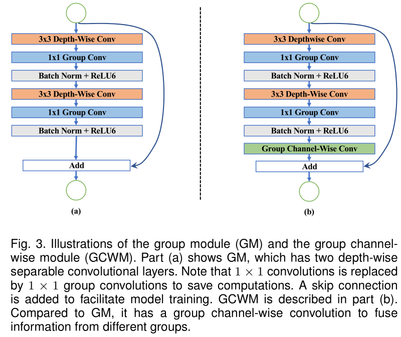

  > 注意GM的具体细节是a：两个bw_block；GCWM的细节是b：两个bw_block+skip connect + GCWC;


- 1)**Depth-wise Separable Conv**

  参数量：$d_k * d_k * m + m * n$

  FLOPs:$d_k * d_k * m * d_f * d_f + m * n * d_f * d_f$

  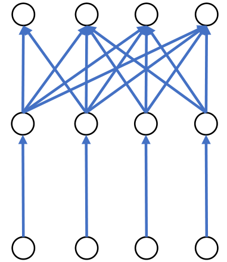

  2)**Depth-wise Separable Channel-wise Conv**  存疑

  参数量：$d_k * d_k * m + m * n$

  FLOPs:$d_k * d_k * m * d_f * d_f + d_c * m * n * d_f * d_f$

  3)**Group Channel-Wise Convolutions**

  参数量：$d_k * d_k * m + m/g * n/g * g + d_c * g$

  FLOPs:$d_k * d_k * m * d_f * d_f + n/g * m/g * d_f * d_f * g + d_c * n/g * d_f * d_f * g$

  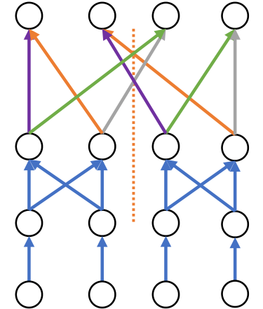

  4)**Depth-Wise Separable Channel-Wise Convolutions**

  参数量：$d_k * d_k * m + d_c$

  FLOPs:$d_k * d_k * m * d_f * d_f + d_c * n * d_f * d_f$

  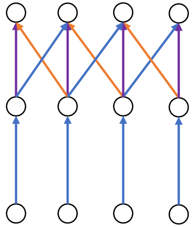

  > <u>观察3和4，这里的channel-wise如果没有组的概念，则使用同一个1D卷积核，使得每相邻的三个特征图得到一个特征图。这种情况下，其实没有指定输出的特征图的数目，似乎的感觉？？？</u>
  >
  > 上一句话是错误的；
  >
  > 4中channel-wise的参数量只是一个卷积核的数目，但是能够输出跟输入特征图数目一致的输出特征图数，是因为1D卷积面向通道，共用一个卷积核，而输出的特征图其实就是1D卷积每次移动计算得到。**这一点不同于之前的1X1卷积与常规的卷积，他们面向H和W，输出的特征图数目取决于卷积核的数目而非channel-wise一样取决于卷积核移动的次数。**
  >
  > 类似的，3中的channel-wise部分是g个卷积核。即每个组组内各自的卷积核进行移动卷积。**从3图中观察，感觉组间并没有交流，但其实并不是这样，这一点要参考论文中的描述：** Each channel-wise convolution uses **a stride of g** and outputs n/g feature maps with appropriate padding. **重点就在于步长为g。**

  


##### 3.3 Depth-Wise Separable Channel-Wise Convolutions

基于Group Channel-Wise Convolutions的一种特殊情况：组数等同于输入和输出的特征数目，即每个group中只有一个特征图。

- **产生原因：是对Group Channel-Wise Convolutions的改进——去除组概念，减少参数量**

- **如此，1X1group卷积就变成了depth-wise卷积。**
- 如此，将m个具有m步长的channel-wise卷积核，被替换成一个公有的步长为1的channel-wise卷积。**能够有效减少参数量。**

- 与e depth-wise separable convolution with the channel-wise convolution相比，该卷积替代了后者中的1X1卷积，以实现`The connections among channels are changed directly from a dense pattern to a sparse one.`

##### 3.4 Convolutional Classification Layer

- **研究原因：先前的compression Methods对卷积网络的最后一层的全连接模式引起的参数量关注比较少。**因而想要将DWSCWConv应用到分类层；

  倒数第二层通常是一个全局池化层，将特征图图的空间维度锐减至1x1；

- 具体做法：倒数第二层通过一个与倒数第三层的输出特征图空间大小一致的卷积核的depth-wise卷积，达到与全局池化层的**形式效果**一般。

  > 我觉得这里应该强调一下形式效果，因为其确实与内在的语义\意义效果不同。

  最后一层全连接层被替换为一个1X1卷积层。

  如此形成了一个特殊的depth-wise separable convolution.

- 具体做法2：最后一层通过channel-wise替代。

  但是这种做法（depth-wise后接channel-wsie)可以通过一个常规的3D卷积构成；

  > 之所以这里的channel-wsie不是通过1D卷积实现而是通过3D，而是前者不需要保留特征图的空间信息，而后者可以保留。**但是个人认为空间信息的保留并没有什么意义。**
  >
  > 之所以使用3D卷积的另一个原因是，depth-wise同样可以通过扩增到5维度以使用三维的卷积核 $d_f * d_f * 1$（这里的通道对应的维度并不进行卷积）。而channel-wsie如果同样扩增到5维度，之后使用卷积核$1*1*d_c$ ，借由一个认知：**连续两个三维卷积可以一个三维卷积，反之亦成立**
  >
  > 其实这样通过CCL得到了一个五维数据，但是因为二三维度卷积后为1，因从代码中是通过squeeze进行降维。就可以得到。

  其中channel-wise为了实现输出N个值，因此将一维卷积核设置为Valid Padding、stride=1，kernel_size=(m-n+1)，这样每个类依赖于m-n+1个特征图，同时这几个特征图是相连的。

- 做法2的方式是为了模仿DWSCW Conv，但是它存在一些问题，从其优点、缺点两个方面解释：

  - 优点：极大地减少了parameters；
  - 缺点：影响了性能；
    - 1 预测类别的顺序不同，预测准确率会受到影响，因为：**相互挨着的预测类别存在m-n个相同的神经元；另外，因为channel-wise使用了共享的一个卷积核，因此每个类别依赖的m-n+1的神经元的权重是相同的。**

##### 3.5 ChannelNets

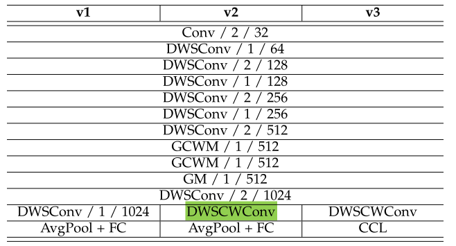

- ChannelNet-v123的具体细节：

  - ChannelNet-v1

    - Group channel-wise convolution
    - 本文设计了GM和GCWM两个模块。
      - GM应用了1X1组卷积和一个残差块；GCWM通过一个GCWConv解决数据组间信息不一致性。
      - 每一个module都可以替代MobileNet中的连续的两个depth-wise Separable Conv。
      - MobileNet中的六个连续的DWSConv被两个GCWM和一个GM代替。
    - second-to-the-last layer：Depth-wise Separable Convolution

  - ChannelNet-v2

    - Group channel-wise convolution（主体不变）

    - second-to-the-last layer：**Depth-wise Separable Channel-wise Convolution**，是为了 **trade-off between efficiency and performance.**

      一方面（**DWSCWConv的缺点**）：GCWM中channel-wise卷积的卷积核大小的特殊安排，使得不同组中的特征图进行融合；

      而DWSCWConv它阻碍了特征图之间的信息交流。

      > 这一点不明白，是因为固定顺序才引起的吗？

      另一方面（**DWSCWConv的优点**）：因为DWSCW比GCWM的参数量少，**因而通过将DWSCW替换GCWM放在倒数第二层**，减少参数量和计算量。

      > 因为它是既有优点也是有缺点的，因此运用它但是只运用到部分位置而不是全部层。因此ChannleNet的主体依旧是DWSConv。

    - 效果：better compression level with acceptable performance loss。

  - ChannelNet-v3
    - CCL to compress the classification layer.

  

  

  

- DWSConv、DWSCWConv和GCWM的区别:

  - DWSConv” denotes the depth-wise separable convolution   图a
    **dw_block: tf.nn.depthwise_conv2d --> 1X1**

  - “DWSCWConv” denotes the depth-wise separable channel-wise convolution 图d
    **dw_block：tf.nn.depthwise_conv2d --> 1D**  

    > channel-wise本质是一个1D卷积，但是因为面向通道C进行卷积，而附有一层语义，因此另取名，表达其面向通道做卷积以减少通道间信息交流程度同时减少计算量的意义和目的。
    >
    > 其实这里最核心的就是面向通道维度的1D卷积，如果步长为1，且窗口大小小于输入通道数，则可达到part的效果 ` each output feature
    > map is connected to a part of input feature maps`；而步长不为1，则又可产生一层part效果。

  - GCWM  group channel-wise module  图c
    **simple_group_block :** 
        先分组；组内DWSCWConv，组间concat；不同的是图C中做了两次的channel-wise（这里因为各组的特征图都是2，所以也可以理解成1X1卷积，但是作者想表达的海还是channel-wise）;
        简单的过程是：Group --> tf.nn.depthwise_conv2d --> 1D --> 1D-->...-->1D;

    > 因此可以说，GCWM的全程是**Grouped** **N**-depth-wise separable channel-wise convolution，突出其组概念和DWSCWConv的重复结构；
    >
    > 其中 **DWSCWConv的重复结构** 是从代码的角度看，而如果单从图c看，应该是channel-wise的重复结构，而不是重复涉及depth-wise过程；

  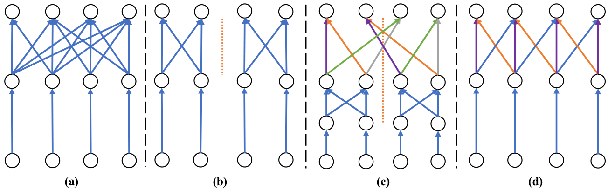

  

- MobileNet的空间结构

  ```mermaid
  graph LR
  	images --> conv_s:conv2d --> dw_block:conv_1_0--> concat:add0;
  	conv_s:conv2d --> concat:add0;
  	
  	concat:add0 --> dw_block:conv_1_1 --> dw_block:conv_1_2--> concat:add1;
  	dw_block:conv_1_1 --> concat:add1;
  	
  	concat:add1 --> dw_block:conv_1_3 --> dw_block:conv_1_4--> concat:add2-->outs1;
  	dw_block:conv_1_3 --> concat:add2;
  	
  	outs2 --> dw_block:conv_1_5 --> simple_group_block:conv_2_1--> add:add21;
  	dw_block:conv_1_5 --> add:add21;
  	
  	add:add21 --> get_block_func:conv_2_2 --> get_block_func:conv_2_3--> add:add23;
  	get_block_func:conv_2_2 --> add:add23;
  	
  	add:add23 --> dw_block:conv_3_0 --> dw_block:conv_3_1--> get_out_func:out-->outs;
  ```

- MobileNet的代码细节：

  ```python
  # block_func: conv_group_block  : pure_conv2d --> dw_conv2ds-->pure_conv2d
  # out_func: out_block: dense
  
  cur_out_num = self.conf.ch_num
  # 1 Conv / 2 / 32
  outs = ops.conv2d(images,2)
  cur_out_num *= 2
  # 2 DWSConv / 1 / 64
  cur_outs = ops.dw_block(outs,1)
  outs = tf.concat([outs, cur_outs], axis=1, name='add0')
  cur_out_num *= 2
  # 3 DWSConv / 2 / 128
  outs = ops.dw_block(outs,2)
  # 4 DWSConv / 1 / 128
  cur_outs = ops.dw_block(outs, 1)
  outs = tf.concat([outs, cur_outs], axis=1, name='add1')
  cur_out_num *= 2
  # 5 DWSConv / 2 / 256
  outs = ops.dw_block(outs, 2)
  # 6 DWSConv / 1 / 256
  cur_outs = ops.dw_block(outs, 1)
  outs = tf.concat([outs, cur_outs], axis=1, name='add2')
  cur_out_num *= 2
  # 7 DWSConv / 2 / 512 -------------------- dw_block
  outs = ops.dw_block(outs, 2)
  # 8 GCWM / 1 / 512 -------------------- group singleblock dw_block
  cur_outs = ops.simple_group_block(outs)
  outs = tf.add(outs, cur_outs, name='add21')
  # 9 GCWM / 1 / 512 -------------------- singleblock dw_block
  outs = self.get_block_func()(outs)
  # 10 GM / 1 / 512 -------------------- singleblock dw_block
  cur_outs = self.get_block_func()(outs)
  outs = tf.add(outs, cur_outs, name='add23')
  cur_out_num *= 2
  # 11 DWSConv / 2 / 1024
  outs = ops.dw_block(outs, 2)
  # 12 DWSConv / 1 / 1024 --- DWSCWConv --- DWSCWConv
  outs = ops.dw_block(outs, 1)
  # 13 AvgPool --- FC AvgPool --- FC CCL
  outs = self.get_out_func()(outs)
  return outs
  ```

  需要说明的是：
  1 `get_block_func `函数选择的其实是single_block，它代表`block_num个dw_block`。
  2 `get_out_func`函数目前不用管。
  3 `dw_block `中先进行`depth-wise`卷积，之后选择：
  	1X1卷积（`DWSConv：depth-wise separable convolution`）
  	或者
  	1-D卷积（`DWSCWConv：depth-wise separable channel-wise convolution`）

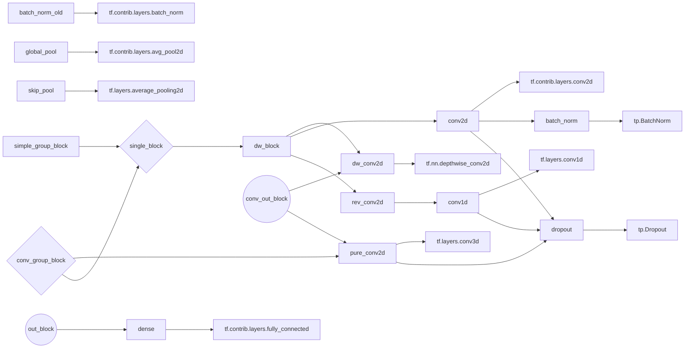
```mermaid
graph LR;
	batch_norm_old --> tf.contrib.layers.batch_norm;

	global_pool --> tf.contrib.layers.avg_pool2d;
	skip_pool --> tf.layers.average_pooling2d;
	
	dw_block --> dw_conv2d;
	
	dw_block --> conv2d;
	dw_block -->rev_conv2d-->conv1d;
	
	conv2d-->tf.contrib.layers.conv2d;
	conv2d-->batch_norm;
	conv2d-->dropout;
	
	batch_norm -->tp.BatchNorm;
	dropout --> tp.Dropout;
	
	conv1d-->tf.layers.conv1d;
	conv1d-->dropout;
	
	dw_conv2d --> tf.nn.depthwise_conv2d;
	pure_conv2d --> tf.layers.conv3d;
	pure_conv2d --> dropout;
	
	id1((conv_out_block))-->dw_conv2d;
	id1((conv_out_block))-->pure_conv2d;
	
	id2((out_block)) --> dense;
	dense --> tf.contrib.layers.fully_connected;
	
	id3{conv_group_block}-->pure_conv2d;
	id3{conv_group_block}-->id4{single_block};
	simple_group_block --> id4{single_block};
	id4{single_block} --> dw_block;
```


##### 3.6 Analysis of Convolutional Classification Layer（分析全连接分类层和卷积分类层间的两个主要不同）

- first difference：

  - FC：每一个类别的预测基于上一层的所有特征；

  - CCL：only a small subset of features are used；

    基于一个假设：基于a small number of features 预测一个类别是 sufficient。

    **全连接层的权重矩阵是稀疏的sparse，而每个权重值can be interpreted as the importance of a feature to a class，the sparsity pattern indicates that the prediction of each class has used only a few important features**。

    CCL的局限性是：

    - 每一次预测使用了固定数目大小的特征；
    - 这些特征又需要放在一起。因为所依赖的m-n+1个特征是连续相挨着的。

- Second Difference： weight-sharing property of convolutions

  -  FC：the predictions of two different classes have two independent sets of weights；

    **换句话说，若是基于相同的特征图的集合，每个类别determines the weights on these features independently.**

  - CCL：the predictions of all classes **share the same set of weights** in the convolutional classification layer, as the channel-wise convolution scans the features **using the same kernel**. 

    **换句话说，Different classes just base on different features corresponding to the same weights.**

    但是这种机制是problematic，相邻的两个类别具有相同的m-n个特征图，只是权重不同，而这样的关系（shift classes and share weights relation）如果成立，那么就存在这么一个假设： adjacent features have the same importance to adjacent classes。但是考虑到特征和类别的种类和顺序的多样性，上面的假设not valid。

- 总的来说，涉及两个假设：

  - 假设1：比较合理；
  - 假设2：too restrictive and lead to performance loss，moreover，如此的CNNs 变得对类别的order sensitive。

  > **这种所设计的结构给出一个相应的解释与假设，且通过实验证明假设的思路是值得称赞的；**

##### 3.7 Convolutional Classification Layer without Weight-Sharing

- 改进：**每个类别的预测拥有不同的权重，同时保持只基于部分特征做预测的特点**。

- 效果： It results in better performance than the convolutional classification layer and alleviate the sensitivity to the order of classes by relaxing the second assumption, as shown by experiments in Section 4.10.

  无权重的CCL引进了更多的训练参数但是suffer less from performance loss.**但是有权重和无权重的CCL拥有same amount of computation。**

  **因此，无权重的CCL achieves a good trade-off between performance and computational resource requirement**

  根据所需的压缩级别，在实践中，原始或没有权重共享的卷积分类层可能会用来替换紧凑型 CNN 中的全连接分类层。

- 具体改进方式：原有的CCL设置为无权重的CCL，同时在CCL之前添加一个GAP层，以避免parameter explosion。

  > 问题是，CCL中的depth-wsie卷积层本来就是替代GAP，那么这里再添加GAP，其ksize是多少？

  

#### 4 EXPERIMENTAL STUDIES

 ablation studies 消融实验

##### 4.1 数据预处理

same data augmentation process in 【5】

scaled to 256 x 256；

 Randomly cropped patches with a size of 224×224 are used for **training**.

 During **inference**, 224×224 center crops are fed into the networks.

##### 4.2 Experimental Setup

- GCWM kernal 8；DWSCWConv 64；CCL: 7 × 7 × 25 
- All models are trained using the stochastic gradient descent optimizer with a momentum of 0.9 for **80 epochs** ；
-  The learning rate starts at 0.1 and decays by 0.1 at the 45 th , 60 th , 65 th , 70 th , and 75 th epoch。
- Dropout [46] with a rate of **0.0001** is applied after **1 × 1 convolutions**
-  We use 4 TITAN Xp GPUs and **a batch size of 512** for training, which takes about **3 days**.

##### 4.3 Comparison of ChannelNet-v1 with Other Models

- 三个方面： top-1 accuracy, the number of parameters and the computational cost in terms of FLOPs。

##### 4.4 Results on MobileNetV2

- 说法：准确度相似但是flops或者参数量相差较大
  - ChannelNet-v1 achieves nearly the same performance as 1.0 MobileNet with a 11.9 % reduction in parameters and a 28.5 % reduction in FLOPs
  - MobileNetV2 with group channel-wise convolutions achieves almost the same performance as MobileNetV2 while saving 0.4 million trainable parameters。

##### 4.5 Comparison of ChannelNets with Models Using Width Multipliers

- https://zhuanlan.zhihu.com/p/33007013 中简单讲述了Width Multipliers；

- 注意这种在低层reduce width并不会引起significant compression,而且会hinder performance。

  同时，相对来说，保证深度模型浅层的通道数是比较重要的；

  而ChannelNet则选择了不同的方式以compression：**replacing the deepest layers， 即 CCL**

- 实验

  - 实验1：We apply width multipliers {0.75,0.5} on both MobileNet and ChannelNet-v1 to illustrate the impact of applying width multiplier

  - 实验2： we compare ChannelNet-v2 with 0.75 MobileNet and 0.75 ChannelNet-v1, since the numbers of total parameters are in the same 2.x million level

  - 实验3： For ChannelNet-v3, 0.5 MobileNet and 0.5 ChannelNet-v1 are used for comparison, as all of them contain 1.x million parameters.

  以上实验的原则都是：similar compression levels（**参数量和FLOPs**）

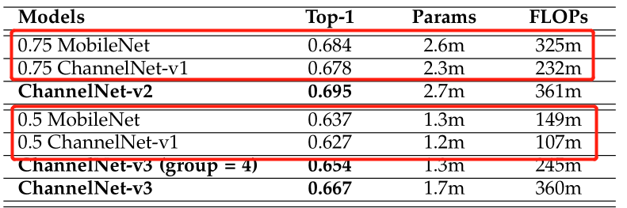

​	**以上实验证明了：DWSCW好于dws；CCL略GAP+FC；**

##### 4.6 Study of Group Channel-Wise Convolutions

- group channel-wise convolutions are extremely efficient and effective information fusion layers for **solving the problem incurred by group convolutions.**

##### 4.7 Performance Study of the Number of Groups in ChannelNets

-  值得选择：GCWMs in [2,3,4] , which cover a **reasonable** range

- 效果：We can observe that the performance decreases as the number of groups increases, while the number of total parameters decreases.

  **However, the performance loss is relatively large with a small amount of reduction in model size.**

  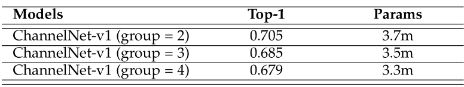

  > 因为通过改变group以期望通过牺牲少量准确度来降低参数量的效果没有达成，但是通过应用CCL来降低参数量同时维持不错的准确度，因而不在group上过度纠结。转而CCL和DWSCW。

##### 4.8 Sparsity of Weights in Fully-Connected Classification Layers

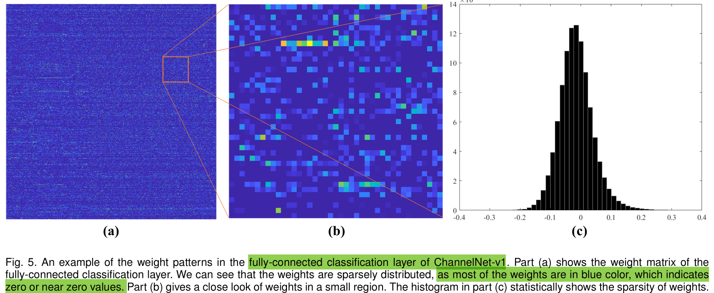


##### 4.9 Impact of Class Orders on Convolutional Classification Layer

- Specifically, since adjacent classes **share features and classification weights,** **more effective feature sharing** can be achieved **when similar classes are placed to be close** to each other.

  由此， For similar classes, they may employ similar important features for prediction, which results in similar weight vectors for similar classes. 

- Based on this insight, each column vector of size 1024 in the weight matrix can be used as **the feature vector of a class**

  两个类别的特征表达向量，通过余弦相似度来评估。

- 实验结果---margin概念

   The network trained using the random order with seed 100 outperforms that trained with the original order **by a margin of 0.5%。**

##### 4.10 Results on Convolutional Classification Layer without Weight-Sharing

- 无权重CCL的准确度较高（无权重CCL的参数量相对较多）；variance 较小，表示对class的order不敏感；

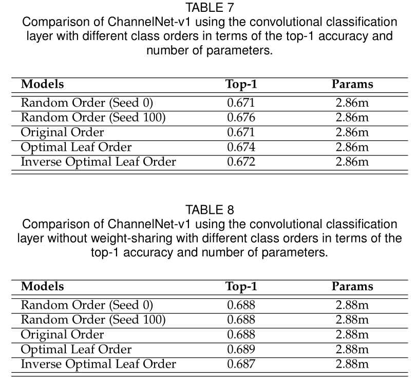

##### 4.11 Ablation Study of Different Classification Layers

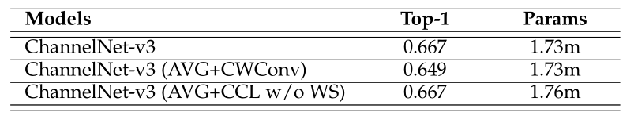

> 这里的参数不明确：v3的CCL的核大小；第三个模型中，avg和ccl共存，那么ccl中的depth-wise卷积是否还存在？


### 4 - 2016《[Temporal segment networks: Towards good practices for deep action recognition](https://link.springer.com/chapter/10.1007/978-3-319-46484-8_2)》

- 代码：https://github.com/yjxiong/tsn-pytorch

**摘要：**提出了TSN对long-range时序结构建模；使用了一个sparse temporal sampling strategy。

#### 1 Introduction

行为识别领域中，两个重要的互补的方面是： appearances and dynamics，motion spatial temporal motion是一种更细节的内容。

作者认为识别系统的性能取决于是否能够提取出相关信息，并由此充分使用这些信息。

The performance of a recognition system depends, to a large extent, on whether it is able to extract and utilize relevant information therefrom.

视频识别中有些内容比较复杂，比如 scale variations 尺度变化、视角变动以及相机移动。我们希望做的事是处理这些挑战以保留动作类别的分类信息 preserve categorical information of action classes.

虽然深度卷积网络很厉害，但是视频分类并不同于图像分类，深度卷积并没有取得比人工特征要好的结果。

作者认为，基于深度卷积的视频行为理解中的两个阻碍：

一是long-range时序结构的建模；目前的一些尝试是**以预定义好的采样间隔**进行密集时序采样，但问题是会引起过度的计算成本。计算成本的过度**限制了其应用，同时如果样本长度超过模型最大长度，会损失视频的重要信息**

二是现存的数据集比较小且不够丰富多样。

两个阻碍进而产生两个问题：

- 如何设计出有效且高效的能捕获long-range时序结构的模型；
- 如何使卷积网络在给定的样本内容下学习到区别性特征；

本文模型结构分析：

- 基于成功的双流模型进行实验；
- 因为视频中连续帧存在高度的重复性，因而 引起高度相似的采样结果的 **密集采样策略被废除，取而代之的是稀疏的时序采样策略**

#### 2 Related Works

###### Convolutional Networks for Action Recognition.

> 论文阅读越多以后，越发觉得Openpose的论文的对比模型缺乏合适的正规的模型比较；对比模型的路子都比较野；
>
> 论文修改势在必行。

###### Temporal Structure Modeling.

所提出的时序语义模型是**第一个**在**完整视频**中实现**端到端**时序结构建模的框架。

#### 3 Action Recognition with Temporal Segment Networks

##### 3.1 Temporal Segment Networks

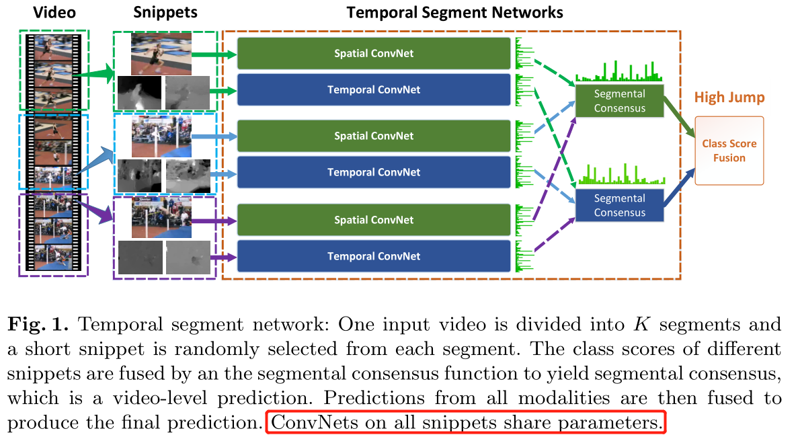

复杂的行为，比如体育行为，由多个过程构成并且跨越一个相对较长的时间。

稀疏采样策略：一段视频分成K个segment，每个segment依旧相对较长，因而内部随机采样得到更短的一个snippet，由此一段视频分成了K个snippet。

函数G用来融合不同snippets的分类结果，空间的或时序的；

函数H用来融合不同空间和时序的Consensus。

函数G尝试了平均、最大化、加权平均等方式发现平均更好；

H是softmax函数。

##### 3.2 Learning Temporal Segment Networks

###### Network Architectures.

BN-Inception as  building block，由于其很好的权衡性于准确率和有效性之间。

###### Network Inputs.

探究多种模态数据对时序段网络的区别性特征的增强作用。

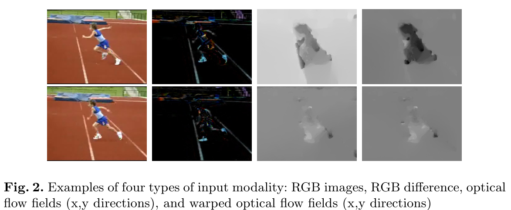

- 单张RGB图片通常使用的是某一时刻的静态表观特征，因而缺乏前后帧的上下文信息。
- RGB difference 是通过两个连续帧相减得到以描述表观特征的变化。而这样的变化 **可能会对应于motion特征的突出区域** （这里说的是可能，推测，在下文会有一定的推翻）
-  stacked RGB difference
- optical flow field 作为输入是为了捕捉motion特征信息。但是现实中 **相机移动和光流场可能并不会专注于人类行为上，这一点从图2中即可以看出，只显示出人的与动作不相关的区域。**同时从图2也可以看出，大量的横向移动提亮了，就是因为相机的移动。
- warped optical flow 第一次评估单应性，然后补偿相机移动，正如图2可以看到的，它能够抑制背景的移动，同时移动更加专注于行为人身上。

###### Network Training.ton

主要介绍模型训练的问题是啥：数据量少引起的过拟合问题。

###### Cross Modality Pre-training

- 帽子|意义：**预训练操作已经被证明是一种有效的在目标数据集不存在足够训练样本的情况下初始化深度卷积模型的方法。 [1]**

  【1】Two-stream convolutional networks for action recognition in videos

- 过程：因为空间网络将RGB图片视为输入，因而自然地使用ImageNet来初始化模型；因为另外三种模态的数据不同于RGB图片，因此作者提出了交叉模态预训练技术，即使用**RGB模型**以初始化时序模型。具体地：

  - 首先，将光流数据通过线性转换以实现离散化。这样以使得光流数据的范围能够和RGB图片一致。
  - 然后，调整RGB模型第一个卷积层的权重以处理光流数据，特别的，将RGB数据的三个通道的权重平均化，其次，复制得到的平均值的倍数为时序网络输入的通道数目。

- 结果：工作很好，同时减少了实验中过拟合的影响。


###### Regularization Techniques. 

- 意义：批归一化是解决 **协变量偏移**问题的重要组件；

- 作用过程：在训练学习的过程中，批归一化会评估每个批次的激活值的均值和方差，并通过使用两个量以将每个批次的激活值转换到标准的高斯分布中。

- 问题：这种批归一化操作将会加速训练的收敛，同时导致转换过程中的过拟合问题。因为有限的训练样本的激活值分布的有偏估计的存在。

- 改进：因此在预训练模型的初始化之后，我们选择固定除了第一个批归一化层之后的所有批归一化层的均值和方差参数值；

- partial BN定义：因为光流数据和RGB数据的分布不同，第一个卷积层的激活值拥有不同的分布，因而我们需要重新评估均值和方差值。除此之外，我们在BN-Inception架构中的全局池化层之后应用一个额外的dropout层以减少过拟合的影响。

  

###### Data Augmentation.

- 原始的双流模型中，随机裁剪和水平翻转；

- 本文采用两种新的数据增强技术：角落裁剪和尺寸抖动；

  - 角落裁剪：所提取的区域仅仅从图像的中心和角落五个地方，以避免隐式地聚焦在图像的中心区域。

  - 多尺度裁剪技术：选择更加高效的尺寸抖动技术，即1 先将输入的图像尺寸固定在256X340；2 随机从一个集合{256,224,192,168}中随机选择得到裁剪区域的高度和宽度；3 将裁剪得到的图片resize到固定尺寸。

    而事实上，尺寸抖动技术不仅仅是可以做**尺寸抖动**，还可以做**纵横比抖动**。1

##### 3.3 Testing Temporal Segment Networks

由于所有片段级 ConvNet 共享时间段网络中的模型参数，因此学习模型可以像普通 ConvNet 一样执行逐帧评估。

- 遵从原始的双流模型的testing scheme，即从每个视频中采样25帧或flow，且裁剪出4个角落，1个中心和以上五个crop对应的水平翻转。
- 空间和时序网络的融合，采用一种加权平均的方式。

#### 4 Experiments

##### 4.1 Datasets and Implementation Details

-  **three training/testing splits for evaluation，report average accuracy over these splits；**（三折交叉验证）
- **初始化： initialize network weights with pre-trained models from ImageNet**
- **数据增强：location jittering, horizontal flipping, corner cropping, and scale jittering** 

##### 4.2 Exploration Study——训练策略和输入形态

训练策略包含：交叉模态预训练和部分不含dropout的BN

 (1) training from scratch；

(2) only pre-train spatial stream as in [1]；

(3) with cross modality pre-training；

(4) combination of cross modality pre-training and partial BN with dropout；

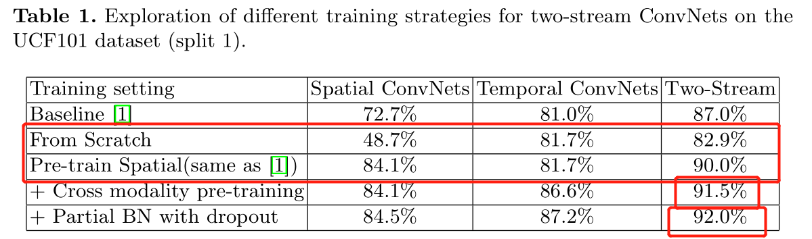

 training from scratch 是什么意思；双流模型作为baseline与 training from scratch的差别是什么？

输入形态包含：RGB difference 和 warped optical flow 扭曲的光流

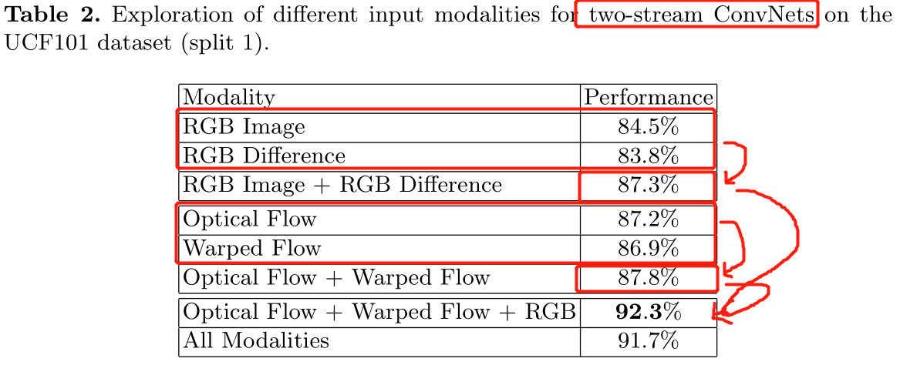

从table2中可以观察到：

- This result indicates that RGB images and RGB difference may encode complementary information. 互补的内容；
- 四种模态一同作用时得到结果变差，结论是：RGB difference may describe similar but unstable motion patterns 描述相似的但是不稳定的移动模态。光流可能更适合捕捉motion信息，而**RGB difference 可能在捕捉motion方面比较不稳**定。而另一方面，**RGB difference 捕获的可能是motion表示的一种low-quality, high-speed 低质量的、高速的替代品**。


##### 4.3 Evaluation of Temporal Segment Networks

- 测试函数G哪种形式比较好

  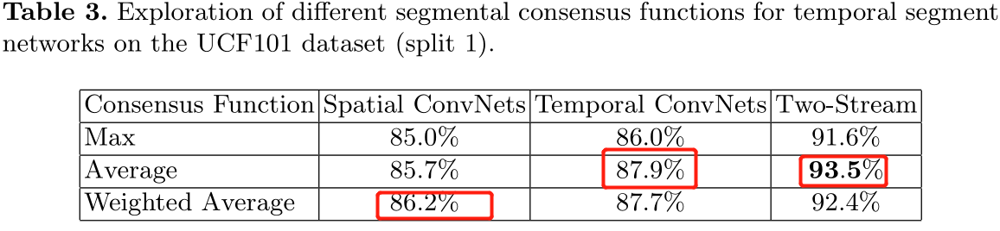

  > **确定好所提出模型的最优选择后，再与对比模型进行对比试验。**

- TSN与其他对比模型的对比实验

  

- component-wise分析，从左到右的每个实验中组件依次叠加。

  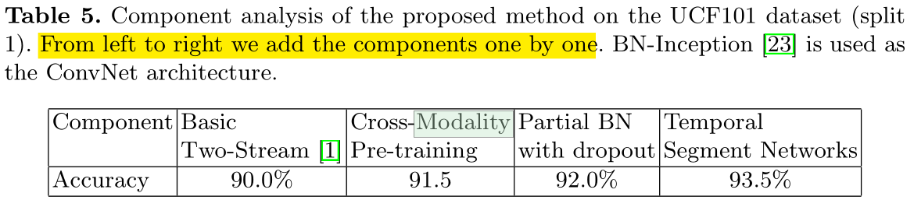

  > 如果我们的模型也是由多个组件（两个或以上）构成，我们也可以做这样的实验。

  

##### 4.4 Comparison with the State of the Art

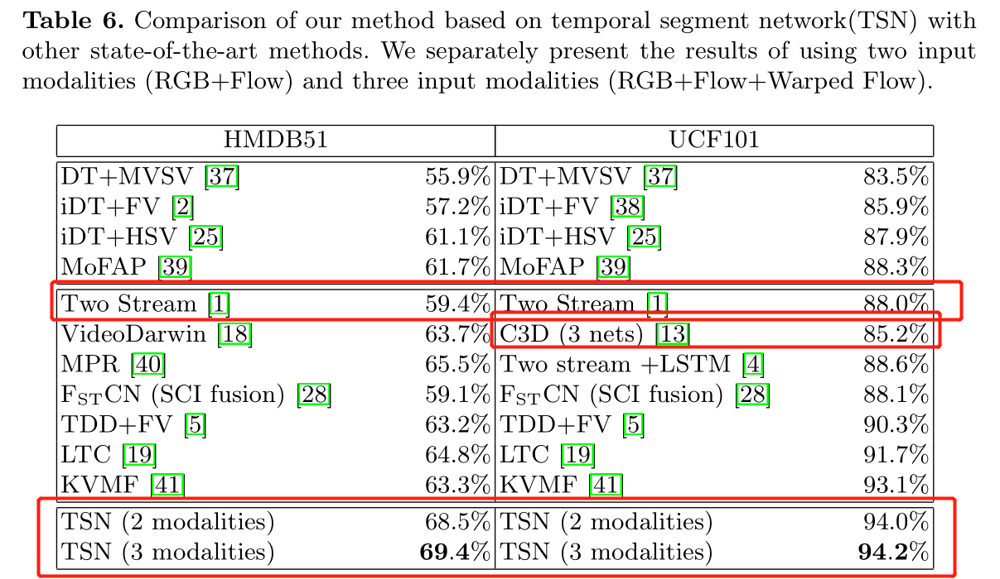


##### 4.5 Model Visualization

通过DeepDraw to attain further insight into the model。

[DeepDraw](https://github.com/auduno/deepdraw)绘图工具，不过问题是该工具基于Caffe框架。

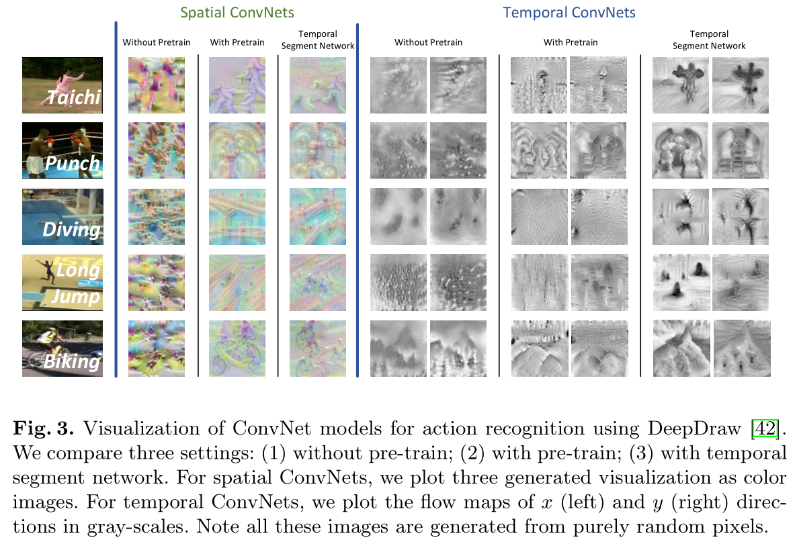

三种设置：未曾预训练、仅预训练和时序部分网络

现象：

- 未曾预训练的空域和时序模型几乎不能生成任何有意义的可视化结构；而预训练后的模型 capture structured visual patterns

- **如果模型是短时模型，比如对单帧识别，那么模型倾向于将场景模式和物体搞混，以作为行为识别的重要证据**；换句话说，结合了时序部分的模型，会发现动态物体的运动会成为主要特征信息。

  > 这一点非常重要：文献引用；关于卷积网络是否学到主体的特征，而非那些干扰内容：场景。

  

#### 5 Conclusion

TSN是一个定位于对长期时序结构建模的视频级框架。

它的性能不错，虽然需要额外的合理的计算成本。而这一点要归因于稀疏采样的语义结构sparse sampling segmental architecture，以及一系列好的实践行为。**前者成就了模型的有效和高效，而后者使得在有限数据集下训练模型且不过拟合成为可能。**


### 5 - 2019《TSM: Temporal Shift Module for Efficient Video Understanding》

CVPR 2019

- 代码： https://github.com/mit-han-lab/temporal-shift-module.

**摘要**：

TSM shifts part of the channels along the temporal dimension; thus facilitate information exchanged among neighboring frames。沿着时间的维度移动一些chnnel，以便于相邻帧之间的信息交流。

#### 1. Introduction

视频识别和图像识别之间的关键差别在于需要对时序进行建模；

> Kinects数据集必须研究，驾驶员异常行为检测 它具有行为识别的特殊性，只有搞清楚两种任务之间的差异，并针对差异想出解决方法，才能写出好论文。

3D卷积做视频理解可以实现对空间和时序的同时建模，但是计算成本比较大，**使在边缘设备上的部署变得困难。**

 Our intuition is: the convolution operation consists of **shift and multiply-accumulate**.We **shift** in the time dimension by ±1 and fold the multiply-accumulate **from time dimension to channel dimension**

> 又想起了速度不变性这一问题！是否TSM能够对这个问题的解决有启发性。

之所以online的处理方式中没有前向shift，**是因为实时分析中，未来的帧还未得到**。

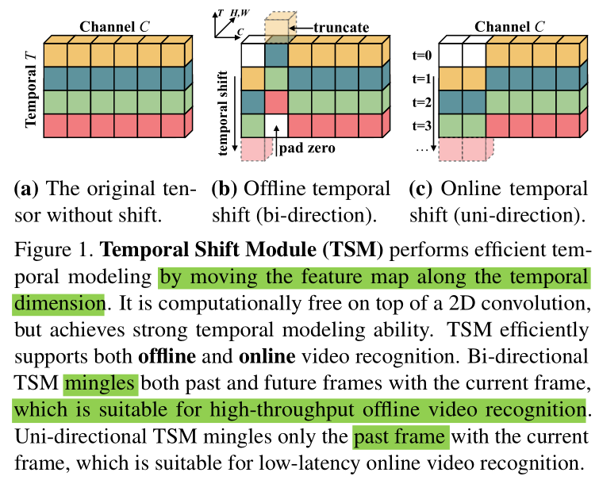

spatial shift strategy 会引起两个问题：

- 不高效：虽然0FKOPs但是数据移动引起了latency，即大量的内存消耗；

  —— temporal partial shift。

- 不准确：shift太多channel会伤害空间建模能力，从而引起performance  degradation。

  —— 将TSM模块插入到残差分支中，以保留当前帧的激活值。

  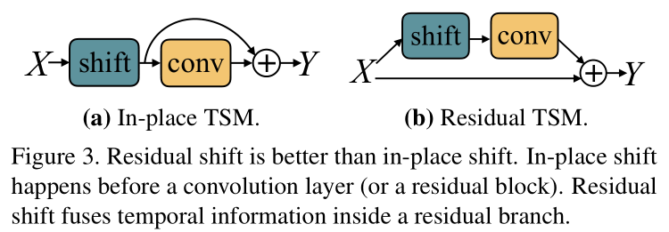

  

#### 2. Related Work

##### 2.1. Deep Video Recognition

**2D CNN.**

TSN模型从跨步抽样帧中提取平均特征。 extracted averaged features from strided sampled frames.

这些模型比3D模型更加高效率，但是不能推理时序顺序或者更加复杂的时序关系。

**3D CNN.**

3D卷积优势在于能jointly学习spatial-temporal特征。

劣势在于计算量大computationally heavy，and 使得部署很困难。同时拥有更多的参数数目；从而更加容易过拟合。

而TSM能够做到和3DCNN一样对时空特征建模，同时和2DCNN一样能够拥有相似的计算量和参数量。

**Trade-offs.**

有很多尝试是在变现里和计算成本之间做权衡， attempts to trade off expressiveness and computation costs

【27】提出一个motion filter，以从2DCNN中生成时空特征；

【46|53】提出2D和3D卷积的mixed模型，形式上是前几层为3D后几层为2D，或者相反；

【46 , 33 , 42 】将3D卷积分解为2D和1D；

总之，对于mixed模型，它们需要 remove low-level temporal modeling or high-level temporal modeling

> ???? 不懂是在说些什么？

而TSM则完全移除了时序建模中的计算成本。

##### **2.2. Temporal Modeling**

【49】提出时空非局域化模块以捕捉long-range依赖；

【50】提出将视频表达为时空区域图；

以上是3D的，以下是2D的；

【 13 , 9 , 58 , 7】同时使用2D卷积和posthoc fusion事后融合。

【 54 , 7 , 41 , 10 , 12】使用LSTM以aggregate2D卷积特征。

【 37 , 28 , 32】表明注意力机制对时序建模非常有帮助。

【58】提出时序关系网络以学习和推理时序依赖。

总的来说，3D模型计算量大，后者2D模型无法 **在特征提取阶段丢失了的有用的低级的时序特征信息**。—— **其实低级提取不出，就更不用说高级的；但是因为这些2D模型能够提取出时序特征但是提取的时序特征又没啥用，因此说提取的是低级的且无用。**

而TSM能够以2D的计算成本达到3D的对低级和高级时序特征的建模。

##### **2.3. Efficient Neural Networks**

【16 , 15 , 29 , 59 , 18 , 47】基于现有的模型进行 prune, quantize and compress 修剪、量化和压缩。

【51，57】表明Address shift地址转移 对硬件比较友好，同时它已经在2D卷积网络中被应用。**但是作者发现，shift应用到视频任务中，neither maintains efficiency nor accuracy, due to the complexity of the video data.**

#### 3. Temporal Shift Module (TSM)

TSM**背后的直观经验和认知intuition**：

 data movement and computation can be separated in a convolution. However, we observe that such naive shift operation **neither achieves high efficiency nor high performance**.

 two techniques minimizing the data movement and increasing the model capacity，which leads to the efficient TSM module.

> 一个idea的发展过程：简单实现---> efficient 实现。

##### 3.1. Intuition

以1D卷积为例，解析了卷积操作的形式；

##### 3.2. Naive Shift Does Not Work

原因是：

- 数据移动，引起 increases the memory footprint and inference latency on hardware 内存占用和推理延迟；

- 当移动当前帧的一些channel给相邻帧，被移动的channel中的信息不再能够被当前帧get到。由此会伤害空间建模能力。

##### 3.3. Module Design

**Reducing Data Movement.**

We measured models with ResNet-50 backbone and 8-frame input using no shift (2D baseline), partial shift ( 1/8,1/4,1/2 ) and all shift (shift all the channels).

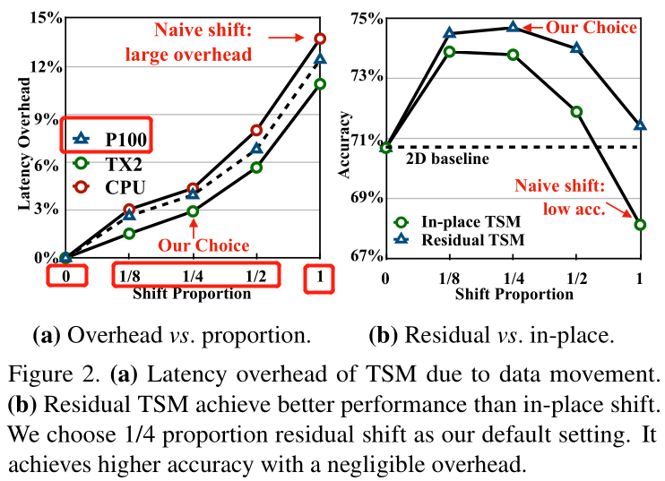

> 因此他们并没有完全克服这个问题，而是在缓解。

**Keeping Spatial Feature Learning Capacity.**

 **balance the model capacity for spatial feature learning and temporal feature learning**

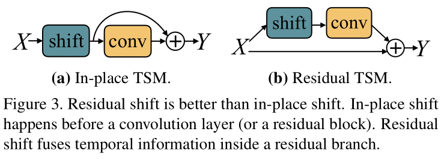

这里的解释非常好，论文是为了平衡\权衡空间建模能力和时序建模能力；

但是如果inplace，则TSM会伤害空间建模能力，因此使用了带有TSM的残差块；

#### 4. TSM Video Network

##### 4.1. Offline Models with Bi-directional TSM

Our proposed TSM model has exactly the same parameters and computation cost as 2D model.

> 上句话存在质疑：TSM在原来2D的基础上增加了残差块，那么参数量和计算成本应该有所变化才对。

A unique advantage of TSM is that it can easily convert any off-the-shelf 2D CNN model into a pseudo-3D model that can handle both spatial and temporal information, **without adding additional computation**。

> 这一点称为easily convert；但是还有一类相似的，称为Plug-and-Play 即插即用

##### 4.2. Online Models with Uni-directional TSM

 adapt TSM to achieve online video recognition **while with multi-level temporal fusion**

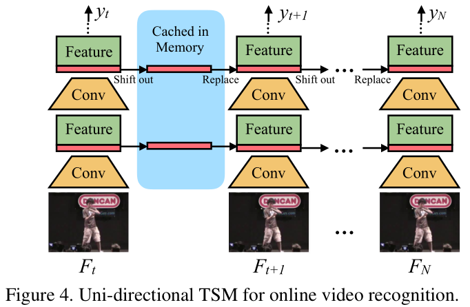

简单说就是上一帧八分之一的channel和下一帧的八分之七的channel合并作为下一层的输入数据。

这样的好处在于：

 Low latency inference .

 Low memory consumption

Multi-level temporal fusion 

有些在线模型仅仅能够实现后期时序特征融合或者中期；而TSM可以实现各个网络层级的融合，而这一点很重要。

#### 5. Experiments

##### 5.1. Setups

**Training & Testing.**

100 epoches；0.01 40 and 80  0.1；batchsize 64；dropout 0.5；

选择性pre-trained；选择性traing epoches；选择性fine-tune；选择性freeze BN；

不同数据集中每个视频中随机抽取多个clip；use 全精确度；

Testing： we used just 1 clip per video and the center 224 × 224 crop for evaluation

**Model.**

an apple-to-apple comparison 表示 同类事物的比较；

**Datasets.**

##### 5.2. Improving 2D CNN Baselines

**Comparing Different Datasets.** 

这里提及所使用的数据集分成两类：与时序相关程度高和低两类

**Scaling over Backbones.**

四种backbones， MobileNet-V2 [ 36 ], ResNet-50 [ 17 ], ResNext-101 [ 52 ] and ResNet-50 + Non-local module [ 49 ] ，其中后者最好；

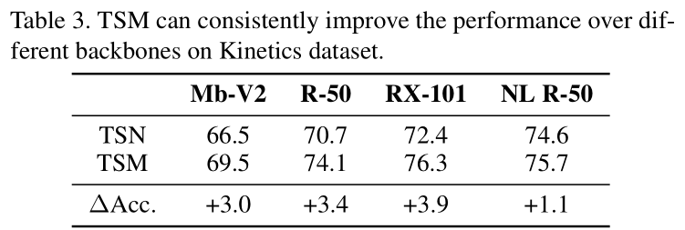

##### 5.3. Comparison with State-of-the-Arts

**Something-Something-V1.** 

表示非局域化模块与TSM正交，可以提升模型性能。

**Generalize to Other Modalities.**

 method can generalize to other modalities like optical flow.

**Something-Something-V2.**

**Cost vs. Accuracy.**

> 从something数据集的实验结果来看，TSN已经落伍了，因此不再审阅TSN而是I3D和C3D；

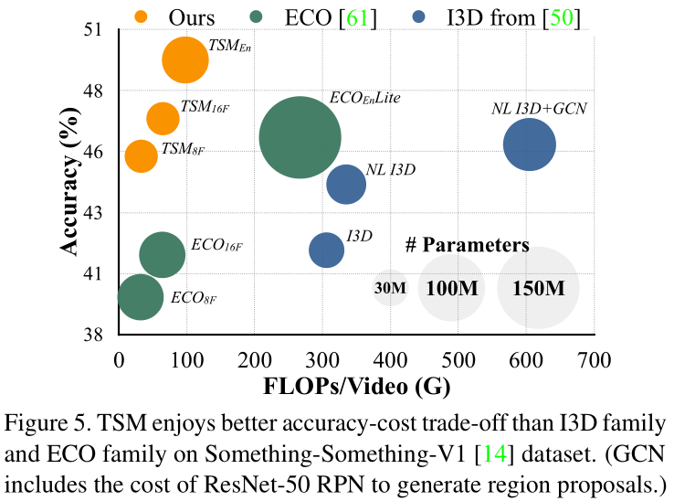


##### 5.4. Latency and Throughput Speedup 


##### 5.5. Online Recognition with TSM

**Online vs. Offline**

实验发现，有些数据集上线上模型要好，有些则比较差；

**Early Recognition**

Early recognition aims to classify the video while only observing a small portion of the frames. It gives fast response to the input video stream.

—— when only observing the first 10% of video frames

**Online Object Detection**

物体识别任务中的表现

**Edge Deployment**

边缘部署：在手机端衡量延迟和功率power。

#### 6. Conclusion

-  enable joint spatial-temporal modeling at no additional cost. 

-  exchange information with neighboring frames。


### 6 - 2019《SlowFast Networks for Video Recognition》

CVPR 2019    Facebook AI Research

https://github.com/facebookresearch/SlowFast.

#### 0 摘要

-  a Slow pathway, operating at low frame rate, to capture spatial semantics
-  a Fast pathway, operating at high frame rate, to capture motion at fine temporal resolution

#### 1 Introduction

- 如果所有的时空的取向are not equally likely，那么我们就不能对称地（平等地）对待空间和时间两个维度；

  这一点在 **基于spatialtemporal Conv的视频识别方法**中并不明确implicit。

  **因而，我们可能需要**分解这样的结构以单独地对待空间结构和时序结构。从认知的角度讲，视觉concept的 catagorical spatial semantics 分类空间语义通常**演变缓慢**。

  - 挥舞的手不会在挥舞动作的范围内改变他们作为“手”的身份；
  - 一个人的运动状态从走路变成跑步，并不会改变他们作为“人”的身份；

  因此分类语义的识别refeshed relatively slowly。

- 物体的motion却是会比物体的identity的演变要faster。

  例如拍手、挥手、摇晃、走路或跳跃

  因而，对潜在的fast changing motion 特征的建模需要使用 **fast refreshing frames（high temporal resolution）**

基于以上两个方面的认知，作者提出了一个模型：

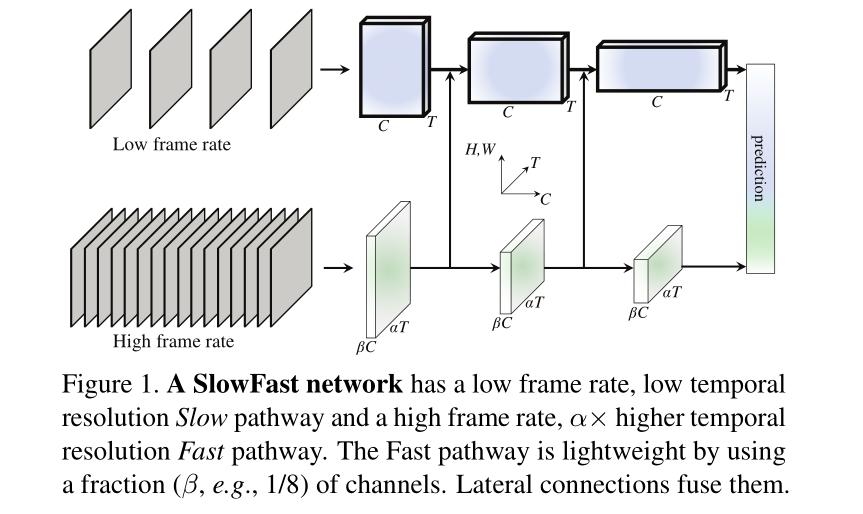

- OnePathWay：捕获sematic infor，based on a few sparse frames  ;

- Another：捕获rapidly changing motion based on  high temporal resolution 

  虽然该路径是high temporal rate，但是本模型中对该path的model设计是lightweight的；

  **This is because this pathway is designed to have fewer channels and weaker ability to process spatial information**

  > 这里的一个思想或原则不错：每一路径只负责一种信息的采集，而对于另一种信息从技术层面消除；**尤其是专注于本路径信息捕获的同时，降低对其他信息的捕获能力。**

  > 不同于双流模型的是，双流模型的每条路径都是相同的模型；那么这就造成一种问题：不同的数据集构造方式是否能够保证模型能够获取到空间、时序或者两者融合的信息。
  >
  > 具体的，2SAGCN 中的joint是涉及到了对空间和时序的信息的提取；而bone数据的图结构在可视化中被打乱，但是这种数据仍然要结合图结构进行分析，因而合理性需要认真分析。---- 需要进一步找证据否定

  > **极其普遍的思维\共识：获取到视频object的不同特征，而不同的特征采用不同的结构，一直都是如此；**
  >
  > **对于这一点，科研的两种做法：**
  >
  > **1 SlowPast。它同时对不同的特征采取不同的采样策略——speed。即相同的数据集，不同的采样策略不一样的特征提取结构，以获取不同的特征。**
  >
  > **2 2SAGCN，含有不同特征的数据集，采取相同的采样策略采用相同的特征提取结构，以获取不同的特征。**
  >
  > 相同的是，都是通过fusion的方式融合。
  
  
  
- conceptual idea： flexible and effective

  - 需要依赖大量frame才能获得运动特征的path，被设计地较为轻便，在牺牲较小准确度的同时提升效率；
  - 不需要依赖大量frame就可提取到空间特征的path，被设计得重量，在牺牲较小额外计算量的同时提升准确率。

  所以 灵活，所以高效；

  >  The Fast pathway, due to its lightweight nature, does not need to perform any temporal pooling—it can operate on high frame rates for all intermediate layers and maintain temporal fidelity。
  >
  > 这句话的意思反映了：任何的的采样策略都是与 **硬件资源承载和模型的特征提取能力之间的** trade-off。换句话说，如果硬件资源的计算能力十分强悍、所使用的模型的特征提取能力也十分强大，那么采样策略就不再需要。否则，就要 **接受“所提取的特征有保真度fidelity损失”。**
  >
  > ——对采样策略的思考。

- 与双流模型的不同：different temporal speeds —— a key concept in SlowFast。

  三个优点：

  - 双流模型采取不同流相同backbone的策略；而SlowFast根据**依赖的不同的数据量规模**采取不同的结构类型；‘

  - 不需要计算optical flow。
  - end  to  end  from raw data。

- The M-cells operate at high temporal frequency and are responsive to fast temporal changes, but not sensitive to spatial detail or color

  > 这一点特别有意思：擅长某件事的同时，不擅长某件事；
  > 而一般地，有些结构 擅长某件事的同时，并不擅长某件事，这种结构/特性十分有价值。

- SlowFast的愿景： We hope these relations will inspire more computer vision models for video recognition.

#### 2  Related Work

##### 2.1 Spatiotemporal filtering

- 概念：行为可以被认为是一个时空对象Spatiotemporal  object。

  通过spacetime的定向过滤，以获得spatial和temporal相融合的特征，因此称为spatialtemporal Feature——**时空特征不能分离。**

- 技术实现：3D卷积实现对时间和空间两个维度的**相似的特征提取过程**；related methods 比如，**通过时序步长实现的对长时段的过滤和池化**又或者将卷积分解成二维和一维。

  > 采样策略之一：卷积的stride非1步长与池化层。——这种话无所参考，就是理解，公认。

##### 2.2 Optical flow for video recognition

- Optical flow 是深度学习出现之前比较经典的、competitive的 **人工设计的特征** hand-crafted spatiotemporal feature。

- 双流模型不是端到端学习模型；

  > **在此，放弃了双流模型因为非端到端，同时放弃了optical flow的兴趣因为其hand-crafted and outdate。**
  >
  > —— 放弃了两个声明。
  >
  > 刚发现有人已经做过 slowFast 和 图卷积的结合：https://www.sciencedirect.com/science/article/pii/S0262885621000469 《Multi-stream slowFast graph convolutional networks for skeleton-based action recognition》
  >
  > 同时发现了SlowFast的pytorch实现版本：https://github.com/r1ch88/SlowFastNetworks
  >
  > 

#### 3 SlowFast Net

##### 3.1 Slow pathway

> 是否可以将即插即用与slowfast的生物知识相结合？
>
> 实际应用地讲，如何实现 行为速度不变性。

关键要点：

- 任何卷积模型；
- 较大的时序步长t，即每t帧选择一帧。实验最优值为16，相当于每半分钟取两帧。

##### 3.2  Fast pathway

another convolutional model

**High frame rate.**

将slowPath所依赖的帧数和fastpath中依赖的帧数 用一个比值 来联系。作为一个超参数。

**High temporal resolution features**

为了追求高分辨率，有两点做法：

- 不适用任何的下采样层downsampling layers——即不存在池化层也不存在**时序（而不是时序和空序两者的）**步长stride；

  唯一的下采样出现在分类层，是一个池化层。

- 使用所有的帧，以maintain temporal fidelity as much as possible.

  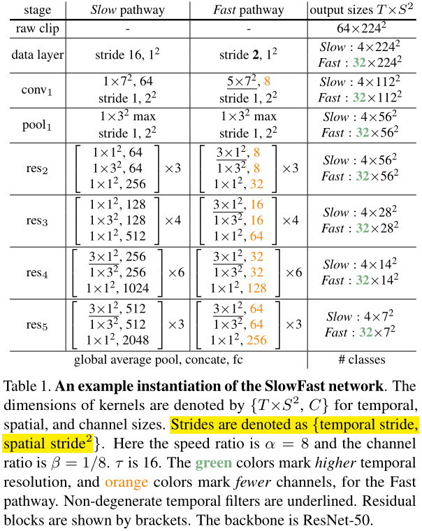

**Low channel capacity**

> 参考上图，通道数一直持续在32个，相对于双流模型中出现的256通道，确实比较少；This makes it lightweight。

**与SlowFast除了帧数不同、网络层不存在下采样，还存在一个差别：channel数存在ratio。**

> 假如在32的基础上增加为64，是否能够提升准确率呢？？？？？？？？
>
> 不过，原文已经解答这个问题了：The low channel capacity can also be interpreted as a weaker ability of representing spatial semantics.通道数目意味着表达能力的程度，可以认为是正比关系。具体的正向比例如何未知。但应该是前期增加一定的通道数和后期增加相同的通道数，前者对表达能力的提升会更大。

- 作者说，因为FastPath中的空间维度没有被特殊对待，因而FastPath的空间建模能力要比SlowPath的空间建模能力低一些；因为FastPath中的channel普遍低于SlowPath中的channel。相差八倍。—— **真的强悍！**

  **无疑，这确实是一个令人欣喜的tradeoff，对于FastPath实现了在削弱空间建模能力的同时增强时序建模能力。**

  > 这种tradeoff的思想可以说是一种 工匠 精神。

  受这种想法的启发，**作者还发现了其他的实现这种tradeoff的方式：1 减弱spatial resolution；2 去除颜色信息，即灰度图。**

##### 3.3 Lateral connections

- 概念：在图像物体检测中，它是一个流行的技术，以融合不同级别的空域分辨率和语义信息。 merging different levels of spatial resolution and semantics。参考35文献。

- 模型：Similar to [ 12 , 35 ], we attach one lateral connection between the two pathways for every “stage" (Fig. 1)

  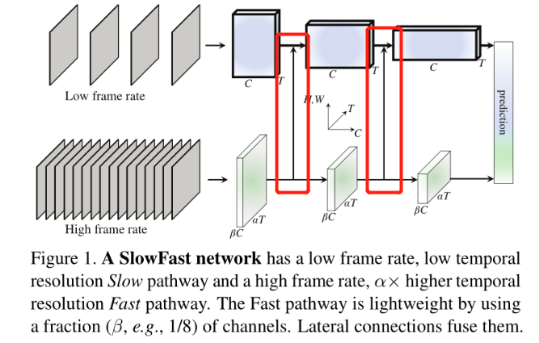

  正如红色框体现的那样：以实现两种信息的交流。

  > 卷积中也曾有过类似的一个思想：depth-wise channel --- 组卷积 --- channel-wise channel。实现组件的信息交流。
  >
  > 但是这里本质属于组卷积的一个特例：即一共两个组，然后每个组一个特征。
  >
  > 如果一个分支输出64个特征，另一个分支输出8个特征，则可以通过channel-wise convolution 卷积。
  >
  > 如果涉及到该卷积，则评价的指标就变成了  参数量、FLOPs；
  >
  > 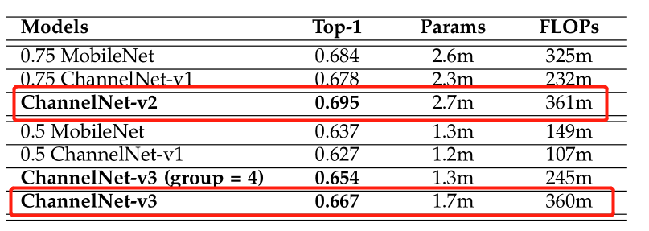
  >
  > 上图是channel-Nets的数据，而v2 and v3的差别在于，前者的分类层是池化+全连接；而后者是基于channel-wise的CCL层。
  >
  > > **得出一个结论：channel-wise等卷积是为了lightweight会牺牲一定的准确率。同时，全连接模式几乎总是性能最强的模式：这就肯定了分类层是全局池化和全连接层的天下**
  > >
  > > 不过问题来了，**池化意味着下采样，会影响性能，那么为什么总是要做全局池化~？？？**
  > >
  > > **答案是，全剧平均池化层抛除”降低参数量“的考量以外，还有就是”整合空间信息，每个特征图对应一个神经元，全连接层中预测的类别因为链接稀疏性，所以它会对其中某些神经元（特征图）产生联系，因为特征图是具有一定的语义信息的，因而对类别的解释也就有了可解释性；而未经过AVG的FC，每个类别所依靠的神经元是N个特征图中的M个位置，如此得到的连接联系，就缺乏合适的解释，见下图：“**
  > >
  > > 

  需要额外注意的是：

  - 只存在Fast的信息向Slow的单向流动；而不涉及Slow向Fast的双向流动；
  - 两个分支在池化后得到concatenate。

##### 3.4. Instantiations

- 不同于C3D和I3D，SlowFast在残差块4和残差块5，使用了non-degenerate非退化时序卷积，即时序核大小大于1。

  而前几层基本都是二维的空间卷积。

  **这种做法基于实验观察，如果在前几层使用时序卷积，会降低准确率。**而这一点作者有讨论，但是不是很懂。？？？？

  *我们认为这是因为当物体快速移动并且时间步幅很大时，除非空间感受野足够大（即在后面的层中），否则时间感受野内几乎没有相关性*

- FastPath，每一层都是用了非退化的时序卷积；

  > 做一个大胆的猜测：退化的时序卷积表示时序维度上采取了窗口大小**等于**1的卷积核。
  >
  > > **TODO：回头再细究。**

  之所以使用非退化的时序卷积，是因为作者观察到**FastPath为时间卷积保持良好的时间分辨率**以捕捉详细的运动。

- 横向连接：涉及的是SlowPath和FastPath的数据之间的size不同的处理方式；三种方式然后做了三组实验；

  > 不同size的数据可以实现融合，技术上无论如何都是可以实现的，但是重要的是，为什么这么做？**技术的方向由理论意义来赋予。归结到这篇论文中就是，空间信息要和时序信息进行交流。**

#### 4  Experiments: Action Classification

- 四个视频识别数据集，标准的评估protocols。

- Our models on Kinetics are trained from random initialization (“from scratch”), without using ImageNet [ 7 ] or any pre-training.——模型没有经过与训练，而是随机初始化。

  > 随机初始化模型和预训练模型相对应，而前者被认为是“from scratch”的代名词。

  - 时序维度：全部帧和卷积选择一帧的方式；

  - 空间维度：随机裁剪224和224pixels，或者**水平翻转？？？**with a shorter side randomly sampled in [256, 320] pixels

    > [45, 56].这两个文献会解释这个方面。

-  一个视频中随机选择10个片段；

  每一帧将最小边缩放到256像素，同时裁剪3个256X256的部分；**作为全卷积测试的近似，遵循 [56] 的代码？？？**

  > **这句话很不明白啥意思？？？？？，同时，这里说遵循56的代码.**即《Non-local neural networks》

- As existing papers differ in their inference strategy for cropping/clipping in space and in time. When comparing to previous work, we report the FLOPs per spacetime “view" (temporal clip with spatial crop) at inference and the number of views used. Recall that in our case, the inference-time spatial size is 256 2 (instead of 224 2 for training) and 10 temporal clips each with 3 spatial crops are used (30 views).

  > - 指标：FLOPs和 spacetime “view
  >
  > - 训练时的空间尺寸和测试时的不一样；
  >
  > - 一个视频被随机选择10次，同时，三个空间裁剪。
  >
  > - 以贯彻：**existing papers differ in their inference strategy for cropping/clipping in space and in time** **以实现样本数据集的丰富性和对模型性能衡量的鲁棒性检查。**
  >
  >   太  厉    害     了   ~~~~！！！！

- 对数据集进行FLOPs的计算的时候，使用的是center-cropped clip——**有讲究**！

##### 4.1. Main Results

- 实验结果表明：模型并不是经过pre-trained就一定会比随机初始化的结果要好。**取决于数据集和模型，不过与数据集的关系还是很大的**。
- 有的文献中对于一个视频的采样能达到100多种，但是成本巨大，而SlowFast不需要，是因为网络的权重轻量级同时高度时序分辨率high temporal resolution。

##### 4.2. Ablation Experiments

**Slow vs. SlowFast. **

- backbone不同|slowpath帧数不同|模型不同；

  结果是残差网络越深越好，帧数越多越好，模型考虑到FastPath越好；

**Individual pathways.**

- 三类：Slow-only，Fast-only，SlowFast 以及 两条路径fuse的方式不同下的SlowFast

**SlowFast fusion. **

发现Interestingly, the Fast pathway alone has only 51.7% accuracy (Table 5a). But it brings in up to 3.0% improvement
to the Slow pathway, showing that the underlying representation modeled by the **Fast pathway is largely complementary.**


**Channel capacity of Fast pathway. **

**A key intuition** for designing the Fast pathway is that **it can employ a lower channel capacity for capturing motion** **without building a detailed spatial representation**.

- 一种对比改进——改变channels的数目，增加了GFLOPs，但是对accuracy具有提升，如何说明这种改进的值得呢？—— **通过对比GFLOPs的相对增加量的百分比和准确率提升的相对百分比。前者5%，而后者1.6%。如此即可说明问题**。

**Weaker spatial inputs to Fast pathway.**—— 如果降低FastPath**的输入数据的空间信息**会如何？

降低数据数据的空间信息的几种方式：

- 分辨率降低一倍，同时通道数降低一倍；
- 灰度图；
- 时序差异帧，time difference frames，通过前后帧相减得到。
- 光流数据。

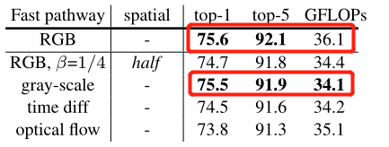

> 对输入数据的不同形式和内容，以做对比实验，具有借鉴性。

对比实验表明，灰度图的综合效果更好，而神奇的是，这一点和生理学上的现象相似：M细胞对色彩不敏感。

> We believe both Table 5b and Table 5c convincingly show that **the lightweight but temporally high-resolution Fast** pathway is an effective component for video recognition.

**Training from scratch. **

**随机初始化模型参数的方式可能不太好调参训练，但是确实效果比预训练得到的结果要好；**

#### **5. Experiments: AVA Action Detection**

**Dataset.** 

**Detection architecture.**

**Training.**

**Inference.**

##### 5.1. Main Results

##### 5.2. Ablation Experiments

#### 6. Conclusion


### 7 - 2018《Non-local Neural Networks》

CVPR 2018

**摘要：**，受到经典非局部平均方法的启发，our non-local operation computes the response at a position as a weighted sum of the features at all positions.而一般的计算是：process one local neighborhood at a time。新方法的价值是 as a generic family of building blocks for **capturing long-range dependencies**

#### 1 引言

两种long-range dependencies，第一种是序列数据，另一种是图像数据，长范围依赖就具象化为通过堆叠卷积块而得到的**较大感受野范围**。而想让依赖更加庞大的方式有：卷积中 **重复** 增加卷积块；序列中 propagate 数据传播以接受更长范围内的数据信息。

传统的方式的不足：

 computationally inefficient；

causes optimization difficulties；

make multihop dependency modeling difficult，当消息需要在远程位置之间来回传递时。

Non-local中的all positions 表示着空间、时间和时空结合，也就意味着可以应用于图像、序列和视频问题中。

非局域操作的优势：

相比于递归和卷积的渐进式计算行为progressive，非局域操作直接通过计算两个位置，无视距离，以捕捉long-range 依赖；

非局域操作高效且仅靠少量网络层取得更好的效果；

非局域操作maintain the variable input sizes保有可变的输入大小，能跟其他操作轻易地结合。

​		通过仅使用RGB图片而不使用任何花里胡哨的，包括光流和多尺度测试。我们的方法会取得跟现有方法优于或相似的结果。

​		为了证明非局域化操作的通用性，基于COCO数据集做了三项图像任务，对比于MaskRCNNbaseline，非局域化操作能够能以较小的额外计算量以提升在三项任务中的准确率。

​		同时在视频和图片上都做了实验，**因此可以说明其在不同格式的数据上或者不同的视觉任务中取得不错的结果**。

#### 2 相关工作

**Non-local image processing.**

非局域化操作是一种经典的过滤算法，通过计算一张图片中所有像素点的加权平均值而得到；

它允许distant pixels 远处的像素基于patch appearance相似性以计算出某一个位置的过滤结果fileter response。

非局域化操作的一个实例是BM3D，是一个坚实的去噪模型，即使与dnn相比。同时它在纹理合成、超分辨率和修复算法方面有成功的案例。

**Graphical models.** 

长范围依赖可以通过图形模型进行模型构建。比如条件随机场。

非局域化网络可以称之为一种抽象的模型——图神经网络。

**Feedforward modeling for sequences.**

> Feedforward 和 recurrent 的区别：每次计算将所有长度范围long-range内的数据考虑在内。而后者是每次计算都是只使用部分数据。

而Non-local属于feedforward，而目前feedforward的方法比如一维卷积能够很好的捕获长范围依赖，同时这**些前馈模型适用于并行化实现**，并且比广泛使用的循环模型更有效

**Self-attention.**

本文与最近机器翻译中的自注意力方法相关。

<u>自注意力模块通过关注所有位置并在嵌入空间中取其加权平均值来计算序列（例如，句子）中某个位置的响应</u>

**而自注意力模型可以被视为非局域平均的一种形式；**

**Interaction networks.**

交互网络用于构建物理系统，它在图的节点之间**即节点对**进行计算，

非局域化网络与交互网络相关联connect，但是实验表明，这些交互网络模型的非局域性与 **注意力、交互行为、关系**相正交，即先联系，而非局域性正是这些模型成功的关键。

**Video classification architectures.**

以往视频分类是将卷积和递归相结合，之后通过对预训练好的二维卷积核膨胀inflating操作以形成三维卷积核。

而后optical flow [ 45 ] and trajectories被认为对分类很有价值，而有价值的原因就在于他们可能提取到了long-range和非局域依赖。

#### 3. Non-local Neural Networks

##### 3.1. Formulation

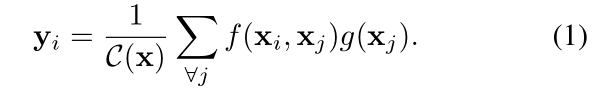

函数f计算得到一个标量，函数g计算出j点的一个特征表示。

非局域网络具有捕捉long-range信息的原因是，每个位置的计算都涉及到了所有的位置；

与卷积、递归和全连接网络的对比：

- 卷积是局域范围；

- 递归仅涉及当前步和前一步；

- 全连接中两点之间的关系并不是基于共同的一个函数，而是不同的被学习的不断改变的权重参数。

  同时全连接层要求只要模型参数固定了，全连接层的输入和输出大小就固定了。**但是非局域化网络就可实现size不变性。**

  > 如果希望实现模型输入尺度的不变性，可以考虑非局域化网络，但是有一个缺点是其输出其实和输入一样。空间域上如何能够在网络中设计一个**过渡结构**，无论输入尺寸多大，都可以转化下采样转化为固定尺寸，以利用cnn等传统的网络结构。——价值在于 尺寸不敏感性；同时实现局域网络和非局域网络的结合。

##### 3.2. Instantiations

关于函数f和g的几个版本。但是虽然有如此多的版本，但是实验结果却表明，非局域化网络对这些函数的具体值并不敏感。

函数f使用了高斯、嵌入式高斯函数、点乘和concatenate。

##### 3.3. Non-local Block

We wrap the non-local operation in Eq.(1) into a  non-local block。

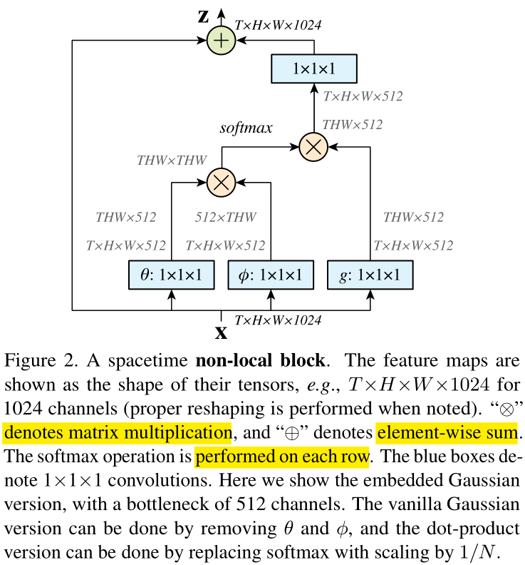

**The pairwise computation of a non-local block is *lightweight* when it is used in high-level, sub-sampled feature maps**


**Implementation of Non-local Blocks.** 

涉及两个lightweight的方法：

- 将block中的channels的数目减半；

- 在block之前进行池化操作，以实现下采样。并不会影响非局域化操作。**但是如此是否会影响精确度呢？毕竟分辨率低了。**

  > **跟池化层作用在卷积之后一样，池化层的加入到底是提升了准确度还是降低了，暂且不谈参数量的多少问题。**
  >
  > —— 需要做实验考量。


#### 4. Video Classification Models

**2D ConvNet baseline (C2D).** 

二维模型得到预训练，处理空间维度而暂不考虑时间维度。

**Inflated 3D ConvNet (I3D).** 

这里提到预训练得到的二维卷积核inflat到三维的方式： 

This kernel can be initialized from 2D models (pretrained on ImageNet): each of the t planes in the t×k×k kernel is initialized by the pre-trained k×k weights, rescaled by 1/t . 

**之所以这么做，因为它具有一定的合理性**：If a video consists of a single static frame repeated in time, this initialization produces the same results as the 2D pre-trained model run on a static frame.

**Non-local network.** 

将非局域化block插入到C2D和I3D中。 We investigate adding 我们研究添加了这四个 1, 5, or 10 non-local blocks

##### 4.1. Implementation Details

**Training.**

- Unless specified, we fine-tune our models using 32-frame input clips.默认32帧；

- These clips are formed by **randomly cropping out 64 consecutive frames from the original full-length video** and then dropping  every other frame.

-  Thespatialsizeis224 × 224 pixels, randomly cropped from a scaled video whose shorter side is randomly sampled in [256,320] pixels.

- 0.01   -- 150_0.001 --- 300_0.0001 --- 350_0.00001

  We use a momentum of 0.9 and a weight decay of 0.0001

  

- We adopt **dropout after the global pooling layer,** with a dropout ratio of 0.5；
- We fine-tune our models with **BatchNorm** (BN) enabled when it is applied
-  The scale parameter of this BN layer is initialized as zero,

**Inference**

in our practice we sample 10 clips evenly from a full-length video and compute the softmax scores on them individually.

#### 5. Experiments on Video Classification

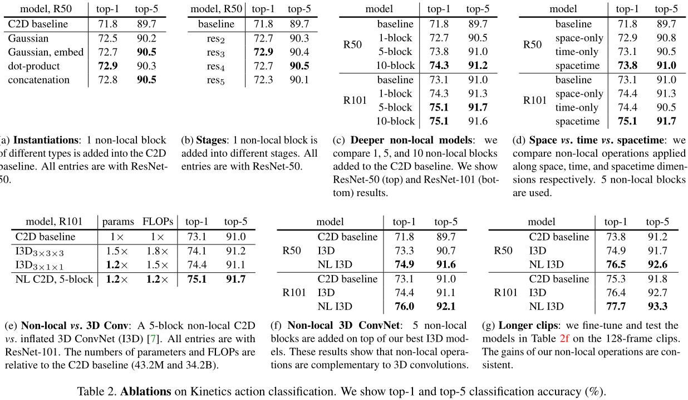

##### 5.1. Experiments on Kinetics

**Instantiations.**
we use the embedded Gaussian version by default。

**Which stage to add non-local blocks?**

4个残差块，选择一个插入，实验展现哪个更好。

The block is added to right before the last residual block of a stage.

插入到残差块5的效果不好，推测 One possible explanation is that res 5 has a small spatial size (7 × 7) and it is insufficient to provide precise spatial information

**Going deeper with non-local blocks.**

Res101效果好于Res50，不仅仅是因为前者的层数更多，不可否认non-local block数目的增加也有促进作用：

只要观察Res50-5block-73.8和Res101-baseline-73.1即可知道

**Non-local in spacetime.**

如何实现只有空间的模型和只有时间的模型。

**Non-local net vs. 3D ConvNet.**

**Non-local 3D ConvNet.**

**Longer sequences.**

**Comparisons with state-of-the-art results.**

##### 5.2. Experiments on Charades

#### 6. Extension: Experiments on COCO

**Object detection and instance segmentation.**

**Keypoint detection.**

#### 7. Conclusion

> 直至最后，也没有看到关于尺度不变性的实现。

### 8 - 2016 《Feature Pyramid Networks for Object Detection》

> ????? 是如何实现接受任意大小的图像的？？？

翻译链接：

https://blog.csdn.net/bi_diu1368/article/details/93107330

https://zhuanlan.zhihu.com/p/36461718


自顶向下的路径和横向连接。**自顶向下的路径通过上采样空间上更粗糙**，但在语义上更强的来自较高金字塔等级的特征映射来幻化更高分辨率的特征。**这些特征随后通过来自自下而上路径上的特征经由横向连接进行增强**。每个横向连接合并来自自下而上路径和自顶向下路径的具有相同空间大小的特征映射。自下而上的特征映射具有较低级别的语义，但其激活可以更精确地定位，因为它被下采样的次数更少。

**摘要：**

> 边际额外成本 ： 边际成本是指 增加一单位产量时，总成本的增加量；
>
> 深度学习中 指：每增加一单位的数据量，比如batchsize，图片大小、RegionProposal 所造成的计算成本的增量。
>
> 计算和内存密集型任务：**计算量远大于访问存储器、通信和输入输出**的一类任务；

特征金字塔是检测不同尺度物体任务中的基础组件/结构；

但是因为其计算和内存密集型的性质，最近的一些深度检测技术在避免使用金字塔表示；

在本文中，我们利用深度卷积网络固有的**多尺度金字塔层次结构**来构建具有边际额外成本的**特征金字塔**，building high-level semantic feature maps at all scales；

> 我想应该有一些领域已经在解决尺度不变性、速度不变性等问题，毕竟这是一个很现实的问题。

#### 1. Introduction

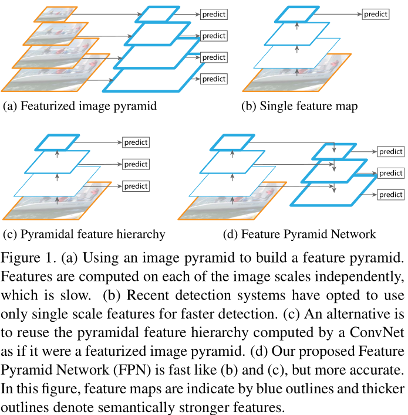

特征化图片金字塔：These pyramids are scale-invariant in the sense that an object’s scale change is offset by shifting its level in the pyramid

其发展历史：曾经辉煌于人工设计特征的阶段；

> 卷积网络虽然很厉害可以自行提取特征，但是仍然存在问题。
>
> 卷积网络本身因为卷积层结构，可以生成不同的空间分辨率，但是随着深度的不同，随之会产生较大的语义鸿沟。而较高的分辨率的特征图具有较小的特征，会影响物体检测能力。
>
> 相似的一个道理：我们可以通过卷积的步长实现速度不变性的测试；

-----

ConvNets：对尺寸的变化比较稳健，方便从单尺寸输入中提取特征。

但是即使稳健，金字塔结构依旧可以帮助卷积网络获得更好的结果；因为金字塔结构的核心优势是 **对金字塔中每一级图片的特征化会产生多尺度特征表示，这种表示中各个级别的语义都很强，即使是高分辨率的级别。**

> 分辨率越高不就表示语义很强吗？

> 另外，实验测试时通常会使用多尺度测试作为评价标准。—— 比较苛刻的标准了，但是应该存在；

但是，对每个尺度进行特征化有比较明显的限制——推理时间增加；内存方面不够feasible灵活（这也是为什么图片金字塔只使用于测试期间的原因）。

----

图像金字塔不是计算多尺度特征表示的唯一方式，一个较深的卷积网络同样可以通过layer by layer的方式计算特征阶层，具体说就是**通过下采样层**（池化层）层级特征has an 固有的多尺度金字塔的形状。这种**网络内的特征层级** 会 产生 不同空间分辨率的特征图，但是会因为不同的网络深度而引起较大的语义鸿沟？

> 为什么会引起巨大的语义鸿沟？

高分辨率特征图具有低级特征，而低级特征会影响物体识别的表示能力。

> 这不是很正常的一件事儿吗？

卷积网络产生特征层级金字塔方式的attempts：

- 【22】图c，构造了一个类似图a的网络结构。理性情况下，应该和图a一样，使用每一层的特征图，但是SSD为了避免使用低级特征，它放弃使用已经计算得到的特征图，取而代之的是从网络的高层开始，构建一个金字塔，然后添加几个新层。

  由此，它错过了重用 **高分辨率特征图** 的机会，而这一点对识别物体非常重要。

  > 由此，可知，高分辨率的特征图在卷积初期常具有较低的语义。

本文目标是利用卷积网络特征层次结构的形状，同时创造一个 **在任何尺度下语义都很强的特征金字塔**。

- 方式：将低分辨率高语义的特征和高分辨率低语义的特征通过一个自上而下和横向链接的结构结合实现。
- 结果：各级语义丰富同时可从单尺寸输入中快速创建的特征金字塔。**而这种方式并不会牺牲表示能力、速度和内存。**

【28, 17, 8, 26】中流行的结构是：自上而下和跳跃连接；Their goals are to produce a single high-level feature map of a fine resolution on which the predictions are to be made。生成一个具有高等分辨率的单一高级语义特征图以进行预测。而本文的目标是：每一层都独立地进行预测，因为是端到端的学习，因而会使得预测的每一层都具有较高的语义，即使是高分辨率的特征图。（每层预测独立以及每层端到端学习很重要。）


#### 2. Related Work

**Hand-engineered features and early neural networks.**

手工设计特征的发展历程

【25】SIFT特征，最初是在尺度空间极值处提取的，用于特征点匹配。

【5】HOG特征，和之后的SIFT特征是基于实体图片金字塔的密集计算得到的，并且得到广泛应用；

【6】实现了可以通过稀疏采样实现快速金字塔计算。

【38，32】在SIFT和HOG之前，应用在脸部识别中的卷积网络都是比较浅层的；

**Deep ConvNet object detectors.** 

【34】OverFeat采用浅层网络对图像金字塔进行滑动窗口处理。

【12】RCNN采用region proposal-based strategy，在卷积分类之前对每个proposal进行尺寸归一化。

【15】SPPNet表明基于region的检测器技术在从单尺寸图像中**能高效地用于**提取特征图。

【11，29】FastRCNN，鼓励使用从单尺寸中提取特征，因为这样可以在准确率和执行速度之间做出较好地权衡。**然而多尺度检测依旧在小物体检测中表现更好。**

**Methods using multiple layers. **

目前很多方法都是通过使用不同的网路层以实现检测和语义分割的提升。

【24】FCN，每个目种在不同尺度上的分数的部分加和以计算语义分割。

【13，18，23，2】等方法在计算预测值之前 将各个层的特征值进行concatenate，**这就等价于将转化过的不同特征进行加和。**

而【22，3】确是基于每一特征图进行预测，而不是将每一层进行融合后进行预测。

另一种不同层之间连接的方式是横向或者跳跃连接，将低级特征图贯穿到分辨率和语义的各个级别。

虽然很多论文采用金字塔形状的结构，但是它们并不是特征图像金字塔，因为特征图像金字塔的预测是独立基于各个级别的。

**但是对于图像金字塔而言，金字塔架构在识别物体时还是需要将信息在不同尺寸中得到流转across。**


#### 3. Feature Pyramid Networks

作者认为FPN是一种通用结构，**因此希望融合进入以下两个结构中**。

 in this paper we focus on sliding window proposers (Region Proposal Network, RPN for short) [29] and region-based detectors (Fast R-CNN) [11]。

在本文中，我们专注于滑动窗口提议器（**区域提议网络**，简称 RPN）[29] 和**基于区域的检测器**（Fast R-CNN）[11]

**输入是任意尺寸被喂入的——这一点很有趣；如此期间的特征图将不再是固定的尺寸**。

> 尺度不变性的思考中也是如此：如果希望做到尺度不变性，那么中间的结构延续了卷积风格，则得到的特征图的尺寸将会与输入尺寸呈现规律变化。


**Bottom-up pathway.** 

？

**Top-down pathway and lateral connections.**

- 这种top-down结构会生成更高分辨率的特征图，通过空间上**对较为粗糙的但是语义更强的特征图采样得到**。
- 而横向连接会使来自bottom-up路径的特征用来强化top-down获得的特征。
- bottom-up的特征图是低级别的语义信息，但是它的激活值能更加准确的定位，因为它仅被下采样很少次数。

> 这里的描述很有意思：空间采样粗糙的特征图、语义强的特征图、更分辨率的特征图。

 Finally, we append a 3×3 convolution on each merged map to generate the final feature map, which is to reduce the aliasing effect of upsampling.

最后通过一个卷积层将融合后的特征图卷积得到最终的特征图，用于减少上采样的混叠效应aliasing effect。

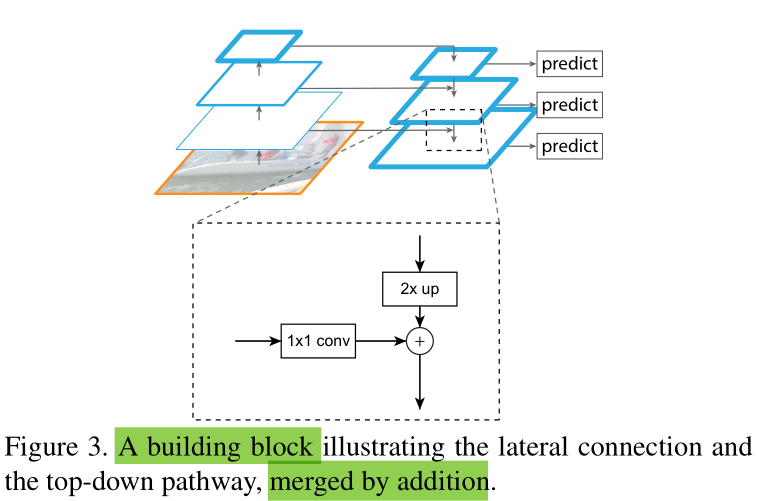

> 这种操作解释得似乎很有道理，但是是否真得如此？
>
> 如果这种设计真实有效，那么我们是否可以从各种涉及element-wise 加法的结构中得到性能的提升呢？

由于金字塔中的各个特征都共用一个分类器或者回归器，因此固定了特征的维度大小为256.**同时网络中的额外几层不存在非线性，因为实验表明取消非线性操作对结果影响很小。**

> 启发：模型真的是调参调出来的。而某个操作是否真的有价值，要取决于具体的网络结构。**核心结构以确定细节构造，由点及面**。

本文核心是简单，作者已经探究出一些复杂的模块可以得到显而易见的结果，但是 **设计一个更好的连接模块不是本文的重点，因此作者选择简单的设计。**

> 这一点很重要！

#### 4. Applications

RPN是为了bounding box；RCNN是为了物体检测；不同的应用。

##### 4.1. Feature Pyramid Networks for RPN

##### 4.2. Feature Pyramid Networks for Fast R-CNN

#### 5. Experiments on Object Detection

##### 5.1. Region Proposal with RPN

**Implementation details.**

###### 5.1.1 Ablation Experiments

**Comparisons with baselines.** 

**How important is top-down enrichment?**

**How important are lateral connections?**

**How important are pyramid representations?**

##### 5.2. Object Detection with Fast/Faster R-CNN

**Implementation details.**

###### 5.2.1 Fast R-CNN (on fixed proposals)

###### 5.2.2 Faster R-CNN (on consistent proposals)

**Sharing features.**

**Running time.**

###### 5.2.3 Comparing with COCO Competition Winners

#### 6. Extensions: Segmentation Proposals 

##### 6.1. Segmentation Proposal Results

#### 7. Conclusion


### 9 - 2021《ACTIONNet Multi-path Excitation for Action Recognition》

**摘要：**作者认为时空、通道、移动模式是相互补充的；众所周知2Dcheap，3Dintensive，因此作者提出一个通用的有效的可嵌入式的模块插入到2D中。（其实之前都已经有过人研究了）

ACTION模块由三条路径组成：STE、CE和ME。

其中STE使用一个通道的3D卷积来提取时空特征；CE **自适应地校准**channel-wise的特征回应，通过准确地对通道之间的时序方面的依赖进行建模；ME计算时间维度的差异——帧间差异，以激发与通道敏感的通道。（不由得说，解释得太迷糊了。）


#### 1. Introduction

进行视频理解的目标是：高准确率和低计算成本。

传统的人类行为识别更多是场景相关的，其中行为并不像时序相关的。

----

目前研究的主流方法是3D和2D

3D能有效对时空建模但是并不能捕捉充足的信息。（我质疑了，不应该是3D的缺点是计算成本大吗？）—— 过拟合，收敛慢以及计算量重，推理慢，难以边缘部署。

现在的2D框架，lightweight以及快速推理。

- TSN不能对时序建模；
- TSM缺乏对行为的精确时序建模，比如motion特征。
- 同时目前的一些工作将嵌入式模块引入到2D卷积中，比如残差网络，以提升对motion的建模能力。

- 为了捕捉多类型特征，先人的工作集中在输入帧的处理，比如SlowFast以及双流模型，但是缺点是需要多个分支的网络，因而需要**expensive computations**。

提出一种即插即用和轻量化的模块，以获取多类型的特征信息，**方式是单流网络多路径激励excitation**

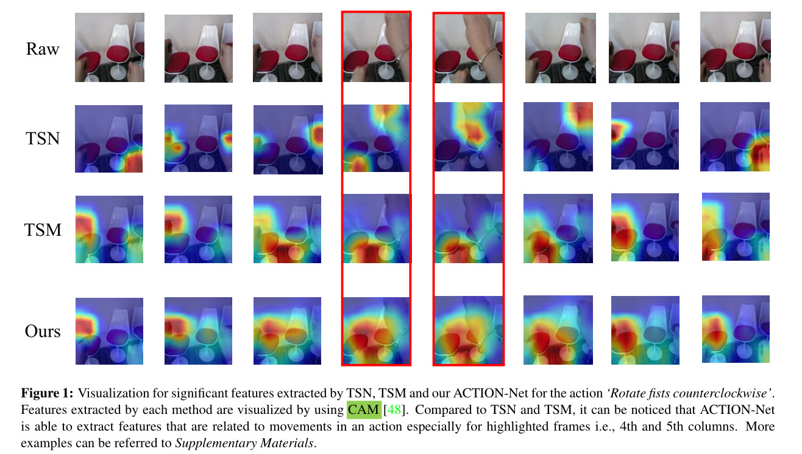

实验表明，TSN和TSM两个模型只集中在识别物体，而非集中精力在 **推理行为reasoning an action.——从形式上看，是覆盖了两个拳头，而非各自的拳头，同时覆盖两个拳头意味着行为联系。**

> 这里介绍了一种映射图CAM，非常有意思！技术只是辅助。

本文的贡献：

- 即插即用：能够提取三个类型的特征信息用于分类；
- 简单且有效：呈现在基于三个backbone的网络实验中；
- 杰出性能：三个数据集。


#### 2. Related Works

##### 2.1. 3D CNN-based Framework

【5】SlowFast能够处理行为之间的不一致问题，比如跑步和走路。

> SlowFast能够处理行为之间的不一致问题，比如跑步和走路；还是有机会的，如果可以将slowFast变成即插即用？是否可以实现新的突破？

【30，40】表明3D卷积可以被因式分解以减少计算量，但是相较于2D而言，依旧是不小的负担。

##### 2.2. 2D CNN-based Framework

【41】TSN是第一个提出使用2D处理视频行为识别的模型，它引入了segment的概念，即从长视频序列中提取segment的概念以统一的稀疏的采样模式；但是2D的直接使用并不会对时序进行建模。

> TSN 看来是非常值得一看的。

【22】TSM缺乏对行为的准确时序的建模，比如相邻帧之间的差异。

【20，24，21】MFNet、TEINet、TEA 嵌入式模型嵌入到2D，且以残差网络为模型骨干。同时对motion和时序信息建模；

【14】STM 提取了一种替代残差块的模块以捕获时空和motion信息。

【38】GSM 使用组空间门机制以控制时空分解中的相互作用interaction。

##### 2.3. SENet and Beyond

【11】SENet 提出了一个2D卷积嵌入式模块：SE squeeze-and-excitation (SE) block 挤压和激励模块。在该模块中，可以通过显示地对通道的相互依赖性进行建模，以增强对图像识别任务的通道特征的学习。具体的方式是，借助两个全连接层和一个激活层以激励最重要的通道特征。**然而，**这种机制是在不考虑视频时序信息的情况下独立地对每张图片进行建模；

为此，【21】TEA 引入了运动激励和多时序聚合MTA以捕获短、长序列的时序演变。

而MTA起初是专为Res2Net设计的【6】，这也就意味着TEA只能嵌入到Res2Net中。

为此本文提出了解决时空视角和时间维度上的通道依赖性的SE模块之外的STE和CE模块。


#### 3. Design of ACTION

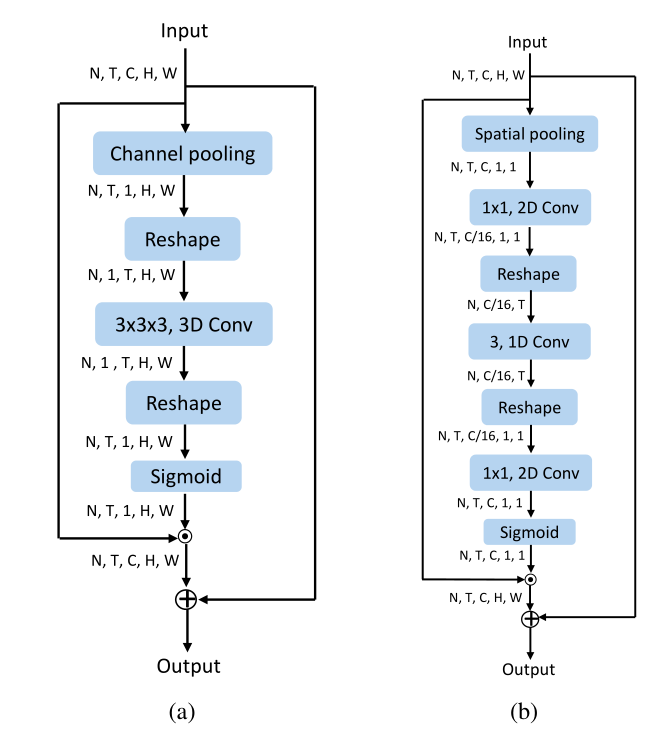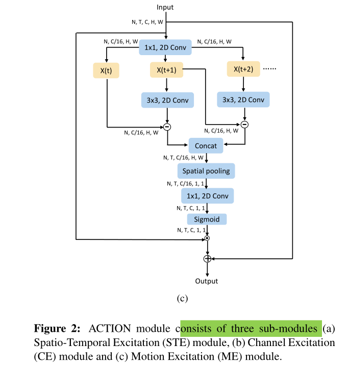

##### 3.1. Spatio-Temporal Excitation (STE)

- 使用3D卷积；

- STE生成了一个时空掩码数据M，它是经过了3D的处理，M计算出后又与原始数据X进行元素相乘。

  > 并不清楚这个时空掩码数据M的作用，价值是什么？

  其中M在卷积之前，经过通道池化层，最终化为了一个通道，这又是为什么？即使是通道维度不为1应该也可以做卷积才对。（可能是希望得到的spatial-temporal特征是across channels的吧。**不过这样挺有意思的，移动、通道和时空维度，各自负责各自的维度的特征的捕获，专注。**）

  不过最后的问题就是掩码M数据的价值是什么？

##### 3.2. Channel Excitation (CE)

CE类似于SE，两者之间的差异是两个FC之间加入了一维卷积，以捕获通道特征的时序信息。

> 同样用到了掩码，不过是通道相关的掩码M

##### 3.3. Motion Excitation (ME)

 model motion information based on the feature level instead of the pixel level.

> 特征级别和像素级别的差别是？
>
> 目前我的一个理解是 特征级别是面向特征图，而像素级别是面向输入图像；
>
> 或者另一种理解是 前者是以特征图为单位，后者以特征图或者输入图像的一个像素点位置为单位。

motion信息是通过对相邻帧建模实现。

同时使用了挤压和膨胀的的策略。

> 这种挤压膨胀结构有些类似于自编码中的编码过程，挤压似乎有利于提取重要的特征。

##### 3.4. ACTION-Net

 element-wise addition of three excited features 

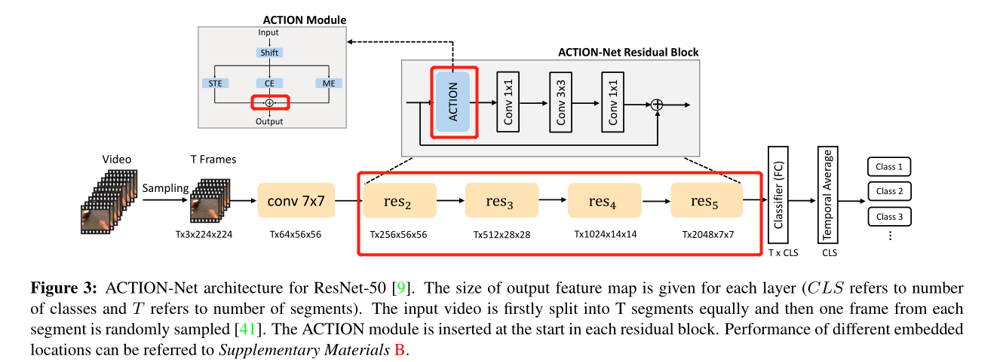

#### 4. Experiments

##### 4.1. Datasets

##### 4.2. Implementation Details

**Training**

following same strategy in TSN！

- 将一个视频均匀分割为T个部分；
- 每个部分随机抽取一张；
- 数据增强： corner cropping and scale-jittering。**我认为需要加上随机抽取N个clip**
-  Batchsize was set as N = 64 when T = 8 and N = 48 when T = 16. 
- Network weights were initialized using ImageNet pretrained weights
- 不同数据集的学习率和下降策略不同。

**Inference**

- scaled the shorter side to256 for each frame and took three crops of 256×256 from scaled frames.
- We randomly sampled from the full-length video for 10 times
- The final prediction was the averaged Softmax score for all clips.
- 另外，推测的时候，使用中间crop进行预测？

##### 4.3. Improving Performance of 2D CNNs

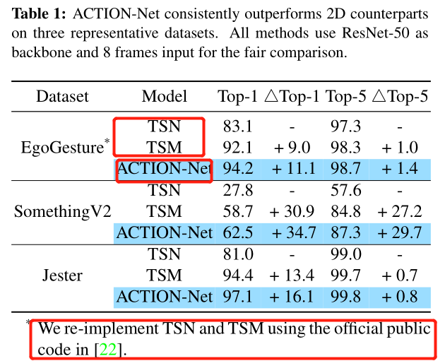


##### 4.4. Comparisons with the State-of-the-Art

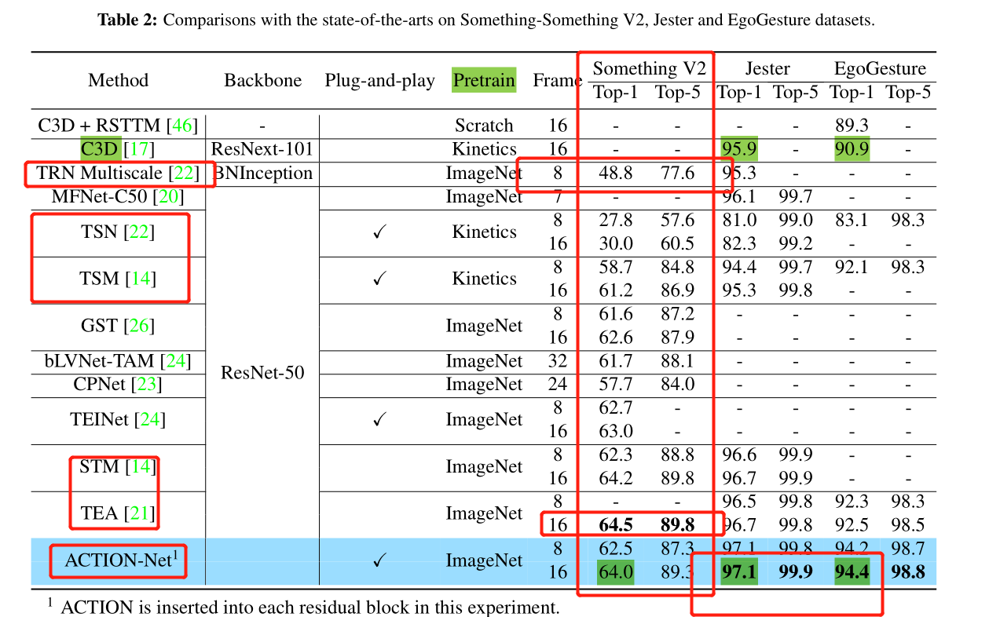

**从图中可以看出，我们要选择的数据集以及目前的预测结果如何，something数据集竟然只有一般以上的准确率。**

**模型的话有几个需要考虑的；**

##### 4.5. Ablation Study

 (1) **efficacy** of each excitation

 (2) **impact** of the number of ACTION modules in ACTION-Net regarding the ResNet-50 architecture。

**Efficacy of Three Excitations**

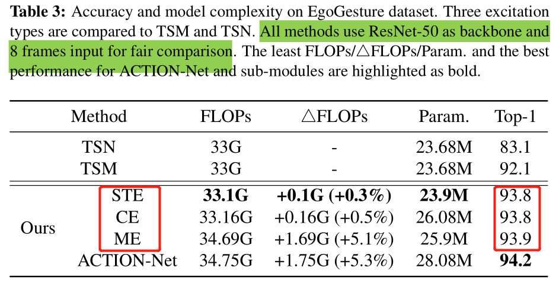

**虽然各个excitaion的效果跟action整体没有多大差别，但是于TSM相比，却有很大的优势。**

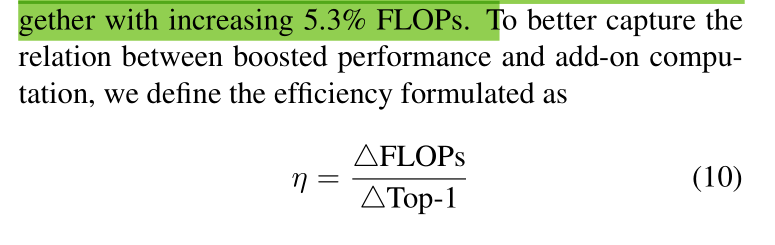

> 这个指标，没有具体名字。

**Impact of the Number of ACTION Blocks**

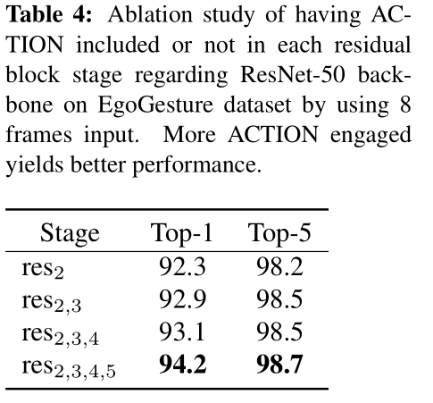

**不是通过单独给每个添加模块，而是叠加的方式。**

##### 4.6. Analysis of Efficiency and Flexibility

-  our ACTION module enjoys a plug-and-play manner like TSM, which can be embedded to any 2D CNN.

  > 这句话透露出一个信息：即插即用风格即是可嵌入式模块，类似卷积模块等。

  

- TSM is used as a **baseline** since TSM benefits **good performance** and **zero extra introduced computational cost** compared to TSN. 


发现MobileNet的骨干比较好。

#### 5. Conclusion


### 10 2017_《Quo Vadis, Action Recognition? A New Model and the Kinetics Dataset》

DeepMind公司

本文介绍I3D，是C3D基础上的双流模型，涉及opticla flow，比较费事。不想阅读了；


## 二 VideoActionTask‘s Summary

### 1 目前了解的视频行为识别任务的实现路径

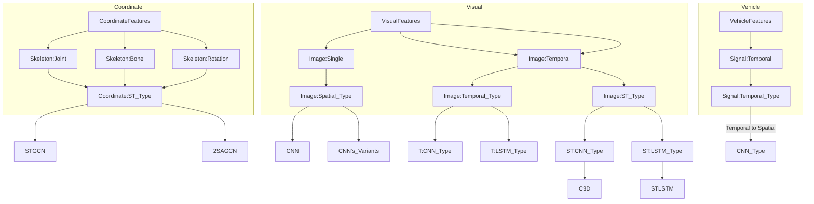
```mermaid
graph TD;
	subgraph Coordinate
	%% firsttype -- datatype --  modeltype
    CoordinateFeatures-->Skeleton:Joint-->Coordinate:ST_Type;
    CoordinateFeatures-->Skeleton:Bone-->Coordinate:ST_Type;
    CoordinateFeatures-->Skeleton:Rotation-->Coordinate:ST_Type;
    end
    subgraph Visual
    %% CoordinateFeatures
    VisualFeatures-->Image:Single-->Image:Spatial_Type;
    VisualFeatures--> Image:Temporal-->Image:Temporal_Type;
    VisualFeatures-->Image:Temporal-->Image:ST_Type;
    end
    %% VisualFeatures
    subgraph Vehicle
    VehicleFeatures-->Signal:Temporal-->Signal:Temporal_Type;
    end
    %% VehicleFeatures
    
    
    Coordinate:ST_Type-->STGCN;
    Coordinate:ST_Type-->2SAGCN;
    
    Image:Spatial_Type-->CNN;
    Image:Spatial_Type-->CNN's_Variants;
    Image:Temporal_Type-->T:CNN_Type;
    Image:Temporal_Type-->T:LSTM_Type;
	
	Image:ST_Type-->ST:CNN_Type;
    Image:ST_Type-->ST:LSTM_Type;
    ST:LSTM_Type-->STLSTM;
    ST:CNN_Type-->C3D;
    
    Signal:Temporal_Type--Temporal to Spatial-->CNN_Type;
    
    
```

### 2 视频理解的感悟

- 驾驶场景的特点

  - 驾驶场景中的行为不是标准的行为动作的堆砌，这一点不同于体操运动；因此模型需要从含有噪声（不同于测量中的误差，而是噪声行为）的行为序列数据中**找到**规整的行为的序列。
  - 

- 驾驶场景的行为识别思路

  - 驾驶行为有哪些？

    打电话、发\看手机消息、吸烟、喝酒、向后看、操作中控系统、是否戴口罩、和副驾驶聊天；


### 3 卷积模块Module总结

- 从几个方面区分几者的区别：
  - 输入和输出数据的维度；卷积核的维度；
  - 输入经过卷积核得到输出的过程可视化；
  - 该类卷积的出处、优点、缺点、特点；

- 几类卷积的共同特点是：

  卷积的重要作用：实现维度间或单个维度内部的信息交互；专业的词称为：**跨通道的信息交互（C）**、空间信息的交互（HW）

  - 对于(H,W,C)的输入数据，对应的卷积核维度，如果某个维度的值为1，则除了输出数据中对应维度的值不变以外，

    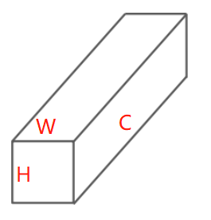

    - (p,1,1)：仅限于**(局部)宽度H之间**（p个WC的面中对应元素间）的交流；（似乎从图像的角度没啥意义）
    - (1,q,1)：仅限于**(局部)宽度W之间**（q个HC的面中对应元素间）的交流；（似乎从图像的角度没啥意义）
    - (1,1,r)：HW两个维度之间无交流，仅限于**(局部)通道C之间**（r个HW的面中对应元素间）的交流；
    - (1,q,r)：局部宽度范围和局部通道范围之间的像素之间产生关系；（似乎从图像的角度没啥意义）
    - (p,q,1)：**局部高度范围和局部宽度范围**之间的像素之间产生关系；
    - 诸如此类：
    - (p,q,r)：局部高度范围和局部宽度范围和通道范围之间的像素之间存在交流。**或者说是图像空间信息之间的融合，且这种融合是不同特征之间的融合；**

    > 这一点很重要，如果有残差块，则还能实现浅层特征和深层特征之间的融合、交流。

    - So instead of seeing it as a matrix of triples, we can see it as a 3D tensor where one dimension is height, another width and another channel (also called the ***depth*** dimension)
    - Note that this is different from a **3D convolution**, where **a filter is moved across the input in all 3 dimensions**; true 3D convolutions are not widely used in DNNs at this time.事实上**普通的卷积仅仅是在两个维度（H和W）**上进行移动。

  - **卷积核的某个维度如果值不为1，则表示卷积的信息融合，涉及该维度**。

  - 卷积核的数目即输出数的特征通道数目；

  - **单个卷积核的一次简单的卷积计算**涉及的过程是：一个卷积核在N个输入数据的特征图中做了N次卷积计算得到N个数值，再经过平均得到一个数值。

    

#### 3.1 Simple Convolution

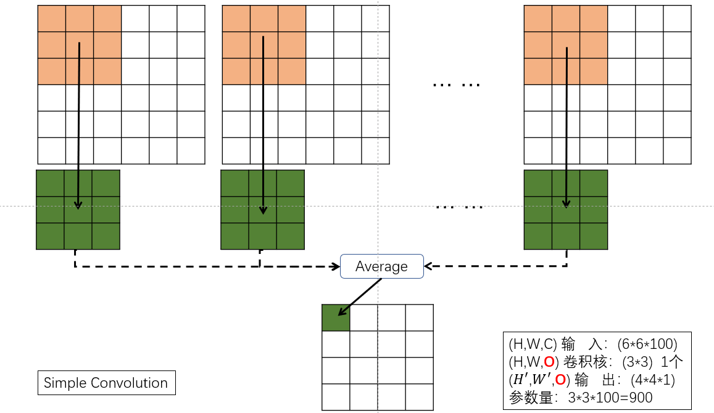


> 上图与下面系列的类似图来源：深度可分离卷积，https://zhuanlan.zhihu.com/p/92134485。

- 从计算的角度，卷积核未涉及到的维度，是要做平均的维度。

  换句话说，这里的卷积核未涉及到的维度是通道C。

  - 特征图通道C的每一个map都进行了卷积操作；
  - 每次卷积计算得到一个值，无论通道数的多少。
  - 最后通道数作为，被平均数（N个特征图一次卷积操作得到的N个数值加和）的**平均数**。

- 特点：

  - 权重共享：生成某一个特征图的卷积核的权重**可以被输入数据中的多个特征图使用**。
  - Translation invariant 平移不变量：

#### 3.2 [1x1 Convolution](https://arxiv.org/abs/1312.4400)

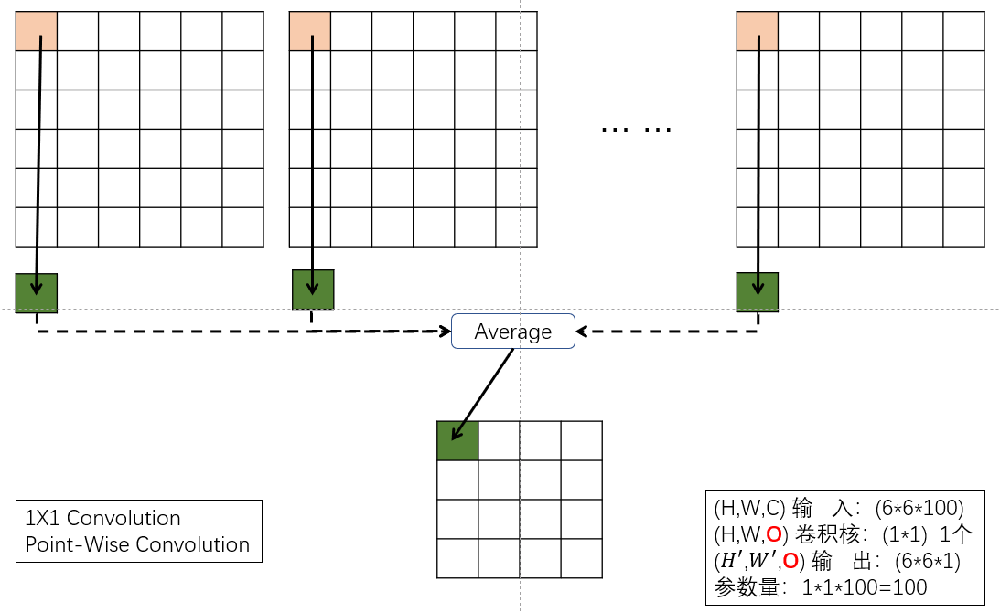


- 通道数作为平均数。

- 特点：

  > 大多观点来自：https://www.zhihu.com/question/378623918

  - 增加或减少维度；**很直观的一种感受**。

    升维从能力角度看**主要是为了**提升了特征表达的抽象能力；从模型维度的构建角度看，是为了维度匹配以做后续计算；

    降维**主要是为了控制模型的参数量**，减少参数同时减少计算量。

  - 在普通卷积后增加非线性；**因为卷积结束后会进行一步Relu激活函数的激活，而并非其本身，因为1X1卷积本身其实就是个线性融合——加和取平均**。

  - 跨通道信息融合；经典案例是深度分离卷积模块。

    具体地，1）depth-wise卷积通过每组只有一个特征图的分组卷积实现的，**如此达到每个通道之间无信息交流的效果**。

    2）Depth-wise卷积之后紧接着是PointWise卷积，即1X1的卷积，**在实现升维的同时，还能是实现不同信道的信息之间的融合**。

    如果没有Point-Wise，则深度分离卷积就只是单纯的Grouped Convolution。

    

    

  - 被视为特征池化Feature Pooling；（全连接层）；

    - 1X1卷积同全连接层的计算方式；

    - 全连接层可以被1X1卷积替代的原因是，两者的作用相同——将上游模块提取得到的局部特征连接起来，从全局的角度融合特征。

      同时，1X1卷积的好处是：

      1）如果上游模块输出的为**具有空间意义的tensor数据**，则1X1卷积还可以实现 **不改变空间结构。**

      2）其次，卷积对输入的尺寸无要求，但是全连接层需要指定输入数据的维度。

      3）1X1卷积的参数少：6X6X42-->6x6x24 >>>> 1X1卷积(1 X 1 X 42 X 24) \ 全连接层 6 x 6 x 42 * 24+ 24.

      但是卷积的计算量高：卷积核为1X1时 （乘法）6 x 6 X 42 X 24  ；（加法）6 x 6 X （42 - 1）） X 24

      -  全连接层：（乘法）6 x 6 X 42 X 24 + 24  （加法）（6 x 6 X 42 - 1） X 24.

      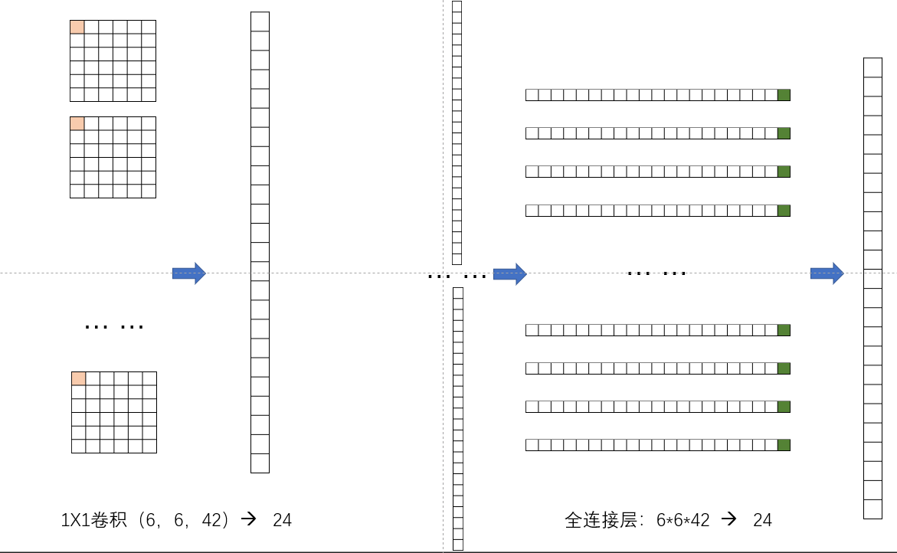

      > 为什么用1*1卷积层代替全连接层？https://blog.csdn.net/qq_32172681/article/details/95971492 

    - GAP要优于1X1卷积，从参数量的角度。

      - **卷积层的计算量高但参数少，全连接层的计算量少但参数多，一种观点认为全连接层大量的参数会导致过拟合**

      - **GAP强制将feature map与对应的类别建立起对应关系**，softmax相当于分数的归一化，GAP的输出可以看成是与每个类别相似程度的某种度量，GAP的输入feature map可以解释为**每个类别的置信度图**（confidence map）——每个位置为与该类别的某种相似度。

        **GAP操作可以看成是求取每个类别全图置信度的期望**。因为只有卷积层，**很好地保留了空间信息，增加了可解释性，没有全连接层，减少了参数量，一定程度上降低了过拟合**。

    > 因而今后将减少使用全连接层，而使用GAP；

#### 3.3 Channel-wise Convolution

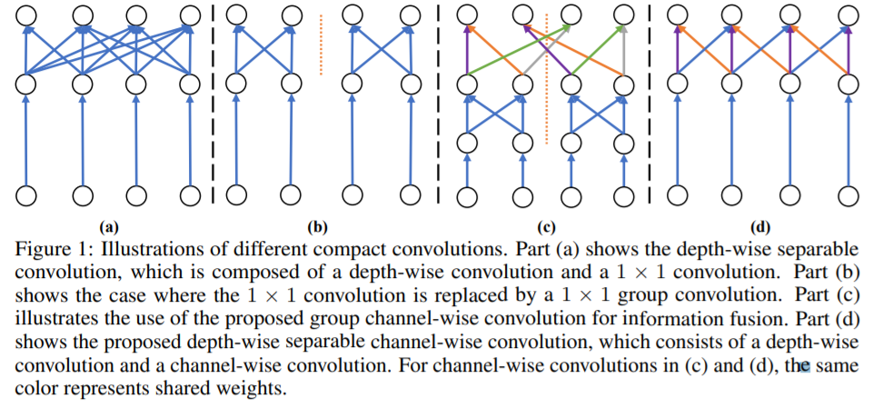

- 对上图的进一步解释：

  - a) depth-wise Convolution实现channel内部交流；1X1Convolution实现channels之间的信息交流；

  - b)  depth-wise Convolution实现channel内部交流；Group Convolution 实现组内部的channels之间的信息交流；

  - c) b)的基础上，实现组间信息交流；

    channel之间的信息交流从**局部的channel之间的信息交流**到**全局的channel间的信息交流**的处理方式的目的是，在b）的基础上进一步较少参数量和计算量。

  - d) depth-wise Convolution实现channel内部交流；ShuffleNet实现选择性的channnels间的信息交流。

  > 图c的组间信息交流和d的channels间的信息交流过程，输入单元和输出单元之间的连接connect关系是通过shuffle确定的。

- 其实Channel-wise是在Depth-wise Separable Convolution的基础上进行的改进，以期望在Separable的基础上进一步减少计算量和参数。

  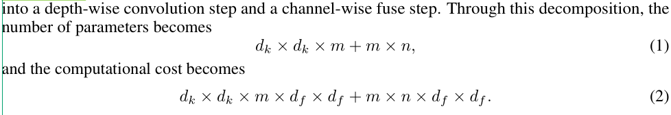

  而作者发现的问题是，The analysis of **regular convolutions** reveals that m（输入的特征图数目） × n（输出的特征图数目） comes from the **fully-connected pattern**, which is also the case in 1 × 1 convolutions.

  > 这里的regular conv 应该是指常规的卷积。因为从下面的参数量的分析上看出，Depth-wise中并不涉及全连接模式。

  而这种全连接模式是指M个输入的特征图和n个输出的特征图间全连接，同时对于产生了MXN个参数（1X1卷积中）而Depth-wise卷积中的参数量是$d_k*d_k*m$ 。


#### 3.4 Depth-wise Convolution

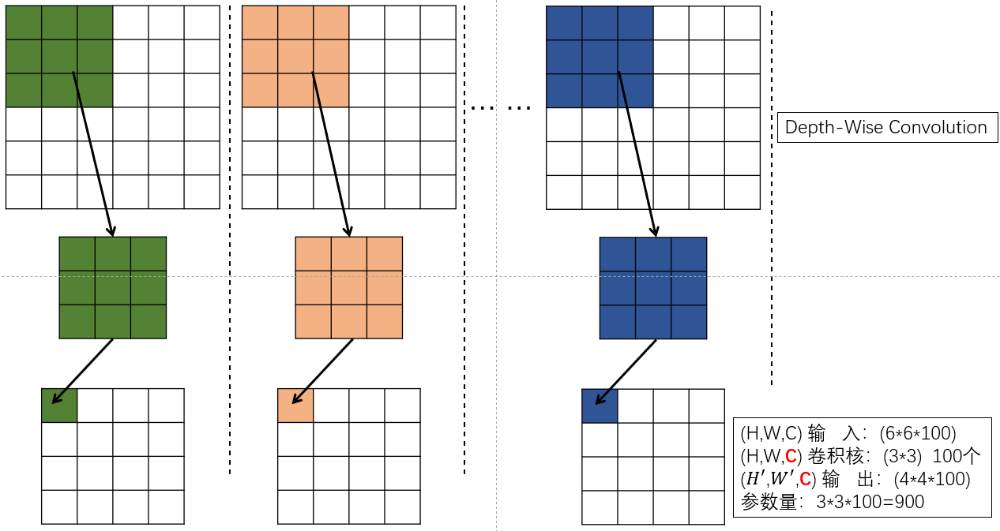


- In the **regular 2D convolution performed over multiple input channels**, the filter is as **deep** as the input and lets us **freely mix channels** to generate each element in the output.（这里的deep是指channels的总数。）

- Depthwise convolutions don't do that - ***each channel is kept separate*** - hence the name ***depthwise***.（channel dim  \ depth dim）

- **Depthwise separable convolution**

  - The depthwise convolution shown above is **more commonly used in combination with an additional step to mix in the channels** - *depthwise separable convolution*

    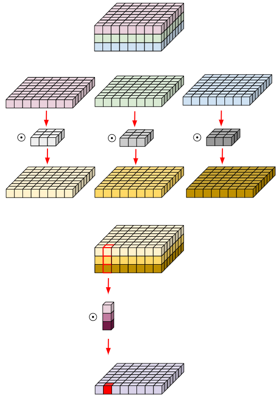

  - **After completing the depthwise convolution**, and additional step is performed: ***a 1x1 convolution across channels***. This is exactly the same operation as the "convolution in 3 dimensions discussed earlier" - just with a 1x1 spatial filter. **This step can be *repeated multiple times for different output channels*.** The output channels all take the output of the depthwise step and mix it up with different 1x1 convolutions.（这里的1X1卷积操作可以想实现多少维就可以实现多少维度）

  - Depthwise separable convolutions have **become popular in DNN models recently**, for two reasons:

    1. They have fewer parameters than "regular" convolutional layers, and *thus are less prone to overfitting.*
    2. With fewer parameters, they also require less operations to compute, and thus are cheaper and faster.

    > 虽然Depth-wise Separable Convolutions 拥有这么多的好处，但是我们需要看到一点：如果硬件性能足够，那么普通的CNN网络的性能不一定会差。
    >
    > 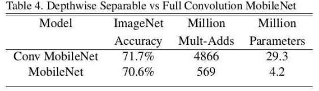
    >
    > 从原论文《MobileNets: Efficient Convolutional Neural Networks for Mobile Vision Applications》可以看出，使用了Depth-Wise的模型在准确度上不如原始卷积网络的效果好；因而该模型非常适合嵌入式的应用型场景。

> 参考文献：[Depthwise separable convolutions for machine learning](https://eli.thegreenplace.net/2018/depthwise-separable-convolutions-for-machine-learning/)

#### 3.5 Grouped Convolution

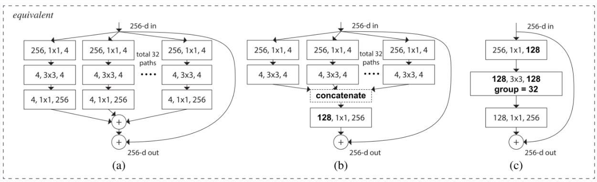


#### 3.6 Shuffled Grouped Convolution

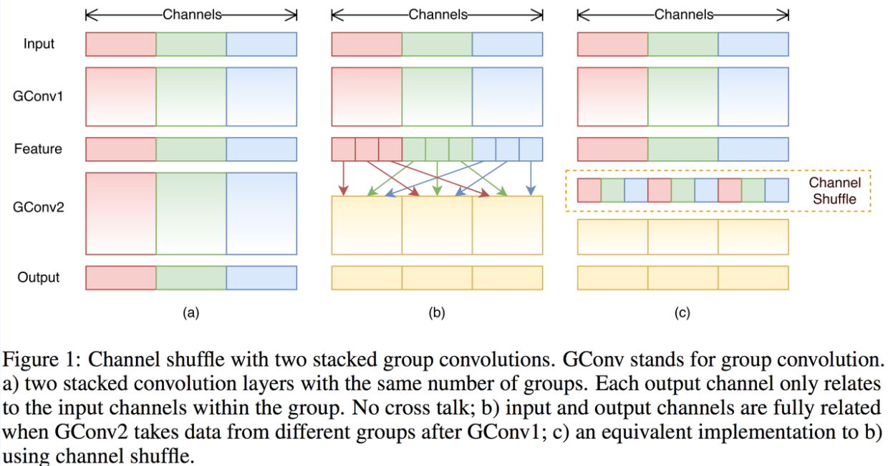


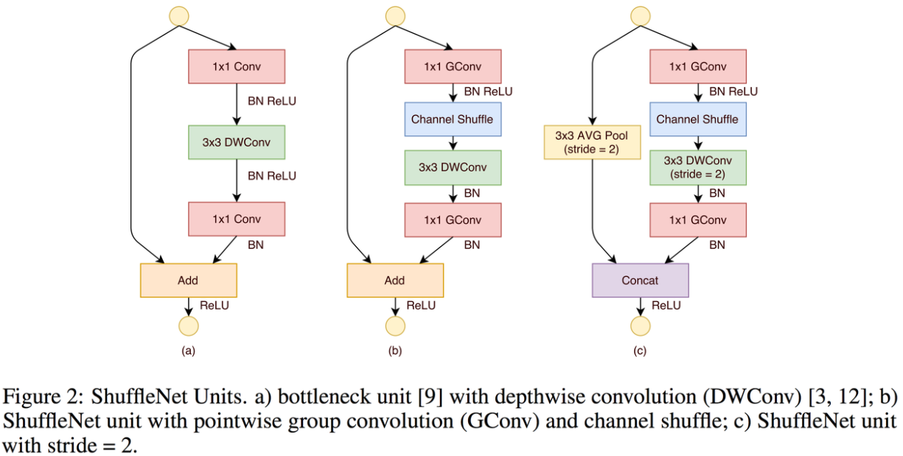

- 利用channel shuffle就可以充分发挥group convolution的优点，而避免其缺点（**就是形成的新的特征图只来源于他们上一级的同组，而不同组别之间的信息没有任何交流，这就会导致性能损失**）
- ShuffleNet对group convolution进行改进，是在卷积完成后加入一个channel shuffle。**进行均匀的打乱，这样接下来进行group convolution时，每一个group的输入不是只来自相邻组，这样就实现了特征融合**。

> 个人感觉，目前Grouped 卷积已经不太使用了，因为当前硬件性能的大幅提升；不过在嵌入式应用中还有很大的空间，比如Channel-wise就使用了该方法，尤其是shuffleNet。
>
> 参考网址：[模型压缩/加速]-加速卷积计算的三种方法-Depth-wise Conv、Group Conv、Channel-wise Conv https://blog.csdn.net/ai_faker/article/details/109469478

#### 3.7 Flattened Convolution

Here we define flattened convolutional networks as CNNs **whose one or more convolutional layer is converted to a sequence of 1D convolutions**.

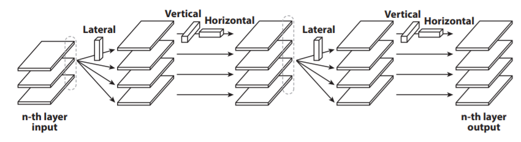

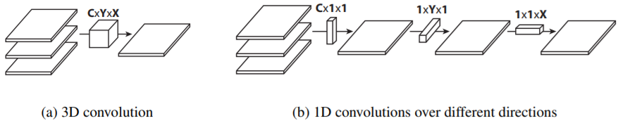

- 这里的L、V、H核在生成每一个特征图的时候都是不一样的。

#### 3.8 卷积的平移不变性和卷积意义的讨论。

> https://zhangting2020.github.io/2018/05/30/Transform-Invariance/

- 不变性

  意味着即使目标的外观发生了变化，但是人还是可以将它识别出来。

  具体地，图像中的目标无论是被平移，被旋转还是被缩放，甚至是不同的光照条件，视角，我们依旧可以将其识别出来。

- 平移

  欧几里得几何中，平移是一种几何变换，表示将一幅图像或一个空间中的每一个点**在某个方向上移动一定的距离**。

- 平移不变性

  意味着无论模型的输入如何平移，模型依旧可以产生完全的相同的输出。

  换句话说，模型对于输入中任何位置的工作原理\处理方式都一致，但是模型的输出会随着目标位置的不同而不同。

- 卷积网络的平移不变性的原因

  - 假设图像某个目标发生平移，而**模型相应的特征图**中对该目标的表达也发生了相似（距离和方向）的平移，就表示**该模型**具有平移不变性。

    具体地：1）图像的左下角一个脸，卷积后，人脸特征（眼睛鼻子嘴）也位于特征图的左下角。

    

    2）当脸位于右上角时，人脸特征同样发生了相似的变化。

    

  - 池化层：以最大池化层为例，感受野中的最大值发生了平移，同时仍在原来的感受野中，则池化层仍然会输出相同的最大值。其实这也是平移不变性的一种表达：即使发生了平移，但是仍然能输出该区域的最大值；（卷积是即使发生了平移，对应目标的特征也发生相似的平移。）

- 卷积的意义

  - **从意义的角度来看，卷积被视为特征检测器，因此每一个卷积核，用于提炼一种浅层或深层的特征。**

  - **从模块的对比角度来看，卷积是限定范围的全连接**

    3x3的卷积就是取9个像素的所有通道进行全连接，而输出的神经元数量就等于输出的通道数。

    1x1的卷积就是 **对应像素通道之间的全连接，但不加入周围的像素通道，但是能够提升通道的特征抽象能力。**

  

#### 3.9 卷积中的FLOPs和参数量的计算公式

假设输入尺寸大小为aXa、通道 为n，输出通道数为m，卷积核大小为bXb，步长为1.那么

- 计算量为 FLOPs = a * a * n * m * b * b**（Mult and Adds）**；
- 参数量为 b * b * n * m；

这就是传统卷积的计算方式，可以看到，**当a、b、n、m相对较大的时候，造成的计算量是非常大的，所以就有降低模型大小与计算量的需要。**

#### 3.10 卷积变体的创新和应用创新思考（待补充）

核心（创新）的两点：

- 输入和输出的稀疏程度；
- 特征图之间存在一定的交流，但是受限，类shuffleNet。


> 各种卷积核无channel-wise：https://ikhlestov.github.io/pages/machine-learning/convolutions-types/

#### 3.11 不同part的convXD和dim的分析

##### Try1: `shape=(4,56,56)`

- Conv1D和`4,56,56`
- Conv2D和`4,56,56,1`
- Conv3D和`4,56,56,1,1`

```python
import tensorflow as tf
import time

tf.random.set_seed(12)

input_shape =(128, 56,56)
x = tf.random.normal(input_shape)

x_1d = tf.random.normal(input_shape)
x_2d = tf.expand_dims(x_1d,-1)
x_3d = tf.expand_dims(x_2d,-1)

print(x_1d.shape,x_2d.shape,x_3d.shape)

time1 = time.time()
y_1d = tf.keras.layers.Conv1D(1, (3), activation='relu', kernel_initializer="Ones",input_shape=x_1d.shape[1:])(x_1d)
time2 = time.time()
y_2d = tf.keras.layers.Conv2D(1, (3,1), activation='relu', kernel_initializer="Ones",input_shape=x_2d.shape[1:])(x_2d)
time3 = time.time()
y_3d = tf.keras.layers.Conv3D(1, (3,1,1), activation='relu', kernel_initializer="Ones",input_shape=x_3d.shape[1:])(x_3d)
time4 = time.time()

print(y_1d.shape)
print(y_2d.shape)
print(y_3d.shape)
print(time2-time1,time3-time2,time4-time3)
# ==============================
"""
(128, 56, 56) (128, 56, 56, 1) (128, 56, 56, 1, 1)
(128, 54, 1)
(128, 54, 56, 1)
(128, 54, 56, 1, 1)
0.0068302154541015625 0.03247642517089844 0.04644060134887695
"""
print(y_1d.numpy().sum())
print(y_2d.numpy().sum())
print(y_3d.numpy().sum())
# ==============================
"""
34486.367
265800.7
265800.7
"""
```

从二维和三维卷积的相同输出结果可知，如果只是单纯地增加了输入数据的维度以及选择了相应的卷积类型与卷积核；同时 **保持输入数据的数据不变**，则最后的卷积结果是一样的；

另外，从时间的角度看，如果卷积的维度越高，则用时越长。

##### Try2: `shape=(4,56,56,128)`

- Conv1D和`4,128,56*56`
- Conv2D和`4,56,56,128`
- Conv3D和`4,56,56,128,1`

```python
import tensorflow as tf

tf.random.set_seed(12)

input_shape =(4,56,56,128)

x_2d = tf.random.normal(input_shape)
x_3d = tf.expand_dims(x_2d,-1)
x_1d = tf.reshape(x_2d,(4,128,56*56))

print(x_1d.shape,x_2d.shape,x_3d.shape)
y_1d = tf.keras.layers.Conv1D(1, (3,), activation='relu', kernel_initializer="Ones",input_shape=input_shape[1:])(x_1d)
y_2d = tf.keras.layers.Conv2D(1, (3,3), activation='relu', kernel_initializer="Ones",input_shape=input_shape[1:])(x_2d)
y_3d = tf.keras.layers.Conv3D(1, (1,1,3), activation='relu', kernel_initializer="Ones",input_shape=input_shape[1:])(x_3d)

print(y_1d.shape)
print(y_2d.shape)
print(y_3d.shape)
#==========================
"""
(4, 128, 3136) (4, 56, 56, 128) (4, 56, 56, 128, 1)
(4, 126, 1)
(4, 54, 54, 1)
(4, 56, 56, 126, 1)
"""
print(y_1d.numpy().sum())
print(y_2d.numpy().sum())
print(y_3d.numpy().sum())
# ===========================
"""
20465.64
165176.72
1092962.4
"""
```

从一维和三维卷积的结果`(4, 126, 1) (4, 56, 56, 126, 1)`。`NHWC`

可以看出，它俩都**只面向通道C维度进行卷积**，但后者的卷积是考虑了**HW两个维度的空间信息**，这就是两种方式的最大差别：都能够实现对C维度的卷积，但是后者能够**同时**学习到另外两个维度的空间信息。

- **那么如何选择呢？——视业务需求，是否需要在融合channel间信息时，包含空间信息。**

  结合Try1中的time分析结果，可以看出，如果低纬度卷积可以实现某个效果，则最好使用低纬度。


### 4 全局平均池化层

参考连接：[全局平均池化(](https://blog.csdn.net/u012370185/article/details/95591712)


**思想：**对于输出的每一个通道的特征图的所有像素计算一个平均值，经过全局平均池化之后就得到一个 **维度==类别数** 的特征向量，然后直接输入到softmax层。

**代码角度的推算**：如果有一批特征图，其尺寸为 **[ B, C, H, W]**, 经过全局平均池化之后，尺寸变为**[B, C, 1, 1]**。也就是说，全局平均池化其实就是**对每一个通道图所有像素值求平均值，然后得到一个新的1 \* 1的通道图**。

**作用：**代替全连接层，可接受任意尺寸的图像

全局平均池化层的好处：

1）可以更好的将类别与最后一个卷积层的特征图对应起来（每一个通道对应一种类别，这样每一张特征图都可以看成是该类别对应的类别置信图）

2）降低参数量，全局平均池化层没有参数，可防止在该层过拟合

3）整合了全局空间信息，对于输入图片的spatial translation更加鲁棒

> 这里想强调的是：除了从tradeoff的考虑以外，即不考虑lightweight，降低参数量以外，**最大认可点是“增强了语义信息、可解释性；同时因为整合了全局空间信息，对于输入图片的空间转换更加具有鲁棒性。”**

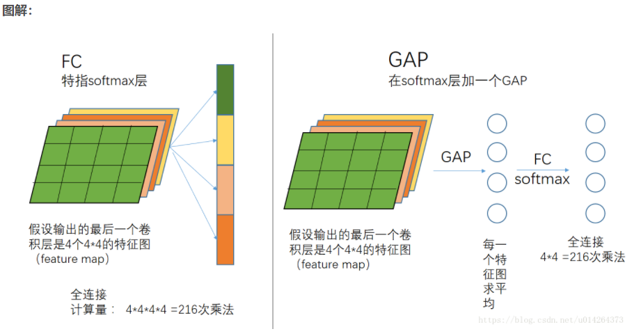


### 10 Utils

#### 10.1 特征图的可视化

特征图可视化：

https://blog.csdn.net/dcrmg/article/details/81255498


## 三 杂文阅读

### 王晋东

#### 1 [如何看深度学习里的Money is all you need的吐槽？](https://www.zhihu.com/question/462995456/answer/1921670491)

1 机器不够，只好智商来凑。**工业界并没有把路堵死，只是把调参调模型的路堵死了**。**身处学术界，没有计算资源的lab，应该更像传统做学术研究的模式，尝试一些clever ideas，也就是需要静下心来靠创造力而非工程能力才能想到的东西**。可以多挖坑，提出新问题或者新想法，而不要过于纠结于刷SOTA. Large scale的推广，就交给工业界来做吧，其实这个分工ideally还是挺好的（当然现实中会有抢功劳）。

2 我最近也遇到了类似的问题，我就用我的例子来解答吧。去年Berkeley/google写了一篇叫DDPM(denoising diffusion probabilistic model)的生成模型，效果很好，只不过需要好多个TPU训练好多天，我等小博士生自然是跑不起来的，只能把pretrained model下载下来，甚至连只跑inference都奇慢无比。**所以我最近研究了如何快速sampling, 无需retrain便能做到几十倍加速**，从而让我能够在single GPU上做extensive evaluation (paper: [https//arxiv.org/pdf/2106.00132.pdf](http://link.zhihu.com/?target=https%3A//arxiv.org/pdf/2106.00132.pdf); code repo: FastDPM_pytorch). 再举一个早一点的例子，**我记得BERT刚出来不久，有个实习生写了一篇文章，讲的是如何在一个GPU上训练 BERT.** **所以，我相信只要肯思考就一定有路子的**。

> 只要肯思考就一定有路子的

> 如果思考迁移学习的产生背景：大规模数据与高计算量，而对于我目前的研究生生活基本上很难去达到对迁移学习研究的层次，最多停留在应用的角度。

### 周志华

#### 1 [[周志华教授：如何做研究与写论文？ (qq.com)](https://mp.weixin.qq.com/s/3pAYLXoivyy_LRe5MjQ4dw)]

- 研究不等于研发

  研究是发现新知、发明新技术；

  研发是基于已有知识和技术进行研制和开发；

- 论文是基于研究工作的，即“做出来的”，而不是写出来的。

- 研究过程：topic——Problem——Idea——Concrete Work（理论分析和实验）——论文书写

- topic明确后，去了解该话题的研究历程和研究现状，方式即是通过“阅读文献”。

  **读不懂的先跳过去，多读几遍**。“**哦 原来是这样啊！——研究乐趣的来源**”

- 热点topic的确定：目前图神经网络；

  但是需要结合过往的知识；

- 问题是科学研究的心脏，任何有价值的研究，都是为了解决某个问题；而问题其实才是研究的真正开始。**会找问题，是具有独立研究能力的标志**

  **问题确定后，搞清楚该问题上已经有过的所有工作，优点与缺点，有没有彻底解决问题，以悟出已有工作的发展线索**

  > 一直认为“速度不变性”是个问题，但是一个行为在10秒内完成和5秒内完成，即使中间有噪音，模型也能区分。就如同空间维度中，不同的猫脸，找到相似之处，以捕捉到猫脸的区分性特征。
  >
  > 那么类似的，空间域上的猫脸识别，存在尺度不变性和位置不变性的考量。因此才有了对一张照片的四角crop。

  而找问题的过程参考下图：

  

  > **切记 小题大作的重要性**。

  - 判断idea是否可行

    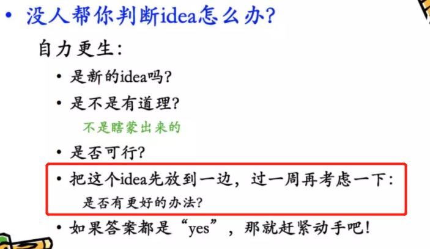

    > 过一周再做考量。

  - Idea得到支持

    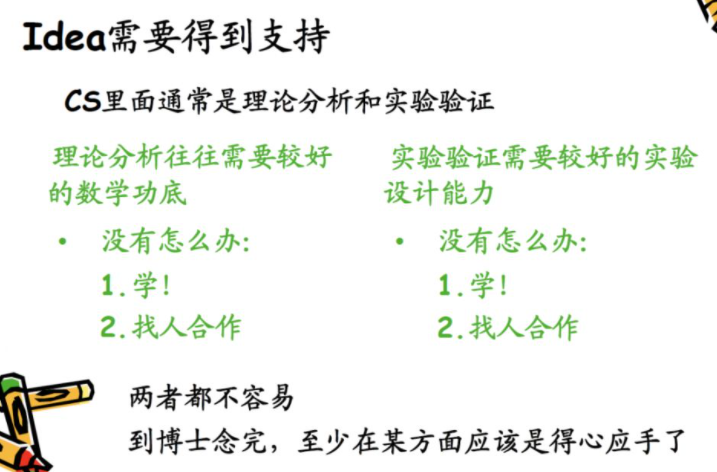

    > **研究生期间，希望你能够学会与人合作！**

- 具体过程：

  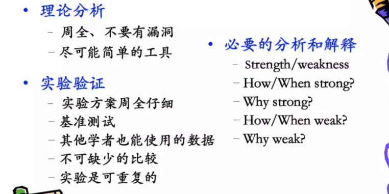

  > 要点是：**实验方案要周全仔细。**

  > **成功之路：聪明+勤奋**
  >
  > 王晋东曾经说过：“**Clever Ideas：静下心来靠创造力而非工程能力才能想到的东西。**”

- 古今中外，做学问者必经的三个境界：

  昨夜西风凋碧树，独上高楼，望尽天涯路；

  衣带渐宽终不悔，为伊消得人憔悴；

  众里寻他千百度，蓦然回首，那人却在灯火阑珊处；

### 沐神

#### 1 我是如何快速阅读和整理文献

- 不同阶段不同方式。

  - 研究生期间：关注自己的领域，读懂每一句话在说什么，并且能够重复它们的实验。
  - 工作之后：关注5-10个领域，了解其最新进展，以思考团队的思考方向或技术讨论的时候指出XXX是一篇很好的论文。

- 一个领域的论文一个markdown文件，记录论文基本信息、重要内容与笔记。

  

- 将一个领域的相关论文画图展示。

  - 用mermaid脚本语言。

- 硬件：12.9寸Ipad。

### 飞桨

#### [更快更强！视频理解模型PP-TSM重磅发布：速度比SlowFast快4.5倍](https://zhuanlan.zhihu.com/p/380815278)

在深度学习的CV领域中，有个重要的研究方向就是**视频理解**，简而言之，就是通过AI技术让机器可以理解视频内容，如今在短视频、推荐、搜索、广告，安防等领域有着广泛的应用和研究价值，像下面这种视频打标签、视频内容分析之类的任务都可以通过视频理解技术搞定！

- SlowFast模型，创新性的使用Slow和Fast两个网络分支分别捕获视频中的***表观信息***和运动信息
- *相较于TSN模型，**TSM模型使用时序位移模块对时序信息建模，在不增加计算量的前提下提升网络的精度**，非常适合工业落地*。

优化方面：

- **数据增强\*Video Mix-up\***

  它将两幅图像以一定的权值叠加构成新的输入图像，对于视频Mix-up，即是将两个视频以一定的权值叠加构成新的输入视频。相较于图像，视频由于多了时间维度，混合的方式可以有更多的选择。*实验中，我们对每个视频，首先抽取固定数量的帧，并给每一帧赋予相同的权重，然后与另一个视频叠加作为新的输入视频*

  结果表明，这种Mix-up方式能有效提升*网络在时空上的抗干扰能力*

  

- **更优的网络结构**

  ResNet50_vd是*指拥有50个卷积层的ResNet-D网络*。如下图所示，ResNet系列网络在被提出后经过了B、C、D三个版本的改进。ResNet-B将Path A中1*1卷积的stride由2改为1，避免了信息丢失；ResNet-C将第一个7*7的卷积核调整为3个3*3卷积核，减少计算量的同时增加了网络非线性；ResNet-D进一步将Path B中1*1卷积的stride由2改为1，并添加了平均池化层，保留了更多的信息。

- Feature aggregation

  对TSM模型，在骨干网络提取特征后，还需要使用分类器做特征分类。实验表明，**在特征平均之后分类，可以减少*frame-level特征的干扰*，获得更高的精度**。

  假设输入视频抽取的帧数为N，则经过骨干网络后，可以得到N个frame-level特征。分类器有两种实现方式：第一种是先对N个帧级特征进行平均，得到**视频级特征video-level**后，**再用全连接层进行分类**；另一种方式是先接全连接层，得到N个权重后进行平均。

  **飞桨开发人员经过大量实验验证发现，采用第1种方式有更好的精度收益。**

  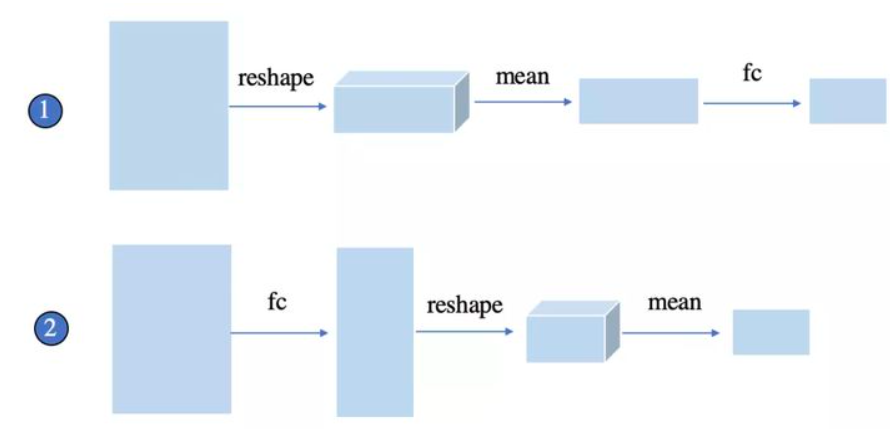

- **更稳定的训练策略**

  **Cosine decay LR**：*在使用梯度下降算法优化目标函数时*，我们使用余弦退火策略调整学习率。假设共有T个step，在第t个step时学习率按以下公式更新。**同时使用Warm-up策略**，在模型训练之初选用较小的学习率，训练一段时间之后再使用预设的学习率训练，**这使得收敛过程更加快速平滑**。

  **Scale fc learning rate**：在训练过程中，我们**给全连接层设置的学习率为其它层的5倍**。*实验结果表明，**通过给分类器层设置更大的学习率**，有助于网络更好的学习收敛，提升模型精度。*

- **Label smooth**

  标签平滑是一种对分类器层进行正则化的机制，**通过在真实的分类标签one-hot编码中真实类别的1上减去一个小量，*非真实标签的0上加上一个小量，将硬标签变成一个软标签*，**达到正则化的作用，防止过拟合，提升模型泛化能力。

- **Precise BN**

  假定训练数据的分布和测试数据的分布是一致的，对于Batch Normalization层，**通常在训练过程中会计算滑动均值和滑动方差，供测试时使用**。

  但滑动均值并不等于真实的均值，因此测试时的精度仍会受到一定影响。为了获取更加精确的均值和方差供BN层在测试时使用，在实验中，我们会在网络训练完一个Epoch后，**固定住网络中的参数不动**，然后将训练数据输入网络做前向计算，**保存下来每个step的均值和方差**，*最终得到所有训练样本精确的均值和方差，提升测试精度。*

- **知识蒸馏方案：Two Stages Knowledge Distillation**

  第一阶段使用*半监督标签知识蒸馏方法*对图像分类模型进行蒸馏，以获得具有更好分类效果的*pretrain模型*。第二阶段使用更高精度的视频分类模型作为教师模型进行蒸馏，以进一步提升模型精度。实验中，将以ResNet152为Backbone的CSN模型作为第二阶段蒸馏的教师模型，在uniform和dense评估策略下，精度均可以**提升大约0.6个点**。最终PP-TSM精度达到**76.16**，超过同等Backbone下的SlowFast模型。


## 四 沐神|深度学习|笔记


### 1.课程安排

- 深度学习很难被解释。

  深度学习似乎很多时候凭直觉。但是他从数学的角度是有一定的解释的。

  深度学习就像是个老中医，虽然你知道它很有效，但你也说不清楚这是为什么？

- 不同的人群，各取所取。

  

  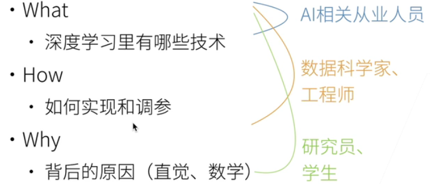

### 2.深度学习介绍

- 计算机视觉之所以不同于自然语言可以用符号学探索的原因就在于：计算机视觉处理的是图像的像素点，不易用符号来表达。

- ImageNet历年各个科研团队的探索，在17年时，基本上所有的paper都能将错误率降低到5%以内，**因此可以说深度学习在图像识别方面已经很成功过了。**

  > 这也就表明，即使我们现在不是很能创新，但是只要阅读大量的文献，了解各模型的优劣，**应用这些模型，面对和处理现实场景的问题还是足够的**。—— 直白地说，驾驶员异常行为方面的应用从理论上应该不成问题了。
  
- 工业中完整的三类人：领域专家、数据科学家和AI专家。

  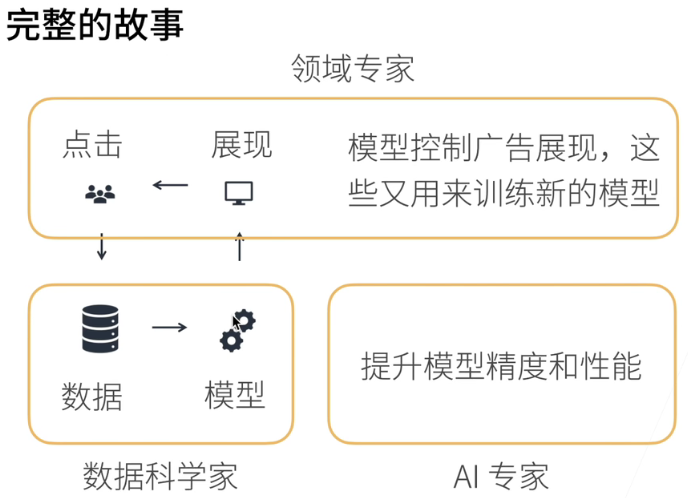

  - 领域专家：相当于甲方提出需求；数据科学家：乙方

- 模型可解释性和模型有效性的区别：

  - 模型可解释性，指模型什么条件下有效什么条件下无效，以及什么时候模型会出现偏差；
  - 模型有效性，指模型为什么有效，给出一定的解释；


### 3. 安装【动手学深度学习v2】

- ubuntu系统创建成功后，首先要执行的几行命令

  ```
  sudo apt-get update # 这一步是自身经验得出的；非常重要；
  sudo apt install build-essential # 安装开发环境必备的包，比如gcc等
  ```

### 4 数据操作 + 数据预处理【动手学深度学习v2】

- 对五维数据和四维数组的形象化表达（以三维数组为表达核心）

  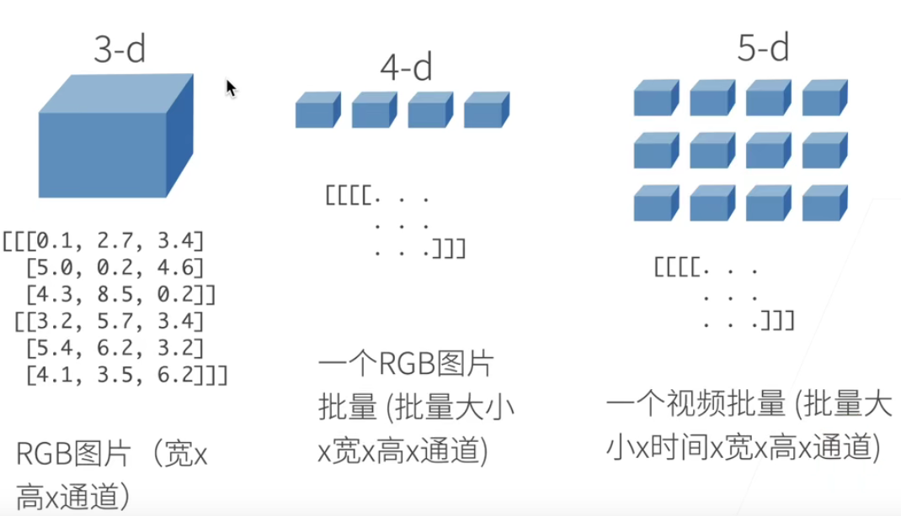

- 生成数据类型为小数的tensor对象的方式：（而数据类型一般设置为32位，如果是64位，深度学习中会比较慢）

  - 指定tensor的数据类型；
  - 将其中的一个整数的后面加点。

- **广播机制的要点是：两个张量的轴数一致，同时某个张量的某个维度的值为1，而另一个张量中该维度的值不为1。**

- python不同于C中需要考虑内存地址分配的问题，但是偶尔其高级应用也需要进行内存的考虑。但是对内存的处理并不会像C一样处理得灵活。

  常见的场景是：用id查看张量的内存地址的十进制标识；体积越大的张量越不应该频繁复制，而是执行原地操作。

  

  另一个例子，表现了numpy中定义的变量变成torch中的变量，所做的是复制操作，**两者的内存地址不同**。并且这样的转换的逆转换也是一样的。

  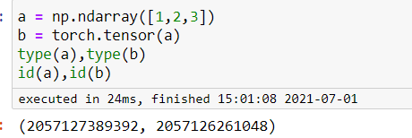

  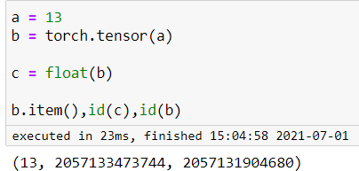

  

- 对于数据集中含有缺失值或者Nan的的特征列A的处理方式：

  - 0
  - 该列均值；
  - 将特征A列分为两类，特征A非缺失，特征A含缺失值两个类别的特征。即将NAN视为一个类。

- pytorch中的view和reshape的区别：

  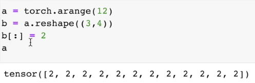

  view其实相当于数据库中的视图，但是如果将视图的值更改后，也会更改源数据的值（内存中的值）。

  view相当于一个浅拷贝，**单从上面的例子，应该注意不要轻易更改一些值。**

- **张量和N维数组**的区别

  - 张量算是物理或数学中的一个概念；
  - N维数组是计算机种的一个概念；

  tensor 其实就是数组，不需要也不要纠结数学上对张量的定义。

### 5 线性代数【动手学深度学习v2】

- 深度学习中不会涉及太多的正定矩阵的应用。
- 向量乘以一个矩阵，一般都会被改变向量的方向，但是有一种向量被矩阵作用后，不会发生改变方向，这种向量成为特征向量。
- 如果tensor中希望实现深拷贝，可以使用clone，通过分配新的内存。
- **涉及维度计算的操作，通常操作后会失去某个维度，而如果希望保持轴数不变，使用参数keepdims=True**
- **两个向量之**间的点积`torch.dot(x,y)`，或者按元素相乘后加和得到点积（标量）`torch.sum(x * y)`
- 矩阵和向量之间的乘法得到列向量`torch.mv(A,x)`
- 矩阵和矩阵之间的乘法得到矩阵`torch.mm(A, B)`
- L2范数是向量元素的平方和的平方根`torch.norm(u)`
- L1范数是向量元素的绝对值之和`torch.abs(u).sum()`，torch并未给出对应的API
- A的shape为【5，4】，维度为2，则有两个轴，第一个

---

- one-hot编码得到稀疏矩阵，如果按照正常矩阵的存储方式存储，其实浪费了内存，因此编程中可以通过稀疏矩阵来存储。稀疏矩阵在其他方面的影响基本没有。另外，**稀疏特征表达，可能通过embedding得到的结果会更好。**
- 深度学习使用张量表示的原因：机器学习中是统计学中的研究的主体，因此延续了这种数值计算的方式。
- copy和clone的区别：浅拷贝和深拷贝（涉及新内存）
- **对哪一维求和就是消除哪一维度！**
- torch中是否区分行向量和列向量：torch中的一维数组就是行向量，而二维数组中开始涉及列向量，三维数组中就变成了通过**第几轴**来称谓。
- `sum(axis=[0,1])`怎么求？假设tensor为三维，具象为RGB图片。
  - 计算机可能先求第0维度再第1维度；
  - 淡化求解顺序过程：表示将每个channel的H*W个元素的值相加。

### 06 矩阵计算【动手学深度学习v2】

- 假如导数不存在的时候，将导数拓展到不可微分的函数。即亚导数。

- 梯度，向量和标量之间求导时，所得到的结果的类型，是向量还是标量。

  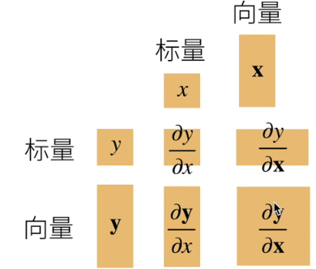

  - 标量对向量求导得到向量：标量被广播，向量对标量求导一致。

    如果按照分子布局符号，则前者得到的是行向量，后者得到的是列向量；

    如果按照分母布局符号，则相反。默认使用分子布局。如上图所示的表达。

  - 向量对向量求导，首先转化为列向量，列向量中每个元素为标量对向量求导，而每个元素得到的结果是单个的行向量，由此构建出一个矩阵。

    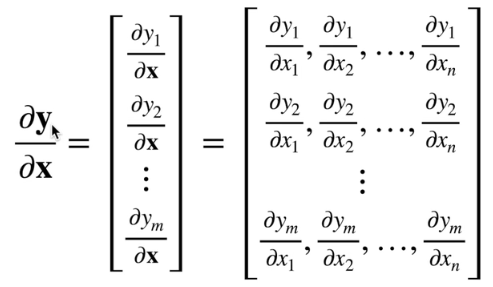

    - 其中两个例子，图中后两个，很有用；

      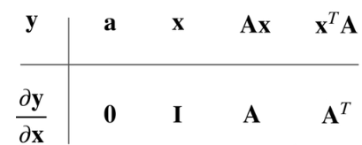

    - A是与x无关的矩阵时，见图中的中间例子。

      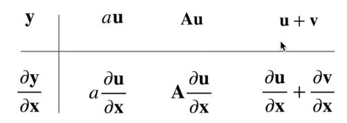

      

  - 扩展到矩阵层次

    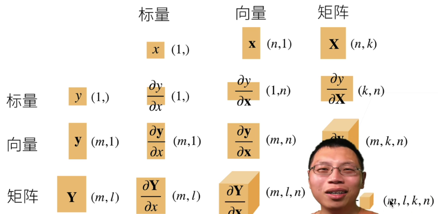

    - 标量在上，而矩阵或向量在下面的时候，向量和矩阵的维度将会逆转。**相同的情况是向量在上的情况。**

      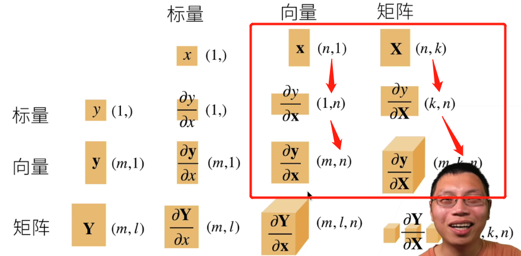

    - 矩阵在上时。

      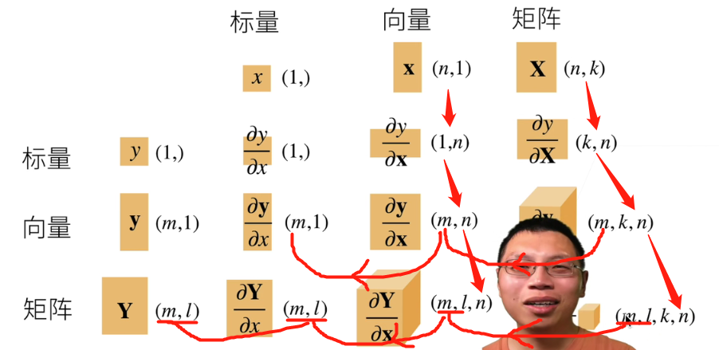

    - 不严谨的总结：分子不变，分母要逆转。

----

- 如果一个算法能够得到最优解，那么该问题属于P问题，但深度学习是用来解决NP问题的。

  对于凸函数而言，理论上可以寻找到全局最优解，但是从实际的计算中是得不到的。

- 框架都会实现自动梯度计算，但是对于个人而言，**虽然不需要亲自计算梯度，但是能够理解出计算过程中得到的结果的形状是很重要的**。

### 07 自动求导【动手学深度学习v2】

- 标量链式法则：

  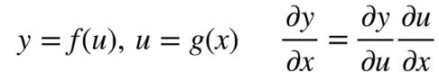

- 向量链式法则：其实结合第6节内容还是比较好理解的。

  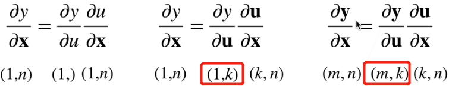

  - 标量对向量求导的例子1和2，**非常到位，三个偏导之间互不相关，很重要的理解点**

    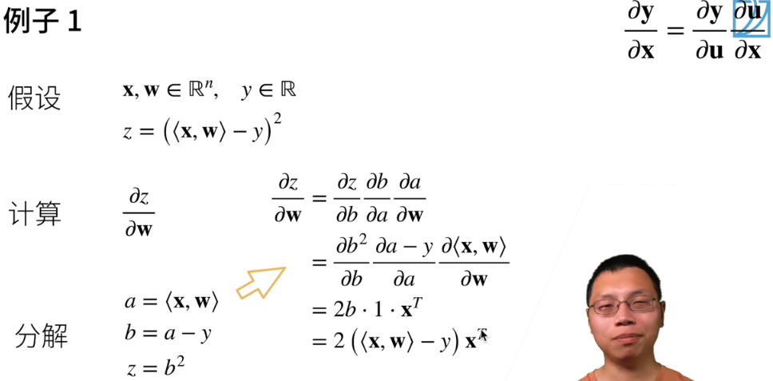

    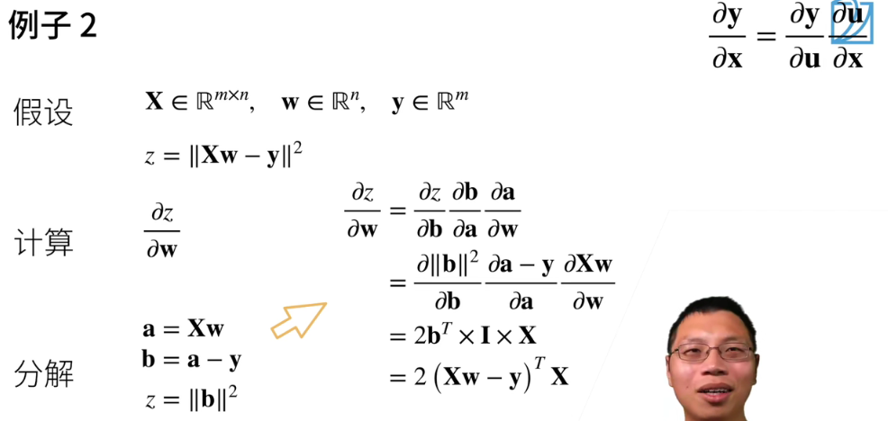

- 计算图：

  - 无环图
  - 显示构造方式，先构造出公式，再代入具体数据
  - 隐式构造方式。**其实讲得不太明白。**

- 自动求导的两种模式（正向累积和反向累积，**但是这里正向累计不是正向传播，而是计算梯度的一种方式。**）

  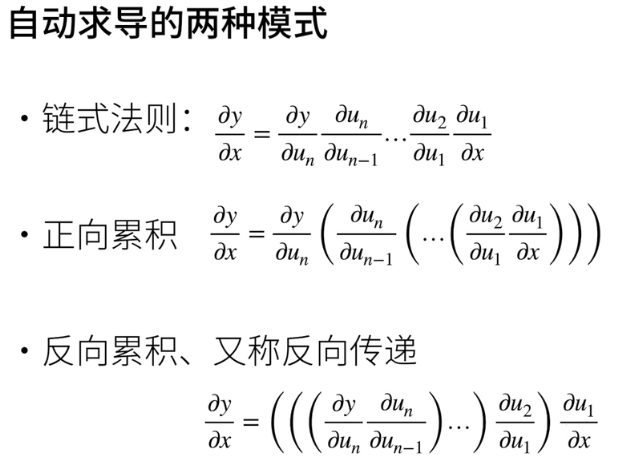

  正向累积由远及近，反向累积由近及远。**两者的差异见下面的复杂度。**

  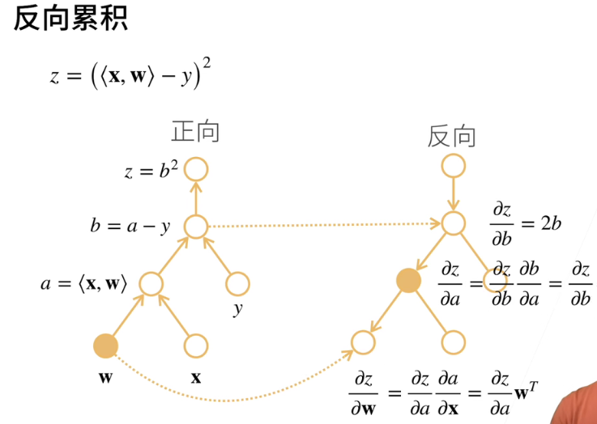

  **反向传播的重点是，会记住正向传播过程中计算得到的数据。更具体的是下面的PPT内容。**

  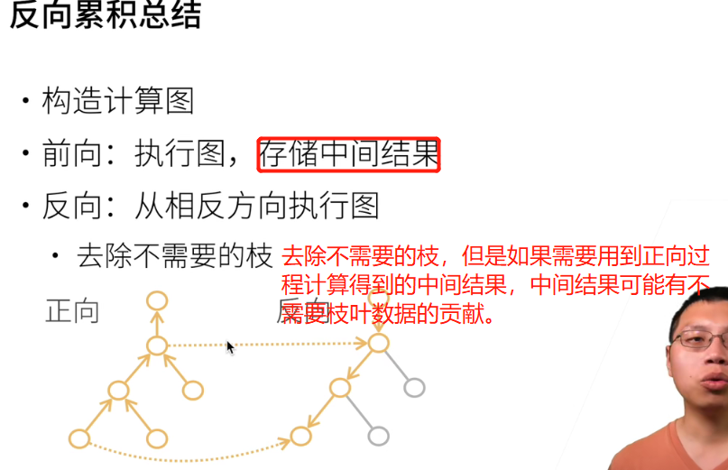

- 自动求导过程的复杂度

  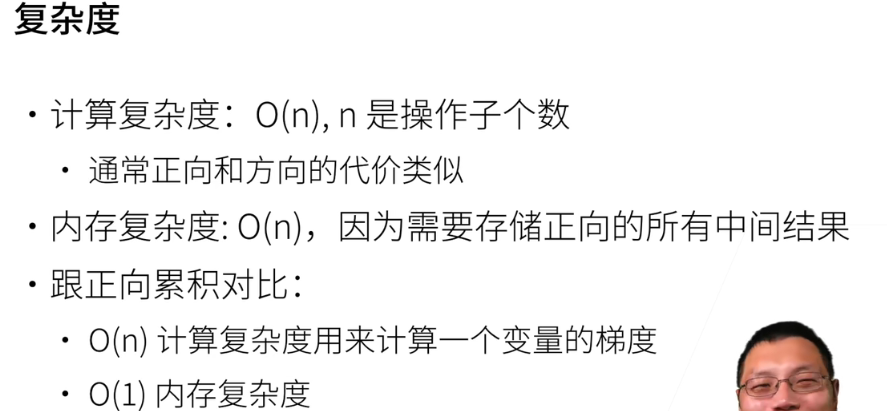

  - 内存复杂度的解释是：因为需要存储正向过程中的所有中间结果，这也是为什么说深度学习非常耗资源的原因。
  - 计算复杂度，正向和反向的过程是基本一致的，可能的不同在于反向计算的时候有些枝叶可能不会去计算。

  **注意：正向累积不是正向传播**。

  - 正向累积中计算复杂度等同于反向累积；但是内存复杂度要低一些。不过如果细究，会发现**计算一个变量（正向传播）或者计算一个变量的梯度（正向累积）**就需要对整个图计算一次，因此计算复杂度其实很高。

- 自动求导实现中，**一般我们的计算结果是个标量，而不是一个向量，即使是一个向量也会再通过平均、最大化等方式变成一个标量。**

- “将某些计算移动到记录的计算图之外”——detach出的张量A会变成标量B，**意味着生成张量A的计算图将依旧会参与梯度计算，但是标量B从张量A中detach后变成一个叶子，而detach意味着深拷贝。**

  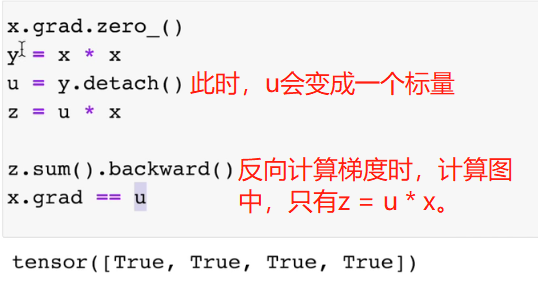

  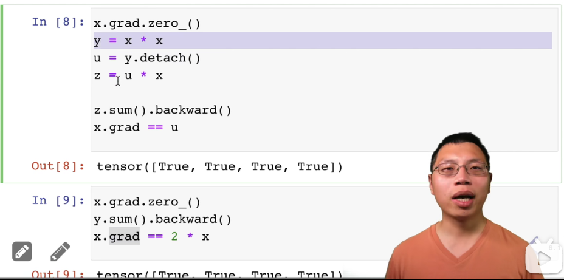

  - 面向的场景是：当一些模型中需要将某些参数固定的时候。

- 即使是在模型使用了很强的Python控制流，仍然可以使用自动求导。

  即使是很复杂的判断循环语句，**只要在正向传播能够结束，框架可以保存该过程的计算图**，**这一点也就表现出，pytorch的隐式构造方式要比显式构造的优势之处：对Python控制流的处理会很好，但是缺点是计算速度会慢一些。**

----

- Pytorch为什么会默认累积梯度？

  累积梯度的使用场景：

  - 大批量128batchsize数据的场景，一下子算不下，即不能将该批量的数据的计算结果在正向计算的过程中，内存不能全部保存其结果。可以将128切分成两个64，最后梯度相加。
  - 多模态，权重在不同模型中进行share的时候，有一定的好处。
  - **多个loss分别反向传播的时候，是需要累积梯度的**。

  Pytorch的内存管理一向不是很好。

- 为什么深度学习中一般对标量求导而不是对矩阵或者向量？因为通常loss是一个标量，如果loss变成了矩阵或者向量，会很麻烦。

- **为什么获取.grad前需要backward？**——因为反向传播是很贵的过程，如果正向传播用时1秒，而反向传播也大致需要一秒，因此选择对于反向传播的额过程，采用人为控制的方式。更为甚之的是，正向和反向需要一定的内存储存。

  > 沐神  YYDS

### 08 线性回归 + 基础优化算法【动手学深度学习v2】

- 简单的线性模型是具有最优解的，因为损失函数是凸函数，而凸函数的性质是最优解一定出现在梯度为0的地方。

- 线性回归是 **对N维输入的加权，外加偏差。**—— 类似于加权平均。

- 线性回归可以看作是单层神经网络。

- 如果一个模型没有显示解的时候，如何找到最优解——剃度下降，沿梯度方向走将会增加损失的函数值。

  

  - mini-batch SGD：因为在整个训练集上训练数据计算梯度太贵（计算时间和存储成本）

    因此通过随机采样N个batch以近似整体损失。

    batch-size 批量大小如果太小，计算量太小，不适合并行来最大利用计算资源；如果太小，内存消耗增加，浪费计算资源，尤其是随机采样中有比较多重复的样本的时候，会浪费计算。 —— **但事实上，我们不会做随机采样，每一次的batch样本集都是不重叠的**

    batchsize过小虽然会在每次计算的时候导致梯度的方向或者梯度值不符合总体数据计算梯度时的方向和值，**但是batch-size过小就像是给深度学习增加了噪音一般，而这种噪音对于模型的学习不是坏事。合适的噪音程度有助于模型的泛化性和鲁棒性的提升**

    批次的大小，从理论上不会影响模型的收敛的上限，只是会对收敛速度产生一点影响而以。

    > 虽然存在更加好的优化算法，但是学术论文中为了发表论文，对比模型通常使用SGD，保证对比性和复现性。但是工业中需要使用各种优化方法达到最优。

---

[线性回归的从零实现](http://zh.d2l.ai/chapter_deep-learning-basics/linear-regression-scratch.html)

- 数据生成器：确定数据长度，生成每个样本的索引列表，随机打乱索引列表，batch-size大小的间隔采样子索引列表。

- 学习率过大，容易引起loss值为NAN，因为中间计算过程涉及到分母为0的情况。

- 调用API实现对数据的加载器，注意输入数据要经过TensorDataset的转换。

  

- API中，后加单个下划线的函数，意味着以某种方式（正太数据\标量）重写\赋值数据

  

> 让设计框架的人来教课，会以简单易懂的方式告诉你深层的东西是什么，需要掌握到什么程度。

---

- 损失为什么要平均？？—— 不平均也可以，但是求得的梯度值会比比较大，而学习率可能因此需要变化，比如损失不进行平均，则学习率进行平均，被除数是batchsize的大小。

- 统计学中经常使用n-1代替n求误差，在这里是否也可以用n-1？—— 可以，其实是任何值都可以，客观的讲，我们只关心是否损失值在每次迭代之后能够下降。

- 不管是GD还是SGD怎么找到合适的学习率？有什么好的方法吗？

  - 使用一个对学习率不是很敏感的优化算法；
  - 合理的参数的初始化，促进数值稳定性，会有助于确定合适的学习率。首选尝试的对象是0.1 or 0.01。
  - 第三种保留 

- 针对batchsize大小的数据集进行网络训练的时候，网络中每个参数更新时 减去的梯度是 **batchsize 中每个样本对应参数的梯度求和之后取得的平均值**。

- 随机剃度下降中的“随机”是指批量大小是随机的吗？—— 不是，批量大小人为指定之后就确定了，而是指每次迭代时从数据集中随机采样出batchsize大小的子样本集。 

- 在深度学习中，设置损失函数的时候，需要考虑正则吗？—— 需要，但是正则项偶尔会被用到，更经常的情况是，使用具有正则化效果的操作作用于模型之中。

- 为什么机器学习优化算法都采用剃度下降（一阶导算法），而不采用牛顿法（二阶导算法），收敛速度更快，一般能算出一阶导数，二阶导数。

  - 首先，后半句话不一定是对的，因为二阶导不好算，因为计算太贵。比如一阶导数是个100个元素的向量，那么二阶导数（一阶导数向量对参数向量求导）就是一个100*100的矩阵。因此牛顿法是做不了的，只能做一些近似。
  - 之所以不用牛顿法是：统计模型和优化模型，构建的这两种模型都是错的，**但是虽然错但是有用。**而求出统计模型的最优解的意义其实并不大，因为统计模型本身就是错误的，**之所以说这些模型都是错的，是表示都不是真实的，都是作了一定的近似和减少了约束或增加了约束。**
  - **收敛速度快不快并不是一个非常值的考虑的地方，我们应该更加在意的是模型的收敛上限**。虽然牛顿法收敛速度快，但是基于损失函数所处的多维曲面，牛顿法得到的最优解未必是很好的，或者说稳定性、泛化性是比较优质的，可能是比不过剃度下降的方式的。
  - **因此二阶导算法并不实用，其次收敛速度不一定快，就算快，收敛结果也不一定好。**

- detach的作用：求梯度时，从计算图中将该节点拿出。

  以下观点的代码：https://blog.csdn.net/m0_38052500/article/details/118419757

  - datach操作，相当于一个**深度拷贝**，操作后返回的变量和被detach的节点**不属于同一个内存id**，同时之后，**被detach的节点的内容被修改后，返回的变量不会随之更改**。
  - detach操作后返回的变量默认不进行梯度计算，**因此如果希望计算该叶子节点，则需要指定其梯度计算属性**。

- data-iter的写法，每次把所有输入load进去，如果数据过多，最后内存应该会爆掉吧。有什么好的办法吗？

  - 数据存储在硬盘上，如果是图像数据，我们不要一下子全部load进去，而是在每次随机采样一个batchsize的样本的索引后，通过个样本的本地连接来读取再转移到内存中。而如果是csv格式的数据，一般一两个G存放在显存中，问题也不大。

- 如果样本大小不是批量数的证书倍，那需要随机剔除多余的样本吗？

  - 第一种：修改批量数，以整数倍；
  - 第二种：从其他的epoch中提出一部分以补全；
  - 第三种：丢掉

  其实pytorch中可以实现不丢掉同时也不补全，只要确定网络结构中一致能够保证第一个轴的维数（即当前batch数据的样本数目）在任何层中都不会改变。

- 这里学习率不做衰减吗？有什么好的学习率衰减方法？

  其实也是存在一些Adaptive的优化算法，也不是非得做。

### 09 Softmax 回归 + 损失函数 + 图片分类数据集【动手学深度学习v2】

- 回归和分类 在输出方面的 数目 的 差别

  回归是估计一个连续值；分类是预测一个离散类别。

  

- Softmax回归虽然是名字含有回归，但是本质是一个多类分类模型。

  而使用Softmax操作子会得到每个类的预测置信度。而评价的标准是使用交叉熵来衡量预测和真实标号的区别。

- **从回归的计算思路向类别转换的过程：**

  - 对类别进行一位有效编码；比如one-hot编码；
  - 使用 **回归中的** 均方损失进行训练，一个是真实标号，另一个是类别置信度最大的类别标号。

- 回归的损失函数无法满足分类需要的几点考虑：

  - 但是这里有一个问题就是，分类任务中，其实不关心模型预测的值，而是对正确类别的预测置信度特别大，即目标函数应该专注在使正确类别的置信度要远远大于对其他类别的置信度。

    

  - 如果预测的置信度值能够处于一定的范围，那么也会使得计算更加简单。**规范就意味着可控**。**而这里提到的处于一定的范围，具体可以是概率的基本要求：非负同时所有类别的置信度值的概率总和为1**

  这里就引入了一个新的操作子Softmax，以使得输出的各类别的置信度值变成概率，同时能够拉大正确类别和非正确类别的置信度之间的差距。

  其操作的重点是：指数化（使任何值都变成非负值）和归一化（以使得所有类别的置信度值的总和为1）。

  

  **但是只是利用softmax结合均方损失又不能很好的测量向量之间的差别，毕竟均方损失函数面向的是两个标量（以单样本为诉说对象）；擅长衡量两个向量之间差别且元素值处于01之间的向量的损失函数是交叉熵。**

  

- 几种损失函数

  

  - L2 LOSS

    

    橙色线表示梯度曲线，而绿色线表示预测值作为自变量时的函数曲线而绿色线表示其似然函数（可以看出其似然函数就是一个高斯分布）。

    - 参数的调整方向是梯度的反方向，因而损失函数的导数就决定了如何更新参数。

      当预测值和真实值相距较远时，梯度比较大，因而对参数的更新的变化值是比较大的，但随着预测值逐渐靠近真实值后，梯度的绝对值会变得越来越小，这就意味着模型对参数的更新的幅度也越来越小。

      **但是问题是当预测值与真实值之间的差距比较大时，也并不总是希望用很大的梯度来更新参数，因而有了L1 LOSS**

  - L1 LOSS

    

    特点就是，**无论真实值和预测值相距多远，得到的梯度一致都是常数。如此可以带来稳定性上的好处 **

    问题是零点处不可导。**不平滑型，以至于当优化过程处于后期时得到的优化结果将不会稳定。**

  - Huber Robust Loss：L2 和 L1 损失函数的结合。

    

    

  - 似然函数的弹幕

    最大似然估计过程就是确定参数取值，以使得**所有的样本的概率总体达到最大**，也就是**最大程度地使样本落在我的模型估计结果周围**的过程，最终要求得一个参数的最优取值。而最大似然函数的数学表达形式是多个随机变量的联合概率密度函数的乘积。


- 图片数据集读取代码中对多进程读取worker的效率的评判：对所有数据进行一次迭代需要的时间。

  

  **经验知识点：一种情况是，模型训练时间要块于数据读取时间，因而在正式训练之前会检查数据读取一遍或一个batch需要的时间。如果数据读取时间比较长，则需要增加worker数目。**

----

- 计算分类准确率

  

----

QA：

- 老师能提一下softlabel训练策略吗？以及为什么有效？ —— N类中只有一类对应位置是有值有效的；但是softmax问题是指数操作后，几乎无法实现输出为1，因为只有当值为无穷大时，经过指数化才能为1。所以softmax使数值处于01之间，但是不能逼近0和1 。因此softlabel就是对真实样本的类别的表达进行处理，即使正确类别对应的label值记为0.9，而不正确类别的值记为0.1。**这样使用softmax去拟合0.9和0.1就非常有可能了。**

- softmax和loistic回归分析一样吗？如果不一样，区别在那里？—— 可以认为一样，logistic是softmax样本类别为两个时的形式。但是softmax的所有类别的置信度的加和是1，而logistic加和为0，即-1 和 +1。

  

- 使用softmax计算loss时只涉及预测正确的样本的概率，我们为什么只关心正确类，而不关心不正确类呢？如果关心不正确类，效果又没有肯能更好？—— 之所以只关心正确类，实际上是因为one-hot编码的缘故，如果使用softlabel，可以实现对不正确类的关心。**（如此损失值不仅仅表示正确类别的概率值，还包括不正确类别，那么又没有可能的一种情况是：损失值的下降是正确类别对应概率的下降和不正确类被对应概率上升的综合影响的结果呢？如此虽然损失下降，但是准确率却降低了！）**

- 这样的N分类，对每一个类别来说，是不是可以认为只有一个正类别，N-1个负类别，会不会类别不平衡？—— （类别不平衡第一是常见，第二是通过其他方式来缓解其负面影响）这样的好处是只关心正确类的效果，但是这个不是关心的重点，**而是不是存在一些类，没有足够多的样本。**

- 关于似然函数和损失之间的关系：**最小化损失的过程就等于最大化似然函数值的过程，也就是最优值点的位置的似然值最大。**

- Dataloadder中的num_workers是并行了吗？—— 是并行了，pytorch应该是通过进程实现并行。

- 参数初始化中的方差值的设置为0.01有讲究吗？—— 有讲究，（应该是总体数据集的方差最好）。深度神经网络中方差是很重要的事情。

- CNN网络学习到的究竟是什么信息？是纹理还是轮廓还是其他？—— 目前没有准确的说法，普遍认为是纹理。

- 如果是自己的图片数据集，需要怎么做才能用于训练，怎么创建关于数据集的迭代器？—— 将不同类别的图片放到不同的文件夹下。

  

### 10 多层感知机 + 代码实现 - 动手学深度学习v2

- 1960年的感知机，是真正意义上的机器，每一根线表示着一个权重。

  

- 给定输入、权重和偏移，同时给定一个函数，函数可以有多种形式：一种是01，一种是-1和+1。**但是无论是哪种形式，输出都是只有两个值且整数。二分类问题**

  它与之前的线性回归不一样的地方在于：都是一个实数，但是线性回归会输出一个实数，而感知机得到一个整数。而与softmax对比，后者输出的是多个值，且是概率的实数取值范围。

- 60年代时对感知机的训练与现在的对比

  

  - 参数初始化没有使用现在的高斯分布；

  - 对每个样本进行遍历，**相当于现在的批量为1的梯度下降**，

    - 其中进行**参数调节的条件是分类错误才进行调整**；因此其损失函数用max函数做了判别，如果分类正确，则max函数中的第二个参数将是负值，则损失函数得到0，表示没有损失产生，当前迭代不进行参数调整。
    - 参数调节时不存在现在的学习率和梯度计算的概念。当时还没有梯度下降的算法；

  - 终止条件是所有数据分类正确的时候才停止。

    

  - 感知ji的收敛

    - 收敛是指什么时候能够停，是不是真的能够停？

    - 感知机是各很简单的模型，因此有一个很好的收敛定理。

      

    - 感知机收敛的时候，不仅仅要求所有类别的输出值大于0，而且还要有一定的余量，要求更加严格一些。如果能够满足这一点，那么感知机确信会在可计算出的步数范围之内达到收敛。r表示数据规模量

  - 感知机的问题：不能拟合X0R问题。以二维输入数据为例，无法找到一条线wx+b来分割下面的情况。—— 解决的方式是：多层感知机

    

---

- 学习XOR问题——通过学习到两个简单分类器，组合成一个复杂分类器。

  

- 激活函数是一个按元素进行计算的函数element-wise。

  而激活函数是非线性的，因为如果仍然是线性函数，则代入之后仍然是线性的。

  

  - sigmoid函数是感知机模型的soft版本。

  - Relu函数常用，但是其本质就是一个max函数，其实与感知机的损失函数比较类似。这种老知识新用的情况在2014年之前不在少数。

    Relu虽然本质很简单，但是其意义还是比较重要的：

    - 计算成本低，不需要做指数运算；CPU中1次指数运算相当于100次乘法运算的成本，GPU中稍微好一些，因为GPU中有自己的单元做指数运算，的那是依旧很贵。
    - 实现线性的方式很简单，保留大于0部分的线性，去掉0部分的内容，这样就在数据整体上不存在线性；

    但是从非线性效果上看，其实几个函数相差不大。不过却是计算挺快的。因此，**简单是其最大优点。**

- 多类分类

  

  - softmax的步骤也就是 将输出的每个元素指数化，同时将其压缩到01之间。

  - 多层和单层的差别不大，只是多了几层非线性计算。**同时要记住每一层都要做激活，因为没有激活，该层就失去了非线性，对于分类和拟合的价值就损失了。**

  - 但是最后一层不需要激活函数，因为**激活函数的目的主要是防止层数的塌陷——这一点极其重要**。

  - 深层模型中涉及隐藏层数目和每层的单元数目的超参数的调整，两个思路：

    - 单层模型，加宽单层的神经元数目；

    - 深层，同时采用不断压缩每一层神经元数目的方式。这一点来源于两点：

      - 一般特征数目是比较多，而输出的类别比较少；
      - 机器学习本身就是一个压缩的过程，使问题降维和简单化。

    - 深层，同时先升维度后降维度；但是不能先将维度后升，因为可能会损失很多信息；而前者可能会带来丰富信息的效果。

      但是有个特例是AE自编码，但是这样就涉及到比较精细的设计。

    **其实判断的依据还是要根据所提供的数据的复杂程度，越复杂对层数和神经元数目的要求越高。—— 很重要。**

---

- 尝试一下，参数如果初始化为0 而不是正太分布，效果会怎样。

  

  zero表示一层全连接层，且以0初始化；zero2则是两层；而normal是两层全连接，且以正太分布初始化参数；

  从loss图可以看出，竟然一层的效果更好；而正太分布初始化参数有利于一开始就处于一个比较好的起点。这两点从下图中得以验证。

  

**但是上面的两层网络之间并没有添加激活函数。下面添加激活函数，发现要两层+激活 > 一层  > 两层；同时正太初始化参数要比零初始化拥有一个更好的开始。**


---

- 请问神经网络中的一层网络到底是指的是什么？—— 一层神经元线性变换+非线性集和 称为一层。

  另外，具体的是，一层并不是指输出的内容，而**应该是包含权重的位置——这是核心**。**而每个箭头都是一个权重**

  

- （收敛定理）数据的区域R怎么测量，Rou怎么设定，实际中我们确实想找到数据分布的区域，可以找到吗？—— 找不到，统计学上的东西很多是假设出来的，但是计算时，拿来用，机器学习负责的是计算过程，而不是假设这一面。

- 感知机或多层感知机和SVM哪个好？

  SVM在当时替代了多层感知机的原因是：

  - 多层感知机涉及很多超参数层数之类，需要调整；而SVM对超参数是不敏感的；
  - SVM的数学知识很好，定理也很漂亮；但是多层感知机就相对缺乏数学知识，**当然这是在两者效果差不多的情况下。**
  - SVM的优化会更好一些，相对于MLP中的SGD。

  **多层感知机的好处在于，如果有一些基于MLP的好的想法，会比较容易的修改少量代码就能实现，虽然理论上可能比较麻烦。而SVM的一些想法的实现则需要对SVM进行大改。**

- 为什么神经网络是增加隐藏层的数目而不是神经元的个数？—— 其实没有特别的理论解释，只要实验结果好以及结合目前所学自己能解释的通

- 虽然Relu大于0的部分是线性，但是从整体上是各折线，折线就具有非线性。

- 不同任务下的激活函数是不是都不一样？也是通过实验来确定的吗？—— 其实都差不多。**它作为超参数，远远没有隐藏层数目等超参数那么重要。**

> 数据科学家百分之二十搞数据，百分之八十搞调参数。

### 11 模型选择 + 过拟合和欠拟合【动手学深度学习v2】

- 训练误差不重要，重要的是泛化误差，而验证数据集和测试数据集其实还是不是很了解区别。

  

- 数据量少的时候，可以使用K-折交叉验证。—— 报告K个验证集误差的平均。

----

- 数据复杂度和模型容量之间的关系

  

  而模型容量是指拟合各种函数的能力。

  低容量模型难以拟合训练数据；而高容量可以记住所有的训练数据。

- 模型容量的影响

  

  最优的地方：泛化误差达到最小值

  > **如果训练误差和泛化误差之间的差距很大，那么模型的容量可能过高了，我们可以减弱模型容量，但是如果导致训练误差和泛化误差之间gap减小的同时，泛化误差反而上升了，这并不是我们期望的；还句话说，我们允许一定的过拟合，只要泛化误差能够积极的向下走。**

  **深度学习核心的地方：模型应该足够大，其次通过各种方式来控制模型容量，使得泛化误差往下降，如果同时泛化误差和训练误差之间的gap越来越小则更好。**

- 模型容量（模型复杂度）的估计：相似算法之间可以比较，但是不同算法之间无法比较。

  对于一个模型种类，有两个主要的因素：**参数的个数和参数值的选择范围**。

  - 参数的个数。

    

  - 参数值的选择范围：BN

    如果选择范围比较大，则模型容量会比较高。

- VC维

  - 计算：N维的感知机的VC维是N+1；而一些多层感知机的VC维`O(Nlog_2 * N)`——即比线性的多一个logN的倍数在里面

    如果是二维的VC维就是3。表示二维输入空间的分类器是一根线，这根直线最多能分开三个不同类别的样本，但是如果是四个或以上，就很难确定了。

  

  - 用处：提供了说为什么一个模型好的理论依据：可以衡量训练误差和泛化误差之间的间隔。

    但是深度学习很少用，因为衡量不准确，更因为VC维在DL中的计算比较困难。

- 数据复杂度：多重因素：样本个数、每个样本的元素个数、时间和空间结构（视频）和多样性（分类的规模）

- 总结：
  - 模型容量需要匹配数据复杂度，否则可能导致欠拟合和过拟合；
  - 统计学中提供了VC维理论来衡量模型容量的大小；但是该理论工具并不恰当；
  - 实际生活中一般靠观察训练误差和验证误差来判别前拟合和过拟合。

----

- SVM从理论上应该对于分类效果不错，和神经网络相比，缺点是哪里？—— SVM是通过核来进行分类的，是比较贵的，因此SVM能处理的数据量在几万或几千；但是神经网络就还好。；其次关于核的超参数，比如宽度，但是效果并不大，**即可调性不强**。、

  而神经网络的优点是：**它是一个语言，不同的层相当于是一些小工具，通过对工具的串联或循环，能够达到对问题的理解。但是又不同于编程语言。—— 不过比SVM的可编程性要好**

- 如果是时间序列数据，训练集和验证集可能会有自相关性，应该怎么处理？—— 验证集不能是训练集中随机采样得到，而应该是验证集处于训练集的后面。

- 验证集和训练集的特征构造（如标准化）如何处理？—— 以图片数据的标准差和均值，可以使用训练集中计算得到的标准差和均值放到验证集中。

- 深度学习中数据集一般都比较大，如果做K折交叉验证是不是成本会比较大——深度学习中如果数据规模比较小就适合，但是一般是不使用的，而机器学习中的传统算法一般是会使用的。

- 为什么交叉验证就是好呢？它也没有解决数据来源的问题？—— 交叉验证确实没有解决，它的目的其实是确定**超参数**。 

- 交叉验证时每次训练得到的模型参数是不同的，这时候是要说明什么道理？应该选择哪个模型？—— 最后报告的是平均精度，它反映的其实是大数定理；

  模型选择的方式：

  - 保留所有模型，然后测试数据时，所有模型都执行一遍，然后得到平均值，**这样最好，因为相当于实现了一个voting操作**
  - 选择其中最好的那个，**但该模型就是缺少了对一些数据集的考量。**

- 如何有效设计超参数，是不是只能搜索？最好用的搜索方法是贝叶斯还是网格、随机？

  - 超参数的设计：确定个数、取值范围。因此不同的组合可能真的有100万种；网格是完全遍历，而随机和贝叶斯都不是。

    最好是靠自己的经验，最好组合数不要太大；

  - 搜索方法：自己调；或者随机100次。贝叶斯的话是需要学习一千次一万次才会好一些。

- 假设做一个二分类问题，实际情况是1比9，那么我的训练集中两种类型的比例应该是1比1还是1比9？—— 其实数据量足够多的话，无所谓了，**主要是验证集中尽量两个类型的比例是相等的**。

  但是这个问题再具体一些，如果现实世界中就是1比9，比如异常行为和正常行为，那么1比9用来训练倒是合理，但是如果现实世界中各个类别都是平等的，同时数据的不平衡是人为数据采集造成的，那么就需要通过加权或者缩小一定比例来缓和类别不均衡问题。

- 为什么SVM一开始打败了多层感知机，后来cnn又打败了SVM？—— 其实不能说时打败，而应该是流行。后者总是因为一些突出的优点变得流行。

  SVM并没有比多层感知机的预测效果要好，但是因为其不涉及过多调参数，并且数据知识丰富，计算简单，因此变得流行；**学术界就是赶时髦的**

  CNN在Imagenet中得了第一，所有流行了

- loss函数总是先下降后上升的吗？

  下面的图中的x轴，可以是模型容量，也可以是epoch次数。两者的差别是前者是多个模型的数据，后者是多个模型。

- **沐神认为，世界由三种东西构成：艺术、工程和科学。艺术是主观的，认为某个事物这么构造好看；工程是指能够描述为什么这么做，也是有定理有依据；而科学就是解释为什么；因此科学实际上是我们希望它是科学，但它其实是个工程，而一半还是艺术。其实一开始就是个艺术，但是要发论文，就得解释为什么好，否则没有卖点。但是只要你指出这么做work，那么就会有很多人会慢慢地去指出为什么做这样会work！**

- 同样的模型结构，同样的训练数据，为什么只是随机初始化不同，最后集成就一定会好？

  - 理论上来说，模型是统计学的内容；随机初始化参数即数值的选取是数据中的优化内容。统计加上优化得到最终的结果。
  - 而统计学中建立的模型，目的是对现实世界建模是拟合现实数据，但是所有的模型都是假的，因为模型是假设出来的，因此模型与真实情况总是存在一定的偏移，无论是方差还是均值的偏移。而进行多次数据的选择，会使得最后得到的集成结果与真实结果之间的偏移变小，因而说是有效的。

### 12 权重衰退【动手学深度学习v2】

- 权重衰退是最常见的处理过拟合的一种方法。

- 权重取值范围的限制：

  - 通过使用均方范数作为硬性限制，以控制模型的容量。

  

  但是通常不是选择这样的方式，而是下面的柔性方法

  - 使用均方范数作为柔性限制：因此超参数lambda会使得w整体自适应。取值范围受到限定，但是并不严格。**只是要求其小，但是小到什么具体的范围并不知道。**

    

  - 

    **图中横坐标是权重w，而纵坐标是正则项或者loss函数的输出值，而不是特征的取值。**

    是损失函数和正则项之间的权衡，本质是中和一个矛盾：**w增加会使得正则项增大，loss值减小**。

  - 其实权重衰退是对权重的约束，**在每次更新时会起作用。从权重更新公式可以看出，只要优化器中指定了衰减率，那么做更新时直接在公式中加入即可，而不需要在代码中的目标函数定义中加上正则化项。**

    **同时结合更新公式，权重衰减参数，相当于在每次权重更新之前，将当前参数的参数值做了一次 放小，因此成为衰退。**

    

---

- 定义L2范数惩罚

  ```
  def l2_penalty(w):
      return (w**2).sum() / 2
  ```

  而使用的时候：直接接在loss之后，再基于两者相加的结果进行backward

- 为什么参数不过大复杂度就低呢？

  我们会限制参数的取值范围不能过大也不能过小，而是应该在某一个范围内取值；如果模型允许参数过大或者过小就意味着模型可以拟合任何曲线，见下图，但是限制参数取值范围之后，就相当于引导其学习比较稳定的、平滑的曲线，这也就意味着模型的复杂度会变底；

  

- 如果正则项成为L1，会怎样？

  

  - 似乎L2的训练误差能够达到很高的程度，但是L1的整体拟合效果很好。并且不存在过拟合问题。

  - 在FashionMnist数据集中使用weight-decay，0，0.0005，0.005，0.05，0.5。

    

    发现不增加惩罚项的效果更好。**而且衰减率越高越影响效果。**

  - 观察0和0.0005的过拟合程度，其实也看不出谁好谁坏。

    

- 实践中权重衰减的值一般设置为多少好呢？之前在跑代码的时候总是感觉权重衰减的效果不是很好？

  一般是1，3，5，数量级需要自行调整。太大不是好事儿。

  一般的权重衰减的效果其实不是很明显。**但是我在想，其避免过拟合的效果可能会对其他正则方法有积极影响。所以最好加上，不过是小项。**

- **！权！重！衰！减！能够缓解过拟合的原因是**：<u>一般过拟合的结果是某些参数可能过于大有些过于小，这样就使得模型的拟合效果会增强</u>，<u>但是因为数据本身是有噪声的，拟合效果太强，又会过分记住数据中的噪音特征</u>。因此很自然的一个思路是，限制权重的取值范围。那么给目标函数增加关于权重的正则项或者在权重更新公式中添加权重衰减率，就可以达到这样的效果。**但是一般实际效果并不是很明显，同时由于对权重的限制会影响模型的拟合能力，因此权重衰减之后，训练误差下降的同时，泛化误差也会随之下降。**

- 噪音数据很大的时候，W权重的值一定会很大吗？或者说权重中过大过小的现象很严重吗？

  ```python
  print(train(10), train(5), train(2), train(1), train(0.5), train(0.1), train(0.01), train(0.001), train(0.0001))
  """
  w的L2范数是： 3.9394781589508057
  权重W： [-2.9735, 0.339, -1.9522, 1.3749, -0.9279] 权重方差：: tensor(1.7387, grad_fn=<StdBackward0>) 偏置：: tensor([-0.6280], requires_grad=True)
  
  w的L2范数是： 2.3508965969085693
  权重W： [0.7612, 0.3829, -1.3531, -0.1604, 1.7158] 权重方差：: tensor(1.1362, grad_fn=<StdBackward0>) 偏置：: tensor([0.0679], requires_grad=True)
  
  w的L2范数是： 0.933908224105835
  权重W： [-0.6657, 0.0553, -0.3579, 0.4601, -0.2936] 权重方差：: tensor(0.4312, grad_fn=<StdBackward0>) 偏置：: tensor([-0.2288], requires_grad=True)
  
  w的L2范数是： 0.29742202162742615
  权重W： [-0.0378, -0.2512, -0.005, -0.1231, 0.0935] 权重方差：: tensor(0.1299, grad_fn=<StdBackward0>) 偏置：: tensor([-0.0498], requires_grad=True)
  
  w的L2范数是： 0.7895434498786926
  权重W： [0.1462, -0.016, 0.5212, 0.5291, 0.2239] 权重方差：: tensor(0.2392, grad_fn=<StdBackward0>) 偏置：: tensor([-0.1717], requires_grad=True)
  
  w的L2范数是： 0.7485469579696655
  权重W： [0.579, 0.1397, -0.0003, 0.4438, 0.0928] 权重方差：: tensor(0.2476, grad_fn=<StdBackward0>) 偏置：: tensor([0.1621], requires_grad=True)
  
  w的L2范数是： 0.3128850758075714
  权重W： [0.0614, 0.0763, -0.0702, 0.118, 0.2635] 权重方差：: tensor(0.1200, grad_fn=<StdBackward0>) 偏置：: tensor([-0.0875], requires_grad=True)
  
  w的L2范数是： 0.32380837202072144
  权重W： [0.172, -0.2023, 0.0988, 0.156, -0.0152] 权重方差：: tensor(0.1550, grad_fn=<StdBackward0>) 偏置：: tensor([-0.0011], requires_grad=True)
  
  w的L2范数是： 0.6125597953796387
  权重W： [0.155, 0.3786, -0.0078, 0.2527, 0.3794] 权重方差：: tensor(0.1636, grad_fn=<StdBackward0>) 偏置：: tensor([0.1814], requires_grad=True)
  """
  ```

  整体来看可知，确实噪音越大，**权重取值过大过小的情况比较明显，无论是从权重具体值还是方差值上面看。**

  代码：https://colab.research.google.com/drive/18qxQrK8zEaRVwQGEwVBKfsTdPIU7uF6E?usp=sharing

### 13 丢弃法【动手学深度学习v2】

- 动机：一个好的模型需要对输入数据具有扰动鲁棒性；

  

  > **正则的意思就是：通过操作限制权重的范围，不要太大或太小。**

  丢弃法不同于题刻若夫正则，前者是在层之间加入噪音，而后者是在数据中随机加入噪音。

- 丢弃法能够实现**无偏差噪音**的加入。

  

  **通过老师的手推，我们应该明白为什么需要未被丢弃的数据除以一个除数**。

- 使用丢弃法：作用在隐藏层的输出上。

  

  **不过，Hinton当前的想法是dropout是采用集成的方式：每次随机选择每层的几个单元构成一个子神经网络，将多个子神经网络的结果取平均。不过后来的研究发现以目前的方式来看，实验结果有正则的效果，虽然没有科学依据，但是效果很好。**

  **听了李沐老师的课程，越来觉得尹清波老师的话是对的：很重要的观点，DL和ML中的很多想法都是试出来的，而不是从严谨的科学理论推出来的。**

- 实现

  ```python
  def dropout_layer(X, dropout):
      assert 0 <= dropout <= 1
      # 在本情况中，所有元素都被丢弃。
      if dropout == 1:
          return torch.zeros_like(X)
      # 在本情况中，所有元素都被保留。
      if dropout == 0:
          return X
      mask = (torch.randn(X.shape) > dropout).float()
      # 而之所以不写成 X【mask】 = 0，是因为这样对GPU和CPU运算都不是很好。即做乘法远远要比选择函数要来的快。
      return mask * X / (1.0 - dropout)
  ```

   **而之所以不写成 X【mask】 = 0，是因为这样对GPU和CPU运算都不是很好。即做乘法远远要比选择函数要来的快**。

- 实验结果：权重衰减、正常、dropout三者之间的对比。

  

  - 发现权重衰减和baseline模型的过拟合现象并没有得到消除，不仅如此，拟合效果还有所下降。

    

  - dropout的拟合效果损失更大，**但是其过拟合问题得到有效的缓解，同时随着迭代次数的增加，验证集的loss值与normal和权重衰减相差不大。**

- **！！！！我们通常是可以将模型的复杂度设计得高一些，然后再使用正则化来控制模型的复杂度。**

----

- Droupout随机丢弃，如何保证结果的正确性和可重复性？
  - 正确性：机器学习没有正确性只有效果好不好。
  - 可重复性：设置随机数种子；但是随机数种子不是可重复性保证的全部，当涉及到cudnn的内部计算的时候，可重复性是几乎不能保证的。

- **Dropout是给全连接层用的，BN是给卷基层用的？一定的吗?——实验中可能不区分使用的对象到底是不是全连接层，但是理论上、可解释性上应该是有讲究的。**

- dropout会不会让训练的loss曲线方差变大，不够平滑？—— 如果从因为dropout会随机丢弃一些神经元而担心网络输出不稳定的角度，得出这样的疑问，很正常。但是从目前我自己的实验结果看，**它反而可以使曲线平滑**。其次，关于曲线波动，更让在乎的是后期是否平滑，**因为那意味着是否稳定收敛。**

- 请问可以再解释一下为什么“推理中的dropout是直接返回输入”吗？—— 首先，dropout是一个正则项，是用来限制权重的取值范围不至于过高或过小；训练的时候需要进行权重的调整，所以dropout会其作用，但是推理的时候，不涉及对权重的更改，只是利用权重做正向传播，因此dropout即使使用了，也起不到它本来的作用。其次，推理中直接返回输入是为了避免对同一个样本推理时造成推理结果不一样的情况发生。**因为经过dropout会涉及随机丢失一些输入，从而影响最终模型的输出结果**。最后，推理的时候也可以使用dropout，不过需要对相同的数据做N次实验，最后取平均，以ensemble的方式使**预测结果们的方差**降下来（**方差越小，数据越能集中在均值附近。**）。

- 请问Dropout丢弃的是前一层还是最后一层？—— 严谨的说应该是 前一层的输出或者是后一层的输入。

- dropout和权重衰减都属于正则，但是为什么dropout的效果更好，且现在更加常用？—— 其实是权重衰减用的更多，因为它可以用在RNN、attention、transformer上都OK，但是dropout是作用于全连接层；其次，dropout效果好，更多是因为其参数调整后，效果很直观，**丢弃率就表示丢弃多少神经元，而weight-decay的lambda值没有具体的含义，所以不是很好调整，结果也就没有什么可观的，不过它确实对限定权重的取值范围（正则化）有很好的效果**

  **Dropout的取值一般三个：0.1，0.9，0.5。**

- MLP就是全部为全连接层的结构。我们希望**模型复杂度高，你和能力强**，**但是同时希望模型不会学偏。**

- Dropout的介入会不会造成参数的收敛更慢？—— 会**的，毕竟每次梯度更新的时候都需要丢弃一部分，暂时不考虑这一部分，因此模型达到所有神经元上的平衡稳定相对更需要时间。**


### 14 数值稳定性 + 模型初始化和激活函数【动手学深度学习v2】

- 模型很深的时候，数值会变得非常不稳定。这种现象很常见。**而这种问题的最根本来源是 反向传播计算梯度时因为层数过多，从输出层往前计算每一层梯度时，中间某一层的参数梯度值需要计算出从最后一层到该层的多个梯度矩阵（向量对向量的求导是一个矩阵）的乘积。**

  

  而这种多个梯度计算矩阵带来了两个数值不稳定的问题：**梯度爆炸和梯度消失。**

  

- 梯度爆炸问题的特点是：

  - 无论是梯度值还是激活值都能可能超出值域 infinity，**而这一点对于16位浮点数尤为重要，因为16位浮点数在NVIDIA GPU上可以比32位数据的计算能力快两倍。**

  - 即使是没有超过值域，**也会对学习率敏感。**

    

    - 因此有了自适应学习率调整或者人为手动调整参数。

- 梯度消失问题的特点：

  

  这就使得构造的模型其实从拟合能力上看就等同于浅层网络。

----

- 让训练更加稳定。

  - 目标：让梯度值处于合理的范围之内。比如10的-6到10的3次方；

  - 方式：将乘法变成加法 ——> 形式上是：**使不同分支中拥有着不同语义特征信息的矩阵通过元素相加得到 一个fusion矩阵，从语义上看，它就包含了各分支的语义信息**。 比如残差网络（将两个分支的原始数据和高级语义特征信息融合），比如LSTM将长期信息和短期要遗忘的信息和短期要记忆的信息夹在一起或者mask在一起。—— **这里的解释是从激活值的融合的角度说的，类比到梯度值的计算上也是同样的。**

  - **！意！义**：能够获得一个更好的起点以获得最优解，还有使得数据保持稳定以外，而且还使数据处于一定的区间能够方便硬件计算。**

    - 合理的数值取值区间，可以方便硬件的计算；
    - 合理的数值取值区间，能够使得数据保持稳定，数据稳定进而避免或者缓解梯度爆炸和梯度消失的问题。
    - 合理的数值取值区间，（经验的角度）能够为训练提供一个不错的起点。（可能数据只要是有规律的，就会有好处的吧）

  - 将梯度值归一化，不管其值多大，都将其归一化到01之间。

  - 梯度剪裁：梯度值大于阈值就峰顶为阈值的大小。

  - **合理的权重初始化和合理的激活函数** —— 让每一层的方差是一个常数，均值为0。

    - **让每一层的方差是一个常数，均值为0**。（**正向计算过程保证每层的输出值的方差一致、以及反向计算过程中的每层梯度值的方差一致。**）

      

    - 实现方式之一：权重初始化

      

      原因是：训练刚开始的时候更容易有数值不稳定的情况发生，因此需要对权重的初始化进行考量。

      经过理论的推导，如果希望实现 **每一层的方差是一个常数**，必须满足 **每一层的输入维度和该层权重的方差乘积等于1，且同时该层的输出维度和该层权重的方差乘积也等于1。——而这一点是很难满足（满足的情况只有是该层的输入和输出维度一致时）的，因此Xavier采取了一种方式就是取平均，如下图所示。** 

      

      - Xavier也是一种比较常用的方法

    - 实现方式之二：合理的激活函数。

      - 如果希望期望等于0，那么经过激活函数后偏置等于0；同时如果希望激活函数不改变输入和输出的激活值的方差，那么需要激活函数是线性的。

        

        

      - 为了找到目前的激活函数哪个更加接近 **激活值等于输出值**这一特点，可以通过泰勒展开式。

        

      - **神奇的是，scaled sigmoid能够克服大多sigmoid的缺点；**

----

- nan，inf是如何产生的以及如何避免吗？—— inf通常是学习率太大二引起的；nan一般是除以0；

  解决方式：合理的初始化、学习率适当、激活函数；不过学习率是第一考虑的地方。

- **其实选择不同模型的一个重要原因是：其对于某一种数据能够保证数值稳定；**

- 当遇到一些复杂的数学公式，看到文字描述也没什么感觉，这个应该如何突破一下？

  - 深度学习的一个特点是：即是不懂数学，也可以使用很多的工具；
  - **如果说代码能力是编程能力、做事效率的本体，那么数学就是对深度学习模型理解能力的本体，它确定了你理解问题，解决任务的复杂度的上限**。

- 激活函数的选择可能会引起梯度消失，但是不可能引起梯度爆炸。这是由激活函数的梯度取值范围确定的，一般都是处于0-1之间。越趋向于0的时候（即使是0.8时也会）就造成了梯度消失

- （好问题）让每层方差是一个常数的方法，您是指BN吗？想问一下，BN为什么要有伽马和贝塔？去掉可以吗？—— BN可以使一层的输出值**即使是多次梯度更新迭代之后**仍然保持均值为0和方差为一个常数的正太分布，但是不能保证每层的梯度也是如此。

  > **这里涉及一个好的点：合理的权重初始化和激活函数只能保证每层的输出或者梯度值在开始训练之前保证方差输出为一个常数，但是不能保证经过多次迭代之后依旧如此。**

- 强制使得每一层的输出特征均值为0，方差为1，是不是损失了网络的表达能力，改变了数据的特征？会降低学到的模型的准确率吗？—— 使数据处于一定的区间的好处是：
  - 方便硬件的计算；但是从数学上，处于一定的范围，并不会影响网络模型的表达能力。
- 为什么scaled sigmoid 可以提高稳定性？它和Relu其实是一样的吗？—— scaled近似实现了“**输出值激活后仍为输出值**”的效果，使得输出值能够处于一个合理的区间，因此提高了数据的稳定性；但是**即使说稳定性能够达到和Relu一样的效果，也不能说它的其他方面能和Relu相比**，比如计算速度方面，因为Relu不需要做指数计算。

### 15 实战：Kaggle房价预测 + 课程竞赛：加州2020年房价预测【动手学深度学习v2】

- 

### 16 PyTorch 神经网络基础【动手学深度学习v2】

- 之所以对于定义的含有forward函数的网络层，之所以初始化结束后进行训练不调用forward函数，是因为__call__方法中设置了自动调用forward。


## 五 论文阅读中的启发与实践

### 5.1 启发

1. 我想应该有一些领域已经在解决尺度不变性、速度不变性等问题，毕竟这是一个很现实的问题，这部分的论文需要注意一下；

2. 最后通过一个卷积层将融合后的特征图卷积得到最终的特征图，用于减少上采样的混叠效应aliasing effect。

   是否实验能够给与证明？

3. 启发：模型真的是调参调出来的。而某个操作是否真的有价值，要取决于具体的网络结构。**核心结构以确定细节构造，由点及面**。

4. CAM技术，类别激活映射图。https://zhuanlan.zhihu.com/p/269702192 介绍了很多不同的技术；

5. SlowFast能够处理行为之间的不一致问题，比如跑步和走路；还是有机会的，如果可以将slowFast变成即插即用？是否可以实现新的突破？

6. ME模块，这种挤压膨胀结构有些类似于自编码中的编码过程，挤压似乎有利于提取重要的特征。

7. 常用的数据集Somthing；常用的视频模型：TSM\TSN和TEA SENET等。

8. **论文阅读越多以后，越发觉得Openpose的论文的对比模型缺乏合适的正规的模型比较；对比模型的路子都比较野；**

   **论文修改势在必行**
   
9. 我们通常是可以将模型的复杂度设计得高一些，然后再使用正则化来控制模型的复杂度

10. 其实选择不同模型的一个重要原因是：其对于某一种数据能够保证数值稳定；

11. 如果说代码能力是编程能力、做事效率的本体，那么数学就是对深度学习模型理解能力的本体，它确定了你理解问题，解决任务的复杂度的上限


### 5.2 实践

1. 总结论文使用的模型、数据集和预处理方法、评价标准、评价指标值

   > 数据集，首先选择采样的方式，对于采样得到的帧，逐帧进行随机或指定方式的增强（尺寸抖动或者角落裁剪或者翻转）；只要涉及到采样，就可以通过多次采样以增强数据。
   
2. 实践思路：

   **0630日记**

   - 确定数据集：以两个旧有的数据集为baseline的生成数据集。一般地在这两个数据集中表现良好的模型在其他模型中表现也不差。

   - 复现论文模型：唯一的前提是网络中已出现的代码。**不过阅读的video understanding的论文还是很少，因此需要边复现边看论文，寻找思路**

     也就是这个阶段有三件事在同时进行：

     - 复现论文代码；
     - 看新的论文；
     - 温习正在复现的论文。

   **0702日记**

   - 图片文件一共220847张图片。经过排序后标号为1到220847。
   - json文件被读取后会得到一个字典为元素的列表。同时各文件中的数目为train：168913，valid:24777，test: 27157。总共220847个，因此图片和标签数目是一致的。
   - 标签的数目是174个。是以字典的形式呈现。不同于上面的列表形式。

   

