## 2018_《Real-time Distracted Driver Posture Classification》

遗传算法做权重加和的集成方法；使用遗传算法做分类模型有好的效果。—— **需要对比不同的分类层方式**

过去七年分心驾驶员检测领域的工作可以分成四个部分：

 multiple independent cell phone detection publications

Kaggle竞赛数据集

手机检测数据集

UCSD数据集

分心驾驶数据集

#### 2.1 手机使用检测

【2014】基于SVM的模型以检测驾驶中对手机的使用。数据集包含驾驶员正脸照片，基于一个假设：手和脸都处于采集的图像中。

【2015】使用AdaBoost分类器和隐马尔可夫模型对Kinect4D数据集进行分类。数据集产生于 **室内** 数据；人坐在椅子上，同时作用一种分心行为。但是这种解决方案的问题是：一 光照条件；二 相机和驾驶员之间的距离。现实场景中的光照条件是或sunshine或shadow

【2016】使用Faster RCNN 以检测驾驶员的手机行为和手是否在方向盘上。**它们的模型面向对手和脸部的分割。**

使用的数据集是【2015】年的某数据集。每秒0,06帧或者0.09帧。也就是一分钟3.6帧或5.4帧；

#### 2.2 UCSD数据集

【2013】将图片分成方向盘、齿轮传统装置（变速杆）和中控三个部分，**每个部分使用一种分类器，以探测这三个区域中手部的位置，通过激活分类层探测到真实的手部活动的位置**。

【2013a】基于region的分类方法，以探测在预定好的region探测手部的出现。模型会单独地学习各个区域；之后通过二阶段分类器对所有区域信息融合后进行分类。

【2013b】制作了RGBD数据集，可以观察到方向盘和驾驶员的活动；每一帧图片被分成了五个部分：一只手、没有手、两只手、两只手+cell、两只手+map和两只手+bottle。

#### 2.3 东南大学的分心检测数据集

【2011a】设计了一个更具有包容性inclusive的分心驾驶数据集（side view 侧视图）以包含更多的行为活动：grasp 手握方向盘、操作 shift lever变速杆，吃蛋糕和打电话。

文章中，引入了轮廓波转换contourlet transform 以提取特征，同时评估了多种分类器的分类表现：**随机森林**、K近邻和多层感知机。

【2012】使用多元小波转换做特征提取，提升了多层感知机的分类性能。

【2013】使用有向梯度金字塔直方图和空间尺度特征提取器以提升多层感知加的效果；

【2016a】使用RCNN；其次，以往的的work使用四个类别以检测准确率，而该work使用了六个类别。

【2016b】使用两步方式训练模型；首先，使用预训练好的稀疏卷积核作为第一层卷积的参数；其次，在真实数据集上微调模型，模型使用四个类别： wheel (safe driving), eating/smoking, operating the shift lever, and talking on the
phone.

#### 2.4 StateFarm数据集

是第一个公开发布可用的数据集。

它定义了10个姿势：

1 safe driving,

4 texting using right hand, talking on the phone using right hand, texting using left hand, talking
on the phone using left hand, 

operating the radio, drinking, reaching behind, hair and makeup, and
talking to passenger

**由于该数据集只限于竞赛的目的，因此我们设计了一个相似的数据集；**

### 3 数据集设计

AUC数据集；

通过手机的后置摄像头进行数据的采集，每一帧1080*1920，使用了一个标注工具做数据的标注。

数据集中涉及到31个参与者来自7个国家。

### 4 模型

卷积网络在原始图片、脸部图片、手部图片以及脸+手图片。在四个数据源上训练了AlexNet和InceptionV3网络，而Inception网络使用了ImageNet做预训练。然后，我们将每个网络的输出加权和以得到最终的分类分布，而权重的设置使用了遗传算法。

#### 4.1 手和脸部检测

【2015】基于2012年的AFLW数据集建立的模型取得了合理的结果，然而缺点是：**对相机和驾驶员之间的距离比较敏感（越接近相机的脸部越不容易被检测得到。）**

而【2015】发现，模型经过预训练会取得更好的结果.但是因为没有人工标注的面部的边界框，因此我们不能比较预训练前后模型的效果。但是当我们从不同类中随机选择图片后，我们发现2015年预训练模型越来越接近我们预期的。

**也就是能够处理好相机和驾驶员之间的距离问题。**

> 预训练模型势在必行。

值域手部的检测，我门在2015年预训练模型的基础上稍作修改。因为它们的模型是二分类的AlexNet，对different proposal windows 中的像素检测是否存在手，作者做的修改是：将某些全连接层的权重转换成卷积层，以至于全连接中的每个神经元转换为一个有深度的卷积核为1个像素的网络层。而第一个全连接层除外。

除此之外，这个架构接受变化的输入尺寸，产生变化的输出尺寸。

而最后一个卷积层的深度为2，表示二分类。

#### 4.2 卷积网络

对于分心行为，作者训练了两个网络模块，每个网络基于四个数据源进行训练，以产生四个对应的模型，因此一共会得到八个模型。

> 模型的参数量、模型的计算量、模型是否是端到端学习、数据是否需要额外生成以至于增加内存占用或者计算时间。

AlexNet没有经过预训练。而对于InceptionV3，使用了迁移学习。同时将logit层替换为一个10个神经元的全连接层。

SGD 0.02，每个epoch的学习率下降率为10的－2到 －4；30个epoch；每个batch-size50张图片。

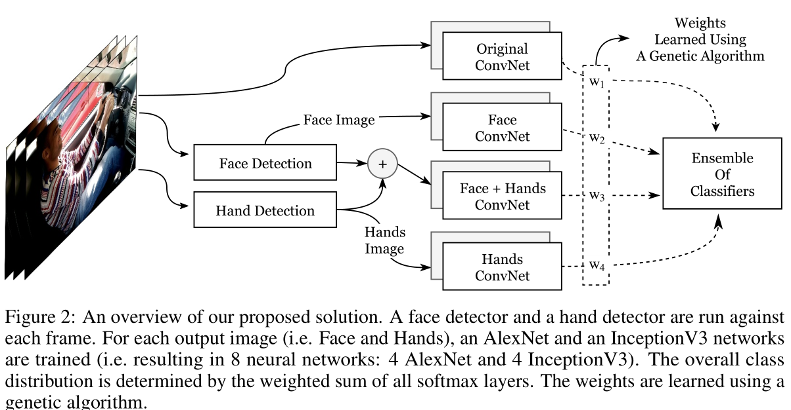

#### 4.3 使用遗传算法做分类层的加权集成

每个分类器会得到一个该类向量，10*8的矩阵。

在大多数的voting系统中，我们假设所有的分类器具有相同的权重会取得更好的结果，**但其实这是一个无效的假设**，而在加权voting系统中，**假设：每个分类器对集成结果的贡献是不一样的，有些分类器会返回比其他分类器更好的结果。**

> **比较好奇，加权和和attention机制的差别在哪儿？**

【2012】年使用了很多方法来评估权重，而作者选择了遗传算法。一个基于搜索的方法。

模型中，染色体包含N个基因，对应N个分类器。适应函数计算一半随机样本的NLL损失值，这种操作能够缓解过拟合。

本文的群体使用了50个个体，在每个迭代中，保留前20%的个体，并使用它们作为母体，其次，从剩下的80%中再选择10%的群体作为母体。换句话说，一共有30%的个体作为母体。

接着从选择的母体中随机变异5%的个体；最终交叉随机选择母体队以产生子体，以再次达到50个个体。

作者执行上述步骤5个迭代，以防止过拟合。作者选择了具有最高适应值的染色体

### 5 实验

脸部和手部的检测运行在整个数据集中；

实验结果如下表：

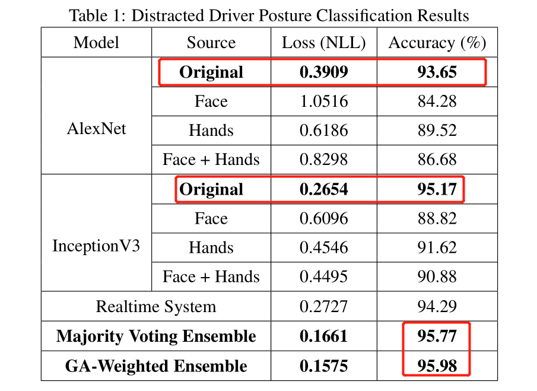

从图中可以看出，GA模型和InceptionV3进行对比，通过额外的七个模型才得到0.81%的准确率的提升。

> 其实实验不能这么结束，应该考虑不同的组合之间会得到怎杨的结果；

#### 5.1 分析

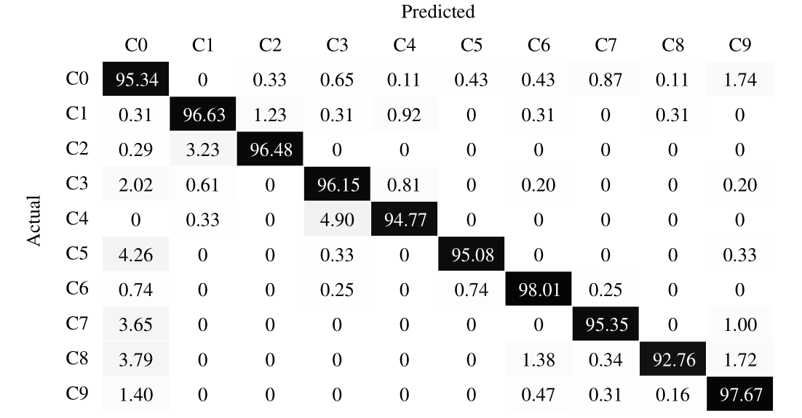

- 最令人困惑的姿势是安全驾驶，原因大概是静态图片中缺乏temporal context时序的上下文信息。

- 相似的行为总是mostly confused。

  > 作者会分析每个类别的混淆类别会是哪些？

  - 左手编辑消息和左边聊天；
  - 化妆与与乘客聊天；
  - 向后看与与乘客聊天以及喝酒很想；

  

## 2016_《WIDER FACE: A Face Detection Benchmark》

### 摘要

Wider Face数据量大，标注丰富包含遮挡、姿势、事件分类以及面部边界框。

WiderFace中的数据十分具有挑战性：因为其在脸部尺寸、姿势和遮挡方面有较大的变动。

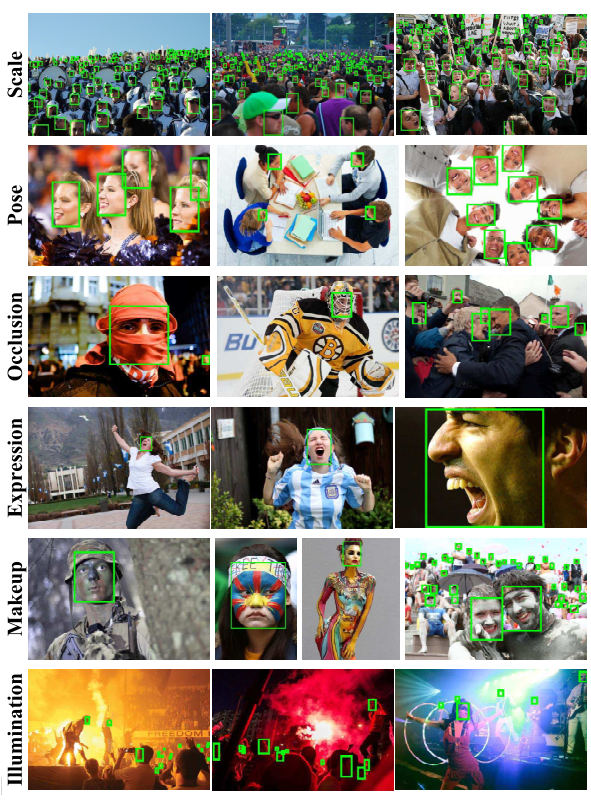

> 同时也揭示了检测领域的挑战性问题：尺寸不变性、pose角度不变性、遮挡不变性、Expression表情神色不变性、妆容肤色不变性以及光照不变性。

作者在几个具有代表性的检测系统中检测，以展现当前最新技术的性能的overview，同时提出一种处理大尺度变化性的解决方案；最终讨论普遍的预测失败的案例。

### 1 引言

脸部识别是所有脸部分布算法中最关键的一步，包括脸部对齐、脸部识别、脸部验证和脸部解析。

对于任意一张图片，脸部检测的目标是确定图片中脸部的presence存在，同时，如果存在返回每张脸在图片中的位置和范围location and extent。

与脸部检测相关的挑战 can be attributed to 姿势、尺寸、脸部神色\表情和灯光条件。

在【21】提出语义概念之后，脸部检测已经取得了巨大的进展。现今的脸部检测器能检测到near frontal faces 较近的正面人脸。

而后越来越多是工作面向**无约束的场景unconstrained scenario**，这一方向的特点是大量的复杂因素比如极端姿势extreme pose、夸张申请exaggerated expression和大面积遮挡都会导致 面部外观上的巨大视觉变化large visual variations in face appearance。

> 这里提及的无约束场景价值很大，研究都是从表面到深入；从少约束的场景到负责约束的场景。
>
> 类比下来，异常驾驶行为检测，的数据集应该也是遵从从少约束到复杂约束的转变。

当前可用的检测数据集有FDDB、AFW和 PASCAL FACE。他们的特点是：样本量不足，在角度姿势、尺寸等方面的变化比较受限，不能达到现实世界的表现performance。**正如我们将要证实的，这些数据集的局限性部分地已经导致了一些算法在处理copy with 严重遮挡、小尺寸和非典型姿势atypical pose时的failure。**

本文三大贡献

- 引入新的数据集：样本量足、复杂约束；为了衡量quantity 不同类型的错误，我们为每个图片标注了6个挑战的标签，**以深度分析每个算法的特点。**

- 提出多尺度两阶段的级联框架，它使用了分而治之的策略devide and conquer strategy以解决尺度变化较大问题。

  这个框架之下，一系列拥有变化输入大小的卷积网络被训练以检测一定尺寸范围内的人脸位置。

- 检测四个具有代表性的算法，代码要么是从作者手中得来，要么是开源代码的重新执行。**作者评估四种算法在不同设置下的表现，分析现有方法失败的条件analysis conditions in which existing methods fail.**

### 2 相关工作

#### 近来脸部检测方法的简单回顾：

现有的脸部检测算法可以分为四类：基于级联的方法、基于part部位的方法、基于特征channel的方法和基于神经网络的方法。

接下来作者着重介绍了部分work，而详细的内容参考【27，29】两篇综述。

- 基于级联的方法

  【21】Viola的开创性work引入了积分图像，**能够在线性时间内**，计算出类Haar特征。这些特征之后被用来学习**具有级联结构的Adaboost分类器**以进行脸部检测。而后续的大量的研究都延续了相似的pipeline。而在这些variants中，【15】SURF级联结构取得了具有竞争力的效果。

  【2】在同【15】相似的级联框架下同时学习 **人脸检测和人脸校准alignment**；

- 基于part的方法

  【7】DPM可变性部分模型deformable part models，它将脸部定义为一系列的部分a collection of parts，同时通过LSVM横向支持向量机制对part之间的联系进行建模。

  基于part的方法比基于级联的方法在遮挡问题上具有更强的鲁棒性。

  【17】表明仅用一个普通的DPM模型就可以取得最先进的性能，超过更加复杂的DPM模型的变体模型。

- 基于特征channel的方法

  【3】ACF聚合的通道特征，最初用于对行人的检测。

  【24】应用ACF的思想于人脸检测，特别地，类似于梯度直方图、整体直方图integral 和色彩通道的这些特征被结合用于学习级联结构的boosting分类器。

- 基于深度学习的方法

  【14，28】利用了深度学习的高容量，而我们anticipate预测WiderFace数据集将会助力深度学习框架。

#### 现存数据集

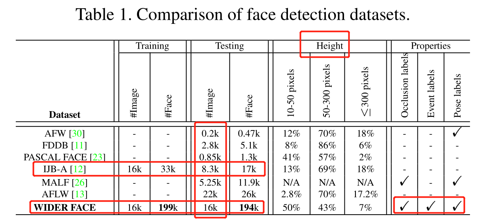

- AFW，每张人脸，标注有一个矩形边界框，6个landmarks界标和pose角度。
- AFLW，每张人脸，有21个界标。

### 3 WiderFace数据集

#### 3.1 Overview

数据来源于Wider数据集，3万张图片以及标注了 **在尺寸、姿势和遮挡等方面具有高度可变性的** 39万张人脸。

60个event classes。对于每个event class，我们随机选择4：1：5用于训练、验证和测试。

指定了两个训练和测试的场景：

Scenario-Ext：人脸检测器使用外部数据进行训练，在WiderFace测试集中进行测试；

Scenario-Int：正常；

采用了和PASCAL VOC数据集一样的评价指标；

于MALF和Caltech数据集一样，**不公布测试图像集合的边界框真实数据**。用户提交最终的预测文件，作者会进行评估。

> 因此事实上，能够用到的数据只有一半；

#### 3.2 数据采集

**Collection methodology**

Wider数据集的数据来源：

- 根据定义好的类别，从LSCOM数据集中收集；

- 使用谷歌和bing检索而来的数据，对于每个种类，收集了大约1000到3000张；

- 手工清晰数据：检查所有的图片同时过滤掉没有人脸的照片。**同时，每个类别中的相似图片被移除了以确保脸部识别中的丰富性。**

  > 为了保证数据集的丰富性和多样性，需要将相似的图片去除。这个技术很重要。

**Annotation policy.**

为每一张图片中**能够人眼识别出的脸**进行标注。

边界框需要紧密地contain前额forehead、下巴chin和脸颊cheek；**而如果脸部被遮挡住，会考虑遮挡的尺寸而对脸部依旧进行标注**

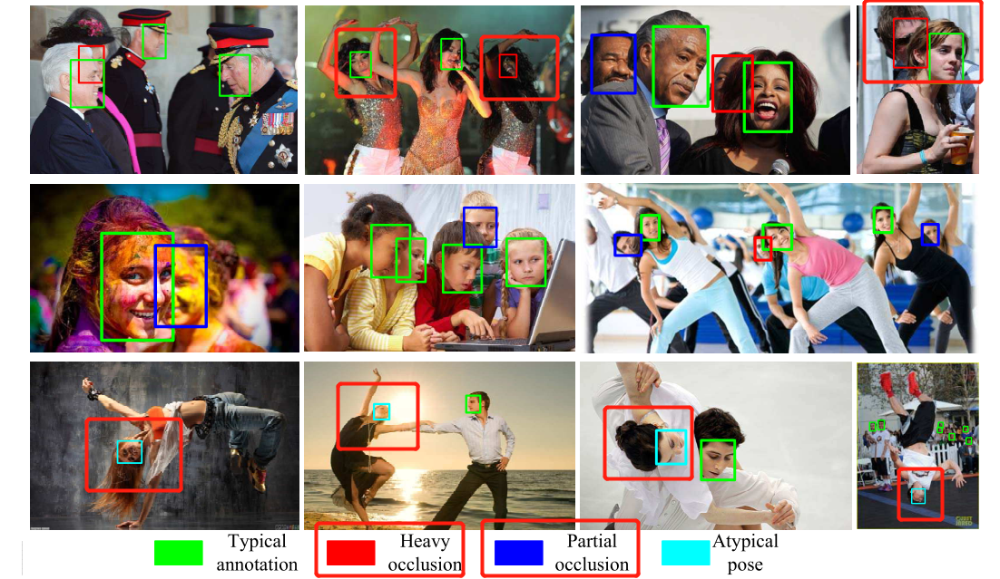

与PASCAL VOC数据集相似的是，为每一张 **由于低分辨率和小尺度而难以识别的人脸** 分配了一个ignore标签。

图片类别和边界框标注完成后，又标注了pose（典型和非典型）和遮挡等级（部分和严重）两方面的内容。

**每个标注都由一个标注者和两个不同的人交叉检查完成（太强了！）**。

#### 3.3 WiderFace数据集的特点

具有挑战性的特点就是：尺寸、遮挡、姿势和背景杂波。

现在我们就通过一些普遍做法来探究。

通过衡量人脸的标注数量`the number of proposals`和人脸的检测率，我们可以对 **数据集的难度和潜在的检测性能进行初步评估preliminary assessment。** 

而在下面的评估中，我们采用Edgebox作为目标提议object proposal。正如【9】中多提到的，Edgebox在准确率和效率上具有很好的性能。

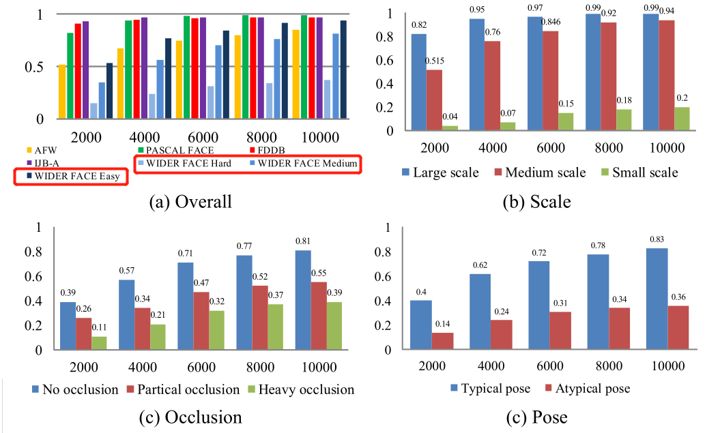

这张图，Y轴表示识别率，X轴表示平均每张图片的proposals的数目；而低检测率反映出高难度

**Overall**

相较而言，WiderFace具有更低的检测率；

效仿前人做法，基于检测率将数据集定义了三个类别。

**Scale**

将脸根据人脸图片大小进行分组，形成三个尺度。

而之所以进行这样的划分是考虑到检测率的差异

**Occlusion**

将遮挡分为三个等级；

首先，取数据集的十分之一作为例子来解释遮挡。

其次，每一个样本中的脸部被两个边界框所标注，一个面向可视化部分，另一个面向完整的脸部范围。

再者，作者计算了遮挡百分比：1减去minus可视化部分再除以全部的脸部区域；

最后，根据遮挡百分比进行划分。

**Pose**

定义了两个deformation level。

而一张脸被识别为非典型数据的情况是：要么the roll翻滚的程度要么是pitch的程度高于30.要么是yaw偏航高于90度。

**Event**

不同的事件通常和不同场景相联系。

WiderFace拥有60个事件类型。作者通过三个因素scale、occlusion和pose来描述每个事件event。

**对于每个因素，我们计算特定事件类的检测率，然后按升序排列每个类的检测率**

下面的排序图是基于尺寸的。

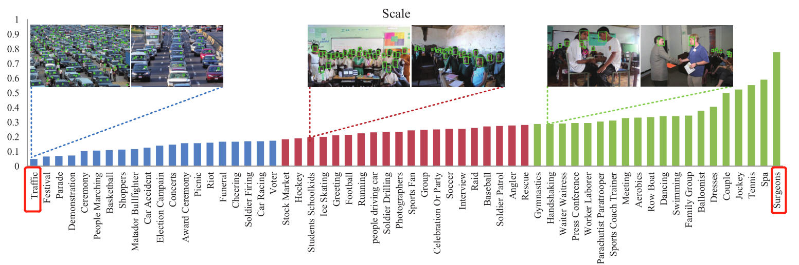

**Effective training source**有效的训练数据

这里涉及到一个现象：有些数据集仅仅涉及到测试数据，因此对于人脸检测算法需要再ALFW数据集中训练模型，然后再到其他数据集中测试。

这样就涉及到两个问题：

- AFLW数据集omits遗漏了对一些小尺度、低分辨率和高遮挡度的人脸的标注。
- AFLW数据集中的样本背景比较clean。如此，许多人脸检测算法需要到其他数据集中resort负样本。

而WiderFace标注了所有可识别出的人脸，同时事件驱动的nature使得它拥有丰富的背景。

### 4. Multi-scale Detection Cascade

为了处理尺度方面的高度变化的现象，提出了一个 **多尺度两个阶段的级联框架模型，同时应用分而治之的策略。**

- 训练一系列面部检测器，每一个处理相对小的尺度范围的脸部照片；
- 每个面部检测器由两个阶段组成。
  - 第一个阶段：由一个全卷积网络生成多尺度proposals；
  - 第二个阶段：由一个多任务卷积网络，一方面对第一阶段生成的每个候选window中的图片预测是否含有脸部；另一方面，对含有脸部的window，确定脸部位置（边界框）。

该模型的网络pipeline如下图：

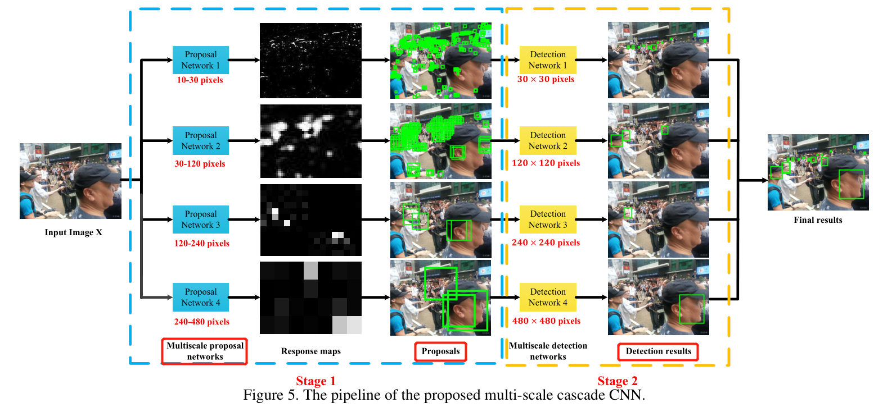

**Multi-scale proposal.**

训练N个全卷积网络用于人脸分类和尺寸分类。

（每个子网络的输入大小都是一致的）

每个网络训练的patch集的图像大小是这些patches中最大的边界尺度。

> 训练的结果会得到什么？
>
> 

**Face detection.**

对于九个类别中的每个尺度，会修正对应的windows位置。

- 使用跟第一个阶段的卷积网络结构的模型，同时训练人脸分类和边界框回归。
  - 人脸分类：如果与真实边框的交互比达到0.5以上，对应的window会被分配为正标签；
  - 边界框回归：略了。

## 2004_《 Robust real-time face detection》

## 2019_《Unsupervised Face Normalization with Extreme Pose and Expression in the Wild》

摘要：

人脸检测的困境：现在的人脸识别模型 对于 严重的个体内在变化现象 **仍然只能达到有限的不变性效果（而不是达到完全的不变性效果）**

- 解决方法之一：人脸归一化，提供了一种高效的廉价的方法实现 **对人脸特征的提取同时消除人脸的变化性。**
  - 本文借助**自然环境下的未配对数据**以生成人脸；
  - 提出了人脸归一化模型，生成用于人脸识别的 **正脸的、自然的神情、真实感的人脸图片**
  - FNM是具有三个创新性的GAN。
    - 人脸专家网络，用于构建生成器 赋予保留人脸特征的能力；
    - 通过对正常人脸的重建，像素级别的loss函数用于稳定优化过程；
    - 一系列的人脸注意力判别器 用于校准局部纹理；
  - FNM 能够recover canonical-view, expression-free image ，直接提升人脸识别模型的性能。
  - 在controlled和自然数据库上进行大量的定性和定量的实验，以证明该方法的优越性。

## 2019_《NADS-Net: A Nimble Architecture for Driver and Seat Belt Detection via Convolutional Neural Networks》

摘要：

用于驾驶员的姿势评估和安全带检测的2D结构；

- 使用特征金字塔网络作为骨干 with multiple detection heads；
- 在一个100名驾驶员50个驾驶场景的数据集得到验证；
- 检测性能是在 **不同的人口、外表和光照条件下进行的**

## 2020_《A survey of face recognition techniques under occlusion》

摘要：

相对于姿势变化性和不同表情等其他挑战，热当问题很少被研究到。

综述将现有的遮挡的人脸识别方法归纳为三个方面：

- 健壮的遮挡特征提取方法 ---- occlusion robust feature extraction approaches
- occlusion aware face recognition approaches
- occlusion recovery based face recognition approaches.

### Section1：引言

- 人脸识别目前面临着挑战。

  人脸识别系统虽然已经取得了大幅度的提升，但是人脸识别系统在面临一些挑战时far from satisfactory，比如在较大角度变化、变化的光照条件、低分辨率和不同的脸部神色和遮挡的情况下。

  而一般地存储在gallery中的人脸照片时高质量，不会出现上述退化degradations。**然而由于这些挑战，probe faces面临着数据缺失的问题**。

  **因此，用于识别的脸部区域比较少，会导致probe faces 和 gallery faces中可用的特征不匹配的问题。**

  人脸遮挡被认为是最棘手intractable的问题之一，因为我们对于被遮挡部位没有先验知识prior knowledge，被遮挡部位可能是一张人脸图片中以任意大小出现在任意位置。

  而收集这样一个大规模的包含所有可能遮挡部位的数据集进行深度学习并不可行feasible。**数据集的匮乏使得遮挡人脸识别成为一个挑战。**

- 遮挡的介绍

  **脸部遮挡常常出现在研究主体穿着一些accessories附件（头巾围巾、口罩、眼睛、帽子等）时，或者任意物体出现在人脸面前**，由于遮挡引起了较高的类间相似度和较大的类内差异，识别精度受到一定影响。

  遮挡的几种设想scenarios，如下表：

  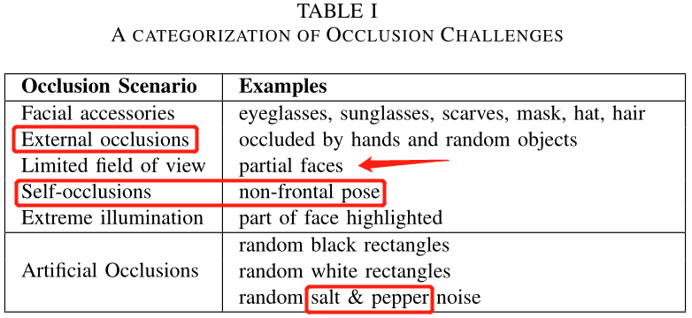

  其中的自我遮挡问题通常被认为是pose Variations 因为头部的较大旋转，因而本文不考虑该scenario。

- 五个设想类别

  在大多数的情况下，遮挡人脸识别涉及到 **通过使用遮挡人脸的替代测试数据集中的probe face image 来查询由无遮挡人脸occlusion-free faces组成的图库。**

  被遮挡的脸依赖于要么是真实遮挡的图像集合要么是人工合成的遮挡图片的集合。

  我们首先以最为明显的方式将研究场景research scenarios按照考虑的图像对进行划分break down。

  下图对五个设想类别进行了解释，同时这五个类别的真实性由最真实到不真实。

  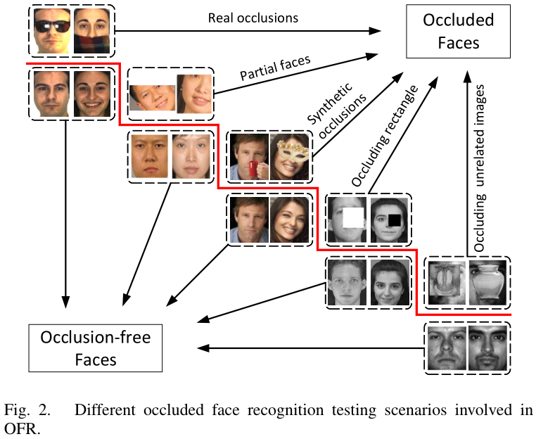

  五个设想类别：

  - 真实遮挡：gallery图片是没有遮挡的mugshots，probe图像被真实物体所遮挡，比如眼睛；
  - 部分脸部：gallery正常，测试图片只有部分脸部（本质做了裁剪），因为裁剪行为是基于正常数据，因此这部分的遮挡图像是 **研究人员给出**
  - 人工合成的遮挡：probe脸部被人工遮挡物block以simulate真实遮挡；
  - 遮挡的方框：测试脸部图片被一个全黑或全白方框所遮挡。
  - 遮挡的不相关图片：测试的脸部照片被不相关的照片所遮挡。

- 遮挡人脸识别方法的分类

  -  occlusion **robust** feature extraction(ORFE) ；
  - occlusion **aware** face recognition (OAFR)；
  - occlusion **recovery** based face recognition (ORecFR)

  遮挡人脸识别系统由三个组成部分构成，而每一个对应一个重要的 **涉及design decision**：

  - 交叉遮挡策略；
  - 特征提取；
  - 对比策略；

  以上的二三设计已经analogues类比到人脸识别中，而第一种是OFR所特有的策略。

  - ORFE category ：**搜索一块被脸部遮挡影响程度较小的特征空间，而一般，基于patch的工程特征和基于学习的特征是交叉遮挡策略的通用做法。**Robust
  - OAFR category：遮挡-丢弃通常是交叉遮挡策略中的一种方法，它使得仅可视化的人脸部分有资格做人脸识别（包括特征提取和特征对比）；而OAFR中我们将部分脸部识别方法分类为OAFR，因为这些方法将被遮挡部分排除在人脸识别以外，以假设在人脸识别开始之前visible part就已经准备好了；
  - ORecFR：尝试将被遮挡的人脸恢复recover为一个无遮挡的人脸以满足传统人脸识别系统的对人脸的需要demands。换句话说，它将遮挡恢复视为交叉遮挡策略的范畴。

  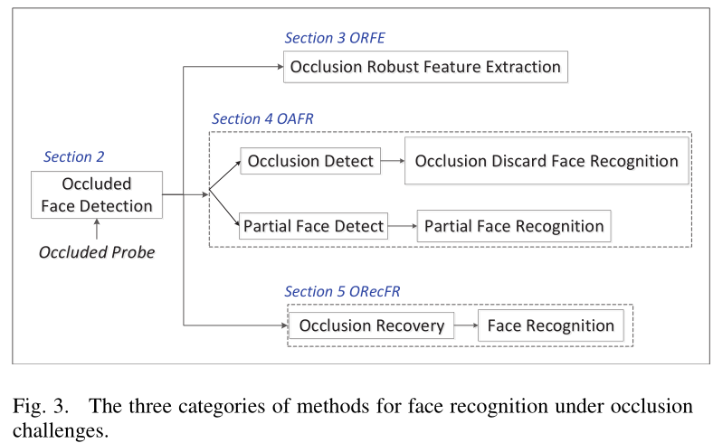

- 关于遮挡人脸识别的全面综述由【5，22，70】
  - 【70】对2017年以前的OFR方法做了全面的总结；与本文十分相关。然而本文的必要性是：首先，近几年的人脸识别算法的发展已经刺激了许多 **解决OFR问题的innovative contributions创新性贡献。**其次，几个大规模遮挡数据集的出现。【IJB-C】通用的评估benchmark；可以预见地，这些数据集将会促使遮挡人脸识别发展的更加快速；
  - 本文综述对人类识别方法做了系统分类。特别地，**由于OFR系统将遮挡人脸检测的运用作为第一要义first step，因此本次综述将简要地回顾遮挡人脸检测的技术。**而且，解决遮挡问题的新发布的具有创新意义的论文将对此全面回顾。最后，在一系列数据集中验证各种技术的表现方法。
- 本次综述的行为思路：
  - OFD技术回顾；
  - Robust方法回顾和分析；
  - Aware方法；
  - Recovery方法；
  - 评估方法的性能；
  - 讨论数据集和OFD研究的未来挑战；
  - 对OFD的总结；

### Section2：遮挡人脸检测

将OFD技术分成两大类：

- 通用人脸检测方法：**可用于检测遮挡人脸的技术**
- 遮挡人脸检测方法：**专门tackle人脸检测中的遮挡问题**

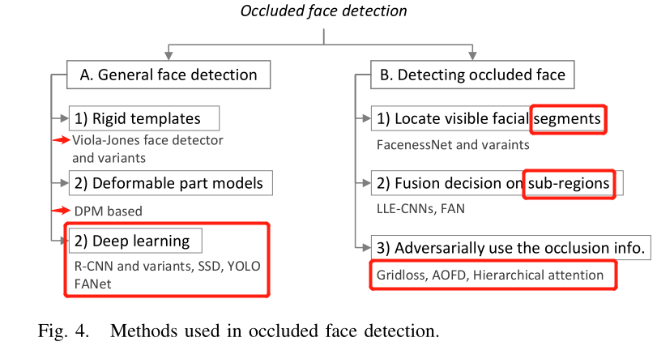

#### A 通用人脸检测

- **人脸检测目的是从一个无约束的环境unconstrained environment中检测出人脸**

  【141，142】是 **基于刚性模板的人脸检测方法**的代表，使用类Haar特征和AdaBoost模型训练级联分类器，可以取得real-time的效率。但是处理真实图片时性能非常不好【160】

  【158】基于可变形部分的模型，因为其高计算量优于 **刚性**。

  【13，172，176】基于人脸对齐联合人脸检测以提升性能；

- **物体检测框架的两个主要分支：**
  - 基于候选区域的CNN模型，两阶段检测器：【39，38，119】，RCNN [39], fast R-CNN [38], faster R-CNN [119]。
  - region proposals free CNN，一阶段检测器：Single-Shot Multibox Detector单次多框检测器 (SSD) [85], YOLO [117]。

  简言之，两阶段算法性能好但是时间消耗严重；一阶段算法具有计算量少的优势但是是以低准确率为补偿的 compensate by less accurate。

- **Some methods [63], [129], [175], [179]将人脸视为一个自然物体，采用物体检测的技术用于人脸检测。**

- **[6], [56], [79], [182]倾向于对tiny face的检测。**

- 基于WiderFace，DCNN取得了promising的结果。

  - 目前Feature Agglomer-ation Networks (FANet) [175], a single-stage face detector是几个人脸识别benchmark数据集取得了先进的效果；

  - MultiScale Features：FANet**提出一个Agglomeration Connection module凝聚连接模块通过一个层级结构以增强context-aware 特征、增强low-level特征图，以处理scale Variance问题。**

    FANet同时提出了层级loss函数，以端到端学习的方式，训练模型变得更加稳定。

#### B 检测被遮挡的脸

遮挡人脸检测任务具有挑战性的原因是：【14】未知的位置和遮挡的类型。

- **检测遮挡的行人是个longsttanding话题，一些研究借鉴相关技术 [45], [178], [189]用于人脸检测。**

  **大多数的遮挡人脸检测方法基于MAFA数据集做实验，但是一些通用的人脸检测方法并不，因此对于两种检测方法，并不是一个公平的竞争环境 a level playing field**

- 检测部分遮挡的人脸的方法被分类为：
  - locating visible facial segments to estimate a full face 定位可视的脸部部分以评估完整脸部的位置；
  -  fusing the detection results obtained from face sub-regions to mitigate the negative impact of occlusion **融合人脸子区域的检测结果**以减轻遮挡的负面影响。
  -  using the occlusion information to help face detection in an adversarial way. **以博弈的方式**，使用遮挡信息对人脸检测。

-  **定位可视的脸部部分以评估完整脸部的位置：**

  facial attributes 脸部属性 ---> facial parts 脸部部位 

  【165】一些模型倾向于提取 **脸部属性和可视的脸部区域之间的内在相关性。**

## 2019_《EEG-Based Spatio–Temporal Convolutional Neural Network for Driver Fatigue Evaluation》

**摘要：**

提出基于多通道EEG脑电图的时空卷积网络ESTCNN，用来检测驾驶员疲劳；

- 核心模块，从EEG中提取时序依赖信息；
- dense layers 用来融合空间特征，实现分类；
- 自动的从EEG信号中学习到有效的特征，比经典的two-step 机器学习算法的效果好；
- EEG数据来自八个处于清醒和疲惫状态的主体
- 对比试验基于八个对比模型
- 模型有点在于计算效率和reference time；

**引言**

- 疲劳，根据个人动机，被定义为一种厌倦该a sensation of weariness，不愿意继续执行任务，可能导致工作雄安率的降低和事故可能性增加reduced work efficiency and increased accident possibility。

- 疲劳检测的几种人类线索human clues。
  - facial expression 脸部神色；
    - 缺点是：神色与个人的生活习惯和文化背景相关，thus may not reliable to a certain extent 一定程度上不可靠；
  - speech signals 语音信号；
  - physiological indexes 生物指标，比如EEG和皮肤电阻dermal resistance。
    - 皮肤电阻与温度和湿度相关
- EEG可行。
  - 是以上所有指标或现象的主要根源，包含着大量的生物信息，它良好的时序分辨率和信息的丰富性促使它能真实反映 pathological and mental states 病理和精神状态；
  - 可穿戴式EEG设备和干电极技术dry electrode tech的快速普及；

- EEG 的信号极度微弱，低信噪比low signal-to-noise ratios，这使得提出一种疲劳检测的计算型算法相当难 fairly difficult。

  研究主体会 in a monotonous and cumulative process单调累积的过程中引起疲劳反应fatigue reaction，**进而影响生理指标**

  一个适合的疲劳阈值可以根据个体反馈和可衍生的指标而建立；**由此，疲劳检测就转变为分类问题**

- EEG的检测算法

  - 时间频率分析；复杂网络；非线性分析

  - 【15】四种频率特征被提取出，并由SVM进行分析，取得了不错的效果；

    【16】基于EEG的系统有效地检测驾驶员地疲劳状态，方式是计算四种熵特征以及分析多重熵融合的影响；

    【17】multimodal多模式的方法用于将EEG和EOG electrooculogram 眼电图，整合了两者的时序依赖。

    【18】EEG信号中的一个独立的因素得到使用，然后伴随着自动回归的模型的和贝叶斯神经网络；

    总的来说，比较困难提出一个单一框架以克服这些问题，对广泛的不同使用者起作用；

  - EEG信号是由固定在大脑皮层的多个活动电极记录下来的。

    ---

  - 基于傅里叶转换的深度学习方法，即可以将时序转换为图片，进而使用channel-wise卷积；

  - 与上一种类似，不同在于使用了新的时序表示，运动图像数据。

### 方法

#### 核心block

即时序卷积。

- 卷积层会以层级的形式处理信息，因此比较方便能够捕捉到高级特征。
- 池化层可以平衡训练准确率和泛化性；
- core block 由三个卷积块和一个池化层构成；如此输出会比输入少六个维度；
- 每个core block中的三个卷积层共享统一超参数。

#### 模型架构

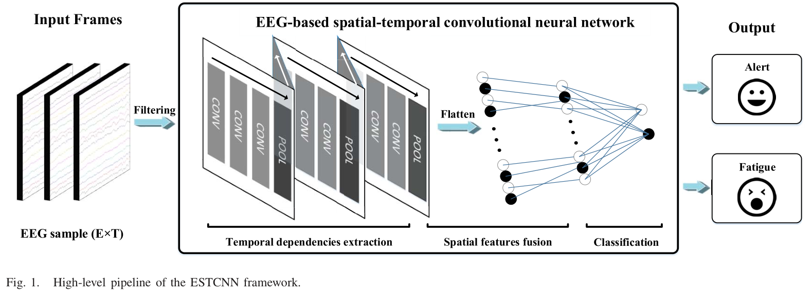

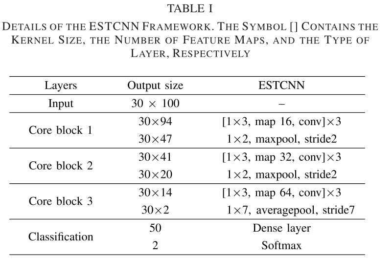

模型介绍省略；

### 实验

we introduce the subject information, experiment protocol, and data acquisition and preprocessing, respectively.研究主体信息、实验协议、数据准备和预处理。

#### Subjects

####  Experiment Protocol

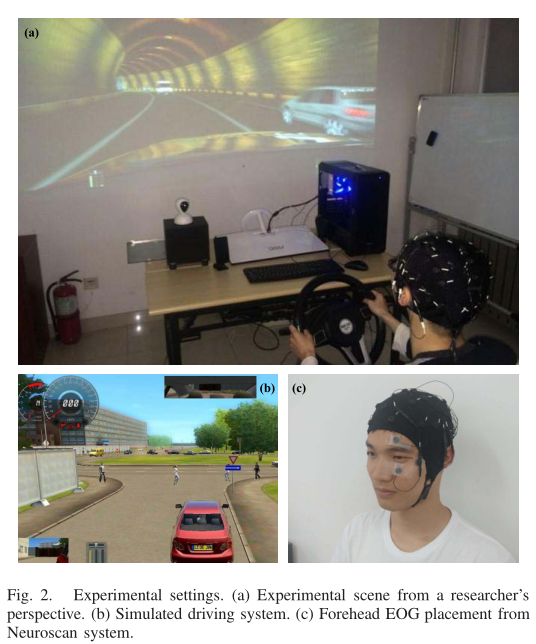

#### Data Acquisition and Preprocessing

## 2021_《A Novel Machine Vision-Based 3D Facial Action Unit Identification for Fatigue Detection》

**引言：**

## 感悟总结

1. 模型的参数量、模型的计算量、模型是否是端到端学习、数据是否需要额外生成以至于增加内存占用或者计算时间。

2. 作者会分析每个类别的混淆类别会是哪些？并且分析可能的混淆场景，混淆原因。

3. 同时也揭示了检测领域的挑战性问题：尺寸不变性、pose角度不变性、遮挡不变性、Expression姿势不变性、妆容肤色不变性以及光照不变性。

4. 这里提及的无约束场景价值很大，研究都是从表面到深入；从少约束的场景到负责约束的场景。

   类比下来，异常驾驶行为检测，的数据集应该也是遵从从少约束到复杂约束的转变。

5. 为了保证数据集的丰富性和多样性，需要将相似的图片去除。这个技术很重要。

6. **重要的design strategy：**

   - DAD数据集中的对比策略；
   - 18年何凯明的非局域化操作；
   - 特征图像金字塔网络与横向连接；
   - ActionNet的多excitation路径与backbone；以及图像采样策略或数据增强；
   - 19年SlowFast网络的Slow和Fast分支网络实现统一训练胜过双流模型，实现了多路径的端到端学习；

