1 行为识别领域，IDT算法是最好的深度学习领域外效果最好的方法；

2 --- 

### 《Driver behavior detection and classification using deep convolutional neural networks》

#### 1 简介：

目前的方法中，一些是仅考虑驾驶员的行为，还有一些方法是在驾驶员行为的基础上融入了车辆状态和环境信息。

目前的研究大多使用深度学习的方法对驾驶员行为进行分类。

由于基于相机的系统可能存在侵犯隐私和欺骗的可能性，因而一些研究倾向于使用非视觉信息和传统的学习技术，比如SVM和KNN；

CNN已经取得了非常大的成功，但是深度学习技术在信号处理signal processing中进度缓慢。因而为了充分利用CNN的优势，作者提出通过递归绘图技术recurrent plot tech将驾驶信号转化为几张图片。**如此实现了从驾驶信号的时序依赖向图片的空间依赖的转化**。

作者的处理过程：

采集车辆信息（加速度，重量，RPM，速度和油门throttle踩下油门踏板的量）——》 重叠时间窗处理时序数据并结合递归绘图技术将数据转换成图像。——》使用CNN模型对驾驶行为分类。

创新点：

1 **对驾驶员行为的分析不是通过驾驶员的脸部监控而是车辆的运动模式**；

2 将行为分为五个类型：正常、攻击性aggressive、分心distracted和嗜睡drowsy以及酒后驾驶drunk driving；（参考2015年的一篇文献）

3 将驾驶信号的时间依赖特征转化为空间依赖。

#### 2 相关工作

异常行为被定义为特定驾驶员在受到身体或者精神因素影响时的罕见行为。scarce behaviors。同时认定异常行为检测时一个一分类问题。OCCproblem。

但是这样的定义并不确切，因为一个驾驶员可能沉浸于非正常驾驶，他的大多数行为都是非正常行为。

以下是对以上五种提及的行为进行的distinguish。

##### 2.1 五种驾驶行为风格的overview

**2.11 攻击性行为**

不耐心的驾驶活动，尝试最小化旅程时间。

比如，速度方面的尾随、异常和即时变化immediate changes行为；

危险的编导和快速加减速行为以及快速制动。

**2.12 分心行为**

Transient inattention 短暂的注意力不集中。

攻击性的驾驶风格具有周期性periodic的不良行为的模式；而分心驾驶具有瞬时性和规律性的模式an instantaneous regular nature。

比如，对车内车外非开车事物的关注，以及吃喝、打电话等行为。

**2.1.3 嗜睡行为**

驾驶员 劳累，试图抵抗睡眠的行为；

重复性打哈欠等

 repeated yawning, difficulty keeping eyes open slower reaction and responses, lazy steering, vehicle wobbling in the road, rare use of brake, slow change in acceleration or gear, and moving slower than the speed limitation.

**2.1.4 醉酒**

Some measurable properties of drunk driving style include inappropriate keeping of vehicle lateral position, abrupt acceleration, and unsafe lane change。

**2.1.5 正常**

##### 2.2 对基于特征类型的驾驶员行为检测方法的分类

两种：基于视觉特征和基于非视觉特征。

**2.2.1 非视觉特征**

2017，提出了一种精细的方法，识别特定的异常驾驶行为。基于车辆的转向和加速度数据，通过神经网络和SVM算法对行为detect。

2013，提出一种非侵入性nonintrusive的技术以检测detect视觉分心行为。它摒弃了对驾驶员眼部轨迹数据而使用车辆的驾驶信息(speed, time to collision, time to lane crossing, steering angle, lateral position, position of the accelerator pedal, position of the brake pedal)。同时创建数据集：每个人16项异常行为任务，而每一项持续三分钟。使用静态和动态的神经网络，自适应神经模糊推理系统和SVM来检测驾驶员的注意力分心。

2005，隐马尔可夫模型利用横纵向加速度和车辆速度来检测驾驶行为。

2015，data fusion 多方面数据融合：GPS，Inertial Measurement Unit (IMU，惯性测量单元), and in-vehicle sensors车载传感器，以检测攻击性行为。

2013 通过向驾驶员提供适当的反馈来减少汽车的危险动作。技术：无监督和监督方法。

2016，高斯混合模型；数据： IMU, GPS, and in-vehicle sensors

2015，ADAS高级驾驶员辅助系统。检测过激行为。数据：速度和加速度。

2010，收集加速度信息，与醉酒驾驶的模式相比较。

2013，上下文感知系统，驾驶员信息和车辆信息以及环境信息，动态贝叶斯网络；

2017，提出两个方法来构建分心行为的模型：1 提取驾驶环境信息及评估风险事件；2关注驾驶员的身体行为，glance。

2017，提出基于车速时间序列的风险识别行为。

2017，数据：加速度、速度和转向角度。通过DSAE deep sparse autoencoder 模型来提取特征。问题：unreal-tim，offline。

2018，the exploited signal 是速度，RPM，转速，油门，刹车踏板和离合器踏板以及齿轮。

**2.2.2 视觉特征**

2016，使用CNN检测驾驶员分心行为；通过GMM提取皮肤区域的，进而由RCNN来训练。数据集：打电话、吃饭、换挡、打电话和抽烟等行为。-- 97.76

2018，CNN检测过激行为；使用近红外光和热照相机传感器获得；数据集：驾驶员脸；

2017，提出了DarNet框架以检测分心行为；数据：内置摄像头和IMU；CNN训练图片，RNN训练IMU的时序信息。最后的output通过经由贝叶斯网络结合在一起。-- 87.02；

2018，VGG16+不同的规范化方法；95.54；

2014，检测眼睛是否睁开；

##### **小结**

**但是基于视觉特征的方法的问题是，对光照太过于敏感。光照强度的轻微改变都会对相关方法的准确率造成负面影响。**

远不止如此，该方法涉及intrusice侵入性技术，比如ECG、PPG或者是相机。

同时，图片的预处理需要较高的计算资源，因此这种方法并不适合实时应用。以及**车辆的嵌入式设备**。

与此同时，非视觉特征的方法决定了其不需要较高的计算资源，但也不会拥有较高的准确率。

由此，引出作者的模型。

##### 2.3 驾驶行为检测方面的机器学习技术

ANN，应用于计算机视觉技术；

聚类技术，用于行为风格检测

HMM，隐马尔科夫模型在驾驶行为和分心行为方面的检测。

GMM，应用于行为识别和道路条件监控。

SVM，大致也是如此；

RNN，sensory-fusion architecture；获取脸部和头部姿势的运动轨迹。使用RNN融合模型来结合车内的人脸信息和车外的信息，比如GPS,road camera和车辆动态。

#### 3 所提出的方法

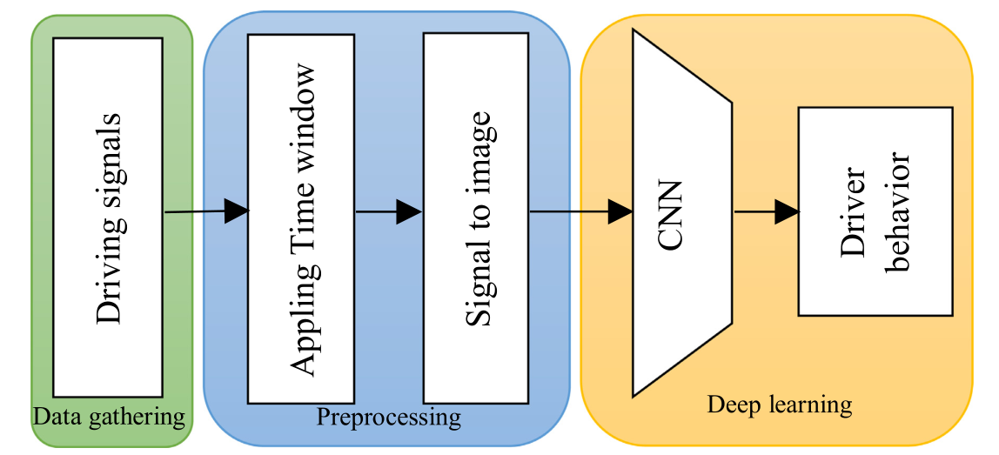

- 数据收集：A
  - 智能手机：加速度和重力gravity；
  - 车载诊断适配器OBD：转速、速度和油门。
  - 数据集简介：三个主体、驾驶相同车辆、在真实的驾驶场景下；
  - RPM is the frequency of engine rotation around a fixed axis in one minute.转速：一分钟内的转动频率；

- 对九个时间序列的信号使用时间窗口

  - time slot  时段；即一段时间内的视频，同时对应一个标签；因此该文章是基于视频修改的研究。
  - 2010年，窗口大小5秒；2016，20秒且保证一半的overlap重复；2013，1.8秒；
  - 本文，50毫秒，98%的overlap。

- 所有的窗口数据通过递归图技术转化为图片。将驾驶信号的时序依赖转化为空间依赖。

  - 递归图制作过程中：九个特征序列被处理成9张50x50的灰度图，进而整理出三张50x50的彩色图，最终的图像是一个150x50的彩色图。

  - 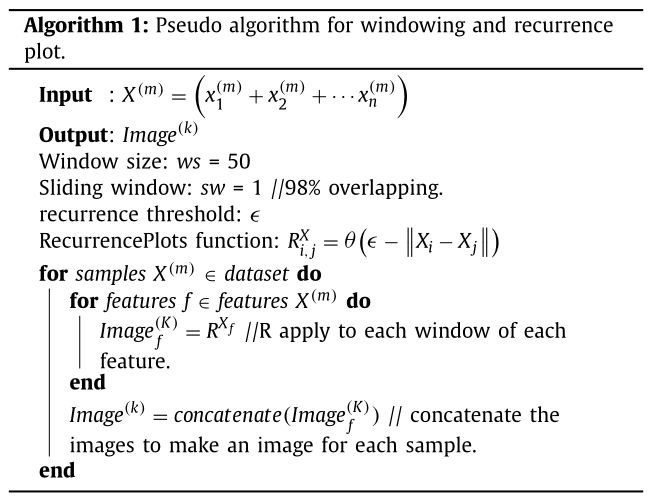

    

- CNN模型用来对五种驾驶风格进行分类。其中CNN模型的参数包括不同的卷积核大小、不卷积层和卷积核的数目以期达到较小的计算成本和较高的效率。

  - Deep neural network automatically learns the discriminative features.

  - we use global max pooling at the end of CNN and a very small fully connected network.These new trends of CNN show having high efficiency, very fewer parameters and less prone to over-fitting in many applications

  - 生成的图片的性质：因为具有高度的结构化模式和空间特征。因此与传统的自然图像相比，提取区分性特征也仅仅需要少量的卷积层就可用于训练和收敛。

  - Leaky ReLU：传统的relu函数因为存在的零梯度范围，会使得网络中的一些神经元被抑制。而leakyRelu函数能够给与一个较小的正梯度值；

    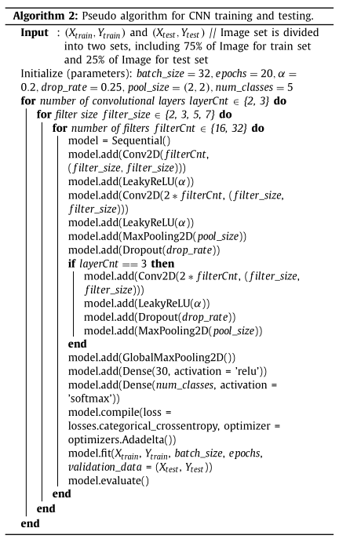

#### 实验

- vanilla stochastic gradient descent（**批**随机梯度方法）； adaptive learning rate method（Adadelta 优化器算法）
- 评价指标：准确率，trade-off图（计算复杂度和准确率间），同时发现影响度最大的前两位是卷积核的大小和数目；为了强调highlight该方法的性能，使用了混淆矩阵。—— **这个可能是嵌入式模式的常用操作。**
- 嵌入式角度：将时间序列生成图片对实验结果影响很大。较小了计算成本；**参数量、模型复杂度和运行时间都是要比较的对象。**

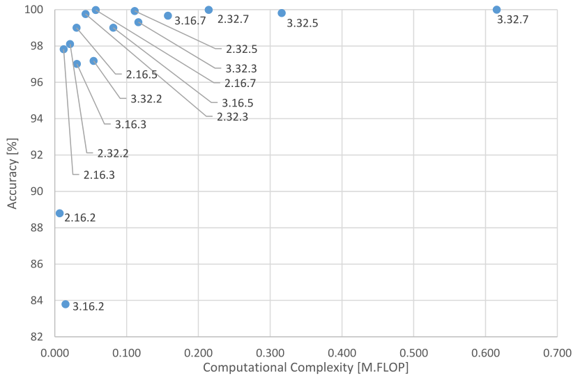

#### 不足之处

没有涉及模型之间的对比，可能是使用车外数据研究车辆的驾驶行为风格的比较少；

#### 补充知识：

##### 1 将一维时间序列转化成二维图片的方式：

GAF gramian angular field 格拉姆角场 和 递归图 recurrence plot；

前者是通过对数据进行极坐标的编码，进而对生成的角度进行类似于Gram矩阵的操作计算。

Gram矩阵，经常用于计算一组向量的线性相关关系。

**单变量时间序列**在*某种程度上无法解释数据的共现和潜在状态*；我们的目标应该是找到替代的和更丰富的表示。

##### 2 AdaDelta算法

https://www.cnblogs.com/neopenx/p/4768388.html 

### 《DEEP LEARNING FOR ANOMALY DETECTION : A SURVEY》27

#### 摘要：

- 对基于深度学习的异常检测技术进行结构化和综合的呈现；
- 评估各种检测技术在各类应用中的效率。

具体而言：

- 作者按照现有假设和方法对当前的技术归类，而每一组将呈现其基础检测技术及变体，同时呈现对应的假设，从而区分异常行为和非异常行为。
- 对每一组技术呈现其优势和局限，同时讨论各种技术在实际应用中的计算复杂度。

最后，分析当前研究中的开放问题和面临的挑战。

#### 介绍：

异常意味着偏离，导致的原因是：

 malicious actions, system failures, intentional fraud。恶意行为、系统故障、故意欺诈

> 异常检测，应该可以算是一个设计方面广泛的领域。只要有数据，只要有产品落地，异常检测就要作用。

Therefore, anomaly detection considered an essential step in various decision-making systems.

#### novelties 新颖事物：

新颖数据（未曾见的事物）  ---  》异常数据和非异常且重要数据；这一点通过一个分数score来评定。

因为未曾见过的数据点不一定总是异常数据，因此，对异常检测的数据同时也可以用于新颖数据的检测，繁殖依然。vice versa. 

#### 深度异常检测技术DAD的驱动力和挑战

- 传统技术在图片和序列化数据中表现次优。因为传统技术无法捕捉到复杂的数据结构。
- 大规模异常数据检测的需要：传统技术几乎无法在大规模异常数据检测中得到结果；
- 深层异常检测技术能够学习到层次性的区分性质的特征。
- 正常行为和异常行为之间的边界并没有确切的定义，并且边界也是一直演化的。而没有确切定义的行为边界为传统技术和DAD技术同时带来了挑战。

#### 相关工作：

尽管深度学习方法已经解决了很多问题，但是深度学习技术在异常检测方面却是相对匮乏。

有些文章使用自编码用于检测，但是没有与各种的深度学习框架进行对比，比较哪个框架更加适合给定的数据集。

论文涉及的方法和应用场景

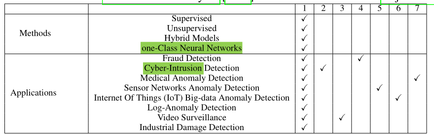

#### 文章组织

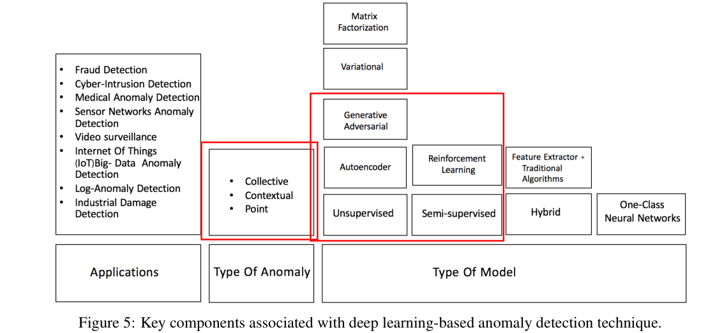

#### DAD检测技术的不同方面

##### 原始的输入数据

原始数据可以被细分成序列数据和非序列数据，各自对应的基础模型如下图所示：

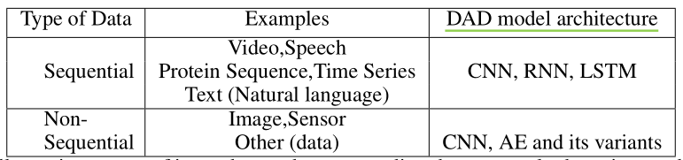

原始数据可以被分为高维数据和低维数据，而DAD技术可以从高维数据中获取到复杂的层次特征。同时网络模型越深，在高维数据上的效果越好。

##### 基于有标签的数据

- 异常数据是稀少的数据，因此获取到它们的标签比较有挑战性。
- 异常数据会随着时间变化。

###### 有监督学习：

有监督的学习涉及二分类和多分类任务；

尽管监督学习效果不错，但是基于两方面的原因，它只能作为次优方案而存在：

- 已标注数据的匮乏；
- 类别不均衡问题。（正例的数目远高于负例的数目）

**因此，本文不涉及对有监督学习模型的回顾**

###### 半监督学习

由于正例的标签比负例要更容易获得，因而半监督学习十分受欢迎。

一个普遍的做法是，使用深度自编码器对不含有异常样本的数据进行半监督学习。

有了充足的训练数据，正常类的自编码器将产生正常情况下的低重建误差，而超过异常事件。

###### 无监督学习

无监督学习的DAD技术只能依靠数据的内在属性。

Unsupervised DAD techniques are used in automatic labeling of unlabelled data samples since labeled data
is very hard to obtain 。 该技术用于未标记数据的自动标记。

而无监督的DAD技术被显示出比传统的PCA方法的性能还要好。

可以说，自编码是无监督学习模型的核心，而这些模型假设，正常实例的发生率高于异常数据实例的失败率，而这将导致较高的假阳性率。具有相同假设的还有：受限玻尔兹曼模型、深度玻尔兹曼模型、深度信念模型和广义去噪自编码器。

##### 基于训练对象

两个新的基于训练对象的模型：深度混合模型DHM和一类别神经网络OC-NN。

1） 深度混合模型DHM

- 主要以自编码器作为特征提取器；
- 所提取的特征作为输入送入 **传统的异常检测算法**，比如一类别SVM；
- 迁移学习包含了丰富的特征，基于迁移学习预训练模型的特征提取器的HM获得了巨大成功。
- 2017变体，考虑将特征提取器和SVM一同训练，同样有成功。

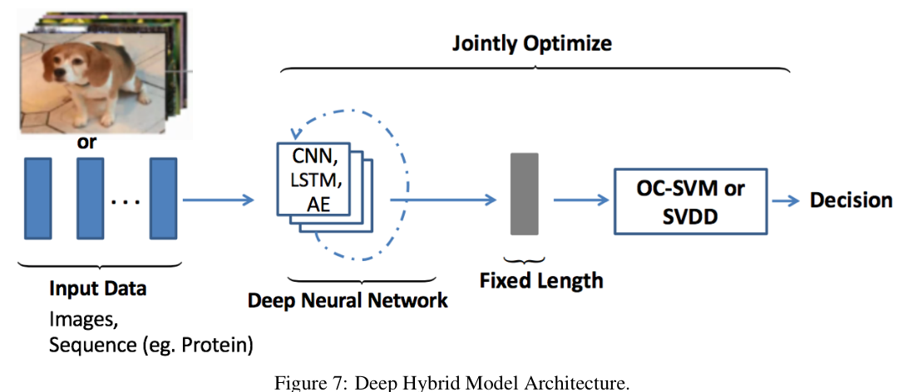

DHM的巨大缺点： the lack of trainable objective customized for anomaly detection，因此HM无法提取到丰富的区分性质的特征来检测异常数据。

为了解决这个问题：深度一分类和一分类神经网络被提出。

2）OC-NN

它受到基于核方法的一类别分类的启发，将深度网络提取丰富特征的能力和生成和正常数据相关的tight envelope的一类别目标结合在一起。

OC-NN巨大成功的原因：

- 隐藏层中的数据表示受到了OC-NN ibjective的驱动；
- 隐藏层中的数据表示是为异常检测定制的。

它和那种自编码器SVM相结合的方法不同；

它的变体D-SVDD模型，通过将正太数据映射到球体中心的方式以训练网络能够提取到共同的 **变异因子**。

##### 异常类型

异常类型可以大体上被分成三个类型：点异常、上下文异常和整体异常。point anomalies, contextual anomalies and collective anomalies.

而DAD技术已经能够很好的检测到这三种异常。

1）点异常

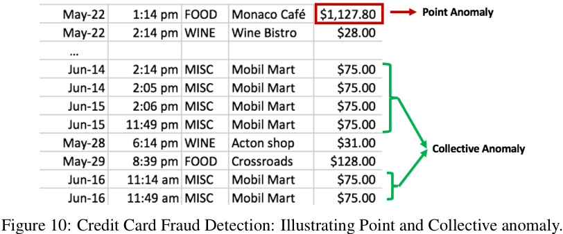

 Point anomalies often represent an irregularity or deviation that happens randomly and may have no particular interpretation。

2）上下文异常检测

 Contextual anomaly is identified by considering both contextual and behavioural features.  上下文异常通常是通过上下文特征和行为特征来识别。其中上下文特征通常是时间和空间。而行为特征通常是消费的模式、系统日志事件的发生和任何特征来描述正常行为，（a pattern of spending money, the occurrence of system log events or any feature used to describe the normal behavior.）

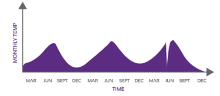

3）Collective or Group Anomaly Detection.

wherein each of the individual points in isolation appears as normal data instances while observed in a group exhibit unusual characteristics.

单独的一个数据点看起来似乎是正常的，但是从一个组的角度来观察，会发现是不正常的。

群体异常检测着重于不规则的群体分布。

##### DAD技术的输出

DAD技术的一个关键的方面是，异常数据的检测方式。而一般地，DAD方法的输出不是异常分数值就是binary labels二进制标签。

###### 1）异常分数值

- 每个数据实例会根据一套方法得到几个分数值，并根据该异常分数值进行排序；
- 每个实例的异常分数与domain-specific 阈值相比较，而该阈值又称为决策分数，为subject matter expert 主题专家给出。

而一般地，决策分数会比二进制标签能够揭示更多的信息。

比如，D-SVDD方法中，决策分数值是由每个数据实例到空间中心的距离得出。

###### 2）二进制标签

Unsupervised anomaly detection techniques using autoencoders measure the magnitude of the residual vector (i,e
reconstruction error) for obtaining anomaly scores, later on, the reconstruction errors are either ranked or thresholded
by domain experts to label data instances.

测量残差矢量的大小以获得异常分数，随后，重建误差将由领域专家**进行排名或设定阈值**以标记数据实例。

> 这里的阈值可能作为0-1分布的阈值。

#### 9 DAD深度异常检测的应用

每一个应用领域都会讨论下面的内容：每个异常的定义；当前应用场景的原始数据；当前应用领域的检测异常面临的挑战；现有的异常检测技术。

##### 9.1 入侵检测

入侵检测系统用于检测计算机相关系统中的恶意活动。

###### 9.1.1 HIDS 基于主机的入侵检测系统

系统调用日志是通过程序或者用户的交互生成的。

DAD技术是面向日志中的sequence data 序列数据，进行建模或者计算日志的序列数据之间的相似性。

###### 9.1.2 网络入侵检测系统

检测整个网络中的可疑流量suspicious traffic。

由于这里的数据具有实时流传输的行为，因此数据的性质就是具有高容量、高速度的大数据的代名词。synonymous。

目前这方面的DAD技术面临的挑战是，异常数据会随着时间发生变化，因为入侵者会使网络攻击躲避现有的入侵检测方案。

##### 9.2 Fraud Detection 欺诈检测

Fraud is a deliberate act of deception to access valuable resources；故意的诈骗行为以获得高价值资源。

检测和预防欺诈并不是一项简单的任务，因为欺诈是一个适应性质的犯罪行为。

许多传统机器学习算法已经足够好，但是欺诈检测面临的挑战是 **它需要实时检测和预防。**

###### 9.2.1 银行诈骗

信用卡诈骗涉及盗窃支付卡的详细信息，并将其用作交易中的欺诈资金的来源fund；

银行诈骗异常检测的挑战是，诈骗行为没有一致的模式；

一种经典的检测方法是，为一个用户创建一个用户配置文件，通过检测每个配置文件以检测异常。

但是因为有数十亿的用户，因此该项技术不具有延展性；性比之下，因为DAD技术固有的延展性，所以获得了比较广泛的应用。

###### 9.2.2 手机蜂窝网络诈骗

因为广泛普及和较低的服务费率，因此它面临着巨大的挑战：

- 语音诈骗旨在偷取隐私；
- 诈骗相关短信偷取客户的钱；

检测比较难，主要是因为移动网络的高容量和高速率。

而传统的静态特征工程技术不能适应不断演变的欺诈行为的性质evolving fraud。

###### 9.2.3 保险诈骗

传统的方法是将欺诈的指标视为特征。

挑战之一是对需要手工知识来提取强大特征的需求；二是保险诈骗远没有声称的发生率那么高。并且 **每一次的诈骗方式都是独一无二的，很特殊**

> 如果想要解决某个问题，需要找到这个问题、场景的固有的模式。如果模式很变，那么就相对来说难以解决。

###### 9.2.4 Healthcare fraud 医疗保健欺诈

并没有具体介绍医疗保健欺诈的具体过程，因此单论这篇文章不能收获该行业的情况，除非阅读其相关的论文。

##### 9.3 Malware 恶意软件检测

传统的检测技术分为两个阶段：特征提取和分类或聚簇任务；

因此，传统的DAD技术极度依赖于所提取出的特征和分类聚簇的方法。

挑战：面临巨大的数据量，同时恶意软件具有很强的适应性。也就是说攻击者可以使用高级的技术来隐藏恶意行为。

##### 9.4 医学异常检测

数据：医学图片、心电图等；

挑战：巨大的样本不平衡问题和深度学习自身的难解释性；

##### 9.5  社交网络中的异常检测

社交网络中的异常通常是 **不规则的且经常是非法的行为**，比如网上诈骗、假消息发布者、谣言的散布者rumor-mongers。

##### 9.6 日志异常检测

异常：文本，可以指示系统错误的原因和性质；

传统方式：正则匹配；局限性：新出现的错误信息不容易被探测到；

挑战：日志数据在格式和语义方面的非结构性质和多样性；

##### 9.7 物联网中的大数据监测 **

数据：通常是序列数据；

挑战：异构设备之间的相互连接使系统变得很复杂；

##### 9.8 工业中的异常检测

工业中的设备每天都经历着巨大的压力；

给设备造成损害的通常使rare事件，因此对这些事件的检测可以被视为一个异常点检测问题。

##### 9.9 时间序列中的异常检测

时间序列的分析分类为：基于单特征和基于多特征两种；

时间序列中的异常类型：异常点异常、上下文异常、群体异常；

挑战：

- 缺乏对异常的发生模式的定义；
- 输入数据中包含的噪音会严重影响算法性能；
- 随着时间序列的长度的增长，计算复杂度也在不断增长；
- 时间序列数据通常是non-stationary, non-linear and dynamically evolving，非平稳、非线性和动态演化的。

###### 9.9.1 单变量的时间序列的异常检测

深度学习擅长提取rich丰富的层级特征，而这种层次特征能够提升异常点的检测；

###### 9.9.2 多变量的时间序列的异常检测

 Effective multivariate anomaly detection enables fault isolation diagnostics。

多变量异常检测使得异常的隔离诊断成为可能。

##### 9.10 视频监管Surveillance

大数据中未被标记的数据的匮乏是有监督学习的挑战。

同时 **视频监管领域中对于异常的检测的明确定义也是一个问题。**

> 再次表明，不同行业的异常研究，首要解决的是异常的定义与发生模式的解释。

#### 10 DAD模型

对于每一个领域的DAD技术，都会讨论以下内容：

- 假设
- 模型架构的类型
- 计算复杂度
- 优点和缺点

##### 10.1 有监督的DAD检测

有监督学习比无监督学习在性能方面具有更好的优越性；

因为有监督学习能够依赖标签数据以学习不同类别的数据之间的**分割边界**。

- Deep supervised learning methods depend on separating data classes whereas unsupervised techniques focus on explaining and understanding the characteristics of data. 

- Multi-class classification based anomaly detection techniques assumes that the training data contains labeled instances of multiple normal classes.Multi-class anomaly detection techniques learn a classifier to distinguish between anomalous class from the rest of the classes.

- 监督学习具有一个固定的学习模式：特征提取网络和分类网络。

  In general, supervised deep learning-based classification schemes for anomaly detection have two sub-networks, a feature extraction network followed by a classifiernetwork.

- 特征提取网络：learn feature representations to discriminate various class instances effectively。

- 从流行方面，由于有监督学习缺乏足够多的干净的标签，所以受欢迎程度不如半监督和监督学习；

- 计算复杂度：决定于输入数据维度和隐藏层的数目；而输入数据的维度越高，越需要越多的隐藏层数目，以确保提取到意义丰富的层级特征。因此 **计算复杂度同样是随着隐藏层的数目线性增加。**

- 优点：

  - Supervised DAD methods are **more accurate** than semi-supervised and unsupervised models.
  - **The testing phase of classification based techniques** is fast since each test instance needs to be compared against the precomputed model.（based techniques是什么意思？）

- 缺点：

  - Multi-class supervised techniques **require accurate labels** for various normal classes and anomalous instances, which is often not available.
  - Deep supervised techniques fail to separate  normal  from anomalous data if the feature space is  highly  complex and non-linear.（**如何评判特征空间是否是线性的？）**

##### 10.2 Semi-supervised deep anomaly detection  | one-class classification

- assume： all training instances have only one class label.然后DAD techniques learn a discriminative boundary around the normal instances，即半监督学习和一分类学习模型是让模型学习出**正常数据的边界**！
- 论文：A review of deep learning based semi-supervised techniques for anomaly detection is presented by Kiran et al. [2018] and Min et al. [2018]. 
- 假设：
  - 邻近性和连续性，Proximity and Continuity: **Points** which are close to each other **both in input space and learned feature space**
    are more likely to share the same label.
  - **Robust features** are learned within **hidden layers** of deep neural network layers and **retain the discriminative**
    **attributes** for separating normal from outlier data points.
- 计算复杂度：The computational complexity of semi-supervised models is similar to supervised DAD techniques。
- 优点：
  - **Generative Adversarial Networks (GANs)** trained in semi-supervised learning mode **have shown great**
    **promise**, even with **very few labeled data**.
  - Use of labeled data ( **usually of one class**), can produce **considerable performance** improvement ****over unsu-**
    pervised** techniques.
- 缺点：Lu提出了半监督的基本问题，而且这些问题也适用于其他的深度学习技术；其次隐藏层学到的特征**可能不能代表较少的异常实例**，因此容易出现**过拟合**问题。

##### 10.3 **Hybrid deep anomaly detection**

- 混合模型的基本结构是：深度学习技术用来做特征提取，而分类部分交给传统的算法，SVM和RBF径向基函数。

  > 这种效果很好：. The hybrid models employ two step learning and are shown to produce state-of-the-art results。 (Erfani et al. [2016a,b], Wu et al. [2015b]).

- 假设：

  - Robust features are extracted within hidden layers of the deep neural network, aid in **separating the irrelevant features** which can **conceal** the presence of anomalies.

  - Building a robust anomaly detection model on **complex, high-dimensional spaces** require feature extractor and an anomaly detector. Various anomaly detectors used alongwith are illustrated in Table21

    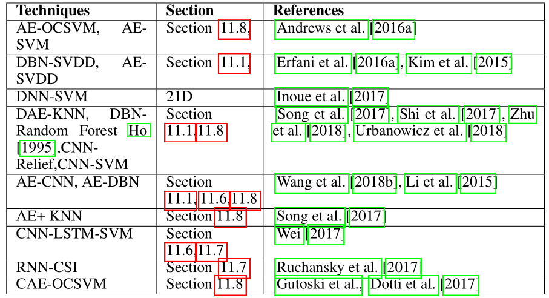

    

- 计算复杂度：

  - 此外，深层网络结构和参数的非平凡选择的固有问题涉及在相当大的空间中搜索优化参数，这引入了在混合模型中使用深层的计算复杂性。
  - 混合模型的计算复杂度分为两部分：深度学习部分和传统算法部分；传统算的复杂度一般是在n以上；

- 优点：

  -  Hybrid models are **more scalable and computationally efficient** since the linear or nonlinear kernel models **operate on reduced input dimension**。
  - **The feature extractor** significantly **reduces the ‘curse of dimensionality（维度的诅咒）’,** especially in the high dimensional domain.

- 缺点：

  - The hybrid approach is suboptimal because it is unable to influence representational learning within the hidden layers of feature extractor since generic loss functions are employed instead of the customized objective for anomaly detection.

    混合模型相对是次优的方案，因为 **由于一般的损失函数是用来检测异常而不是自定义目标。**所以它 不能够影响隐藏层的表征学习；（不太懂~）

  - 如果单独的层是（Saxe et al.[2011]），则更深层次的混合模型往往表现更好，**那篇论文引入了计算开销**。

##### 10.4 One-class neural networks (OC-NN) for anomaly detection

- OCNN结合了“深度学习提取丰富特征的能力”和“One类目标，比如超球面和超平面”。

- OCNN的novel的原因：

  - 隐层通过最优化目标函数值得方式学习到的数据表示；
  - OCNN达到了比现在方法还要好的结果，同时能够保证具有比较合理的训练和测试时间。

- 假设：

  - OCNN模型能够基于隐层的数据分布提取到变化中的共同因素；
  -  we Performs combined representation learning and produces an outlier score for a test data instance.
  - Anomalous samples do not contain common factors of variation and hence hidden layers fail to capture the representations of outliers.因为异常样本并不包含共同的特征，因此隐层无法捕捉到异常点的表示。

- 计算复杂度：取决于模型中的深度学习网络。

   OC-NN models do not require data to be stored for prediction, thus have very low memory complexity. However, it is evident that the OC-NN training time is **proportional** to the input dimension。

- 优点：

  - OCNN能够将基于优化输出空间中包含超球或超平面的数据，对深度网络进行学习。
  - OC-NN提出了一种学习OC-NN模型参数的交替最小化算法。（不懂）

- 缺点：

  - Training times and model update time may be longer for high dimensional input data.
  - Model updates would also take longer time, given the change in input space.

##### 10.5 Unsupervised Deep Anomaly Detection 无监督深度异常检测

- Assumptions：

  -  The “normal” regions in the original or latent feature space **can be distinguished from** ”anomalous” regions in the original or latent feature space.

    > 是否有方法检测两类数据是否能够清除地分隔开？

  -  The majority of the data instances are normal **compared to** the remainder of the data set.

  - produces an outlier score of the data instances based on intrinsic properties of the data-set such as distances or densities. The hidden layers of deep neural network **aim to**capture these intrinsic properties** within the dataset。

- 计算复杂度：

  -  The computational complexity of model depends on the number of operations, network parameters, and hidden layers
  -  the optimization problem is non-convex, similar to any other neural network architecture
  - the computational complexity of training an autoencoder is **much higher than** traditional methods such as Principal Component Analysis (PCA) since PCA is **based on matrix decomposition**。

- 优点：

  - **Could** Learns the **inherent data characteristics** to separate normal from an anomalous data point. This technique identifies  **commonalities** within the data and facilitates outlier detection.
  - Cost effective technique to find the anomalies since it does not require annotated data for training the algorithms.

- 缺点：

  -  it is **challenging to learn commonalities** within data in a **complex and high dimensional** space。
  - While using autoencoders the choice of right degree of compression, i.e., **dimensionality reduction is often an hyper-parameter** that **requires tuning** for optimal results.
  - Unsupervised techniques techniques **are very sensitive to noise**, and data corruptions(数据损坏) and are **often less accurate** than supervised or semi-supervised techniques.

##### 10.6 Miscellaneous Techniques **其他技术**

###### 10.6.1 Transfer Learning 迁移学习

-  Transfer learning is an essential tool in machine learning to solve the fundamental problem of insufficient training data.
-  It aims to transfer the knowledge from the source domain to the target domain by **relaxing** **the assumption** that training and future data must be in the same feature space and have the same distribution.
- The open research questions using transfer learning for anomaly detection is, the degree of transfer-ability, that is to define how well features transfer the knowledge and improve the classification performance from one task to another.

###### 10.6.2 Zero Shot learning 少样本学习

- Zero shot learning (ZSL) aims to **recognize objects never seen before** within training set .
- ZSL achieves this in two phases: Firstly the knowledge about the objects in natural language descriptions or attributes (commonly known as meta-data) is captured Secondly this knowledge is then used to classify instances among a new set of classes
-  This setting **is important in the real world** since one may not be able to obtain images of all the possible classes at training.
-  **The primary challenge** associated with this approach is **the obtaining the meta-data** about the data instances. However several approaches of using ZSL in anomaly and novelty detection are shown to produce state-of-the-art results。问题Q：是什么确保了ZSL能够学习到数据集的元数据信息。？

###### 10.6.3 ensemble 集成学习

- **A notable issue with deep neural networks** is that they are sensitive to noise within input data and often require extensive training data to perform robustly。深度学习的通病是，对输入数据比较敏感，因此需要很多的训练数据。
- 为了即使在有噪声的数据中实现鲁棒性，**随机改变自动编码器的连接结构的想法**也可以获得显著更好的性能。
- Chen et al. [2017]的论文：Autoencoder ensembles consisting of various randomly connected autoencoders are experimented to achieve promising results on several benchmark datasets，同时 avoid overfitting problem while reducing training time.

###### 10.6.4 Clustering 聚类学习

- 如果知识聚类的方法，时间和空间复杂度会使随着类别线性增加；但是结合深度学习可以确保聚类具有复杂和高维数据集的可扩展性。

###### 10.6.5 Reinforcement Learning 强化学习

-  its ability to learn complex behaviors in high-dimensional data space。
-  The DRL based anomaly detector does not consider any assumption about the concept of the anomaly, the detector identifies new anomalies by consistently enhancing its knowledge through reward signals accumulated。

###### 10.6.6 Statistical techniques 统计技术

- 希尔伯特变换是一种统计信号处理技术，它导出实值信号的解析表示；

#### 11 Deep neural network architectures for locating anomalies 异常定位的深层神经网络结构

##### 11.1 Deep Neural Networks (DNN)

-  Deep architectures overcome the limitations of traditional machine learning approaches of scalability, and generalization to new variations within data and the need for manual feature engineering；
-  DBNs fail to capture the characteristic variations of anomalous samples, resulting in high reconstruction error（导致重建误差大）. DBNs are shown to scale efficiently to big-data and improve interpretability。

##### 11.2 Spatio Temporal Networks (STN)

- The temporal features (modeling correlations between near time points via LSTM), spatial features (modeling local spatial correlation via local CNN’s) are shown to be effective in detecting outliers。

##### 11.3 Sum-Product Networks (SPN)

- 和积网络（Sum-Product Networks，spn）是以变量为叶的有向无环图，其内部节点和加权边构成和与积；
- SPNs are considered as a combination of mixture models which have **fast exact probabilistic inference（快速精确的概率推理）** over many layers

##### 11.4 Word2vec Models

- Word2vec is a group of deep neural network models used to produce word embeddings

##### 11.5 Generative Models

- Generative models aim to learn exact data distribution in order to generate new data points with some variations.
- 然而，传统的方法，如K-最近邻（KNN）被证明在**异常数量较少的情况下**比深层生成模型表现更好

##### 11.6 Convolutional Neural Networks

##### 11.7 Sequence Models

##### 11.8 Autoencoders

- Autoencoders with single layer along with a linear activation function are nearly equivalent to Principal Component Analysis (PCA) (Pearson [1901]).While PCA is restricted to a linear dimensionality reduction, auto encoders enable both linear or nonlinear tranformations。
- 自动编码器通过重构输入数据来表示多个隐藏层中的数据，有效地学习身份函数。当自动编码器仅针对正常数据实例（在异常检测任务中占大多数）进行训练时，无法重建异常数据样本，因此产生了较大的重建误差
- **Efforts to combine both convolution and LSTM layers** where the encoder is a convolutional neural network (CNN) and decoder is a multilayer LSTM network to reconstruct input images are shown to be effective in detecting anomalies within data.
- Although autoencoders are simple and effective architectures for outlier detection, the performance gets degraded **due to noisy training data**.

#### 12 Relative Strengths and Weakness : Deep Anomaly Detection Methods

#### 13 Conclusion